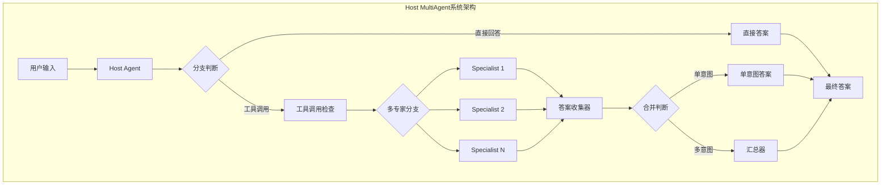
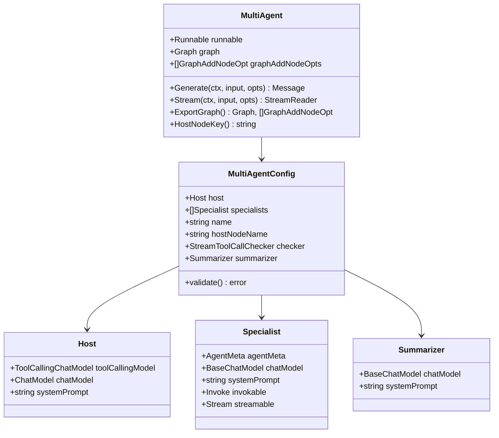
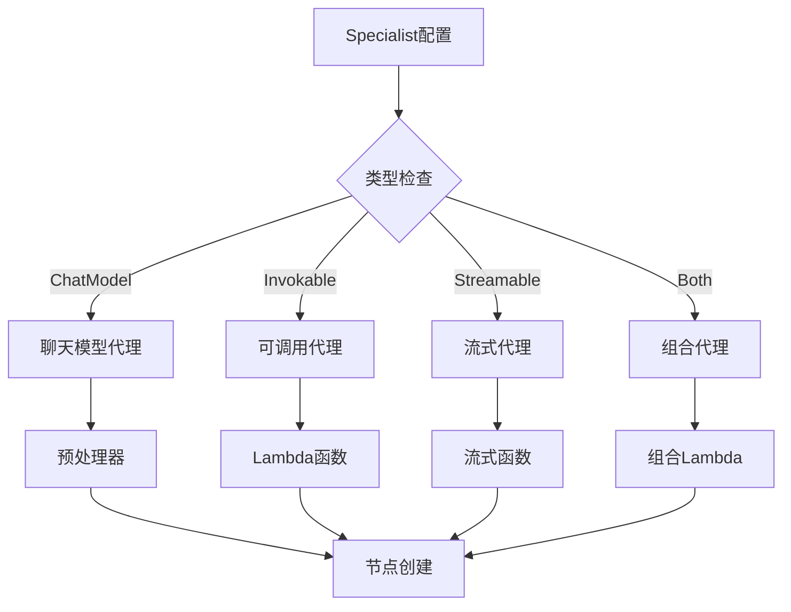
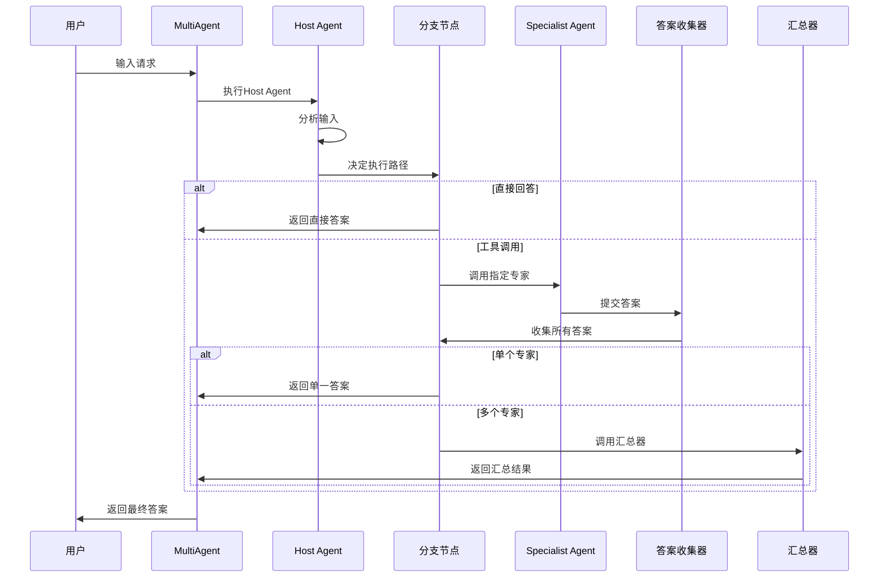
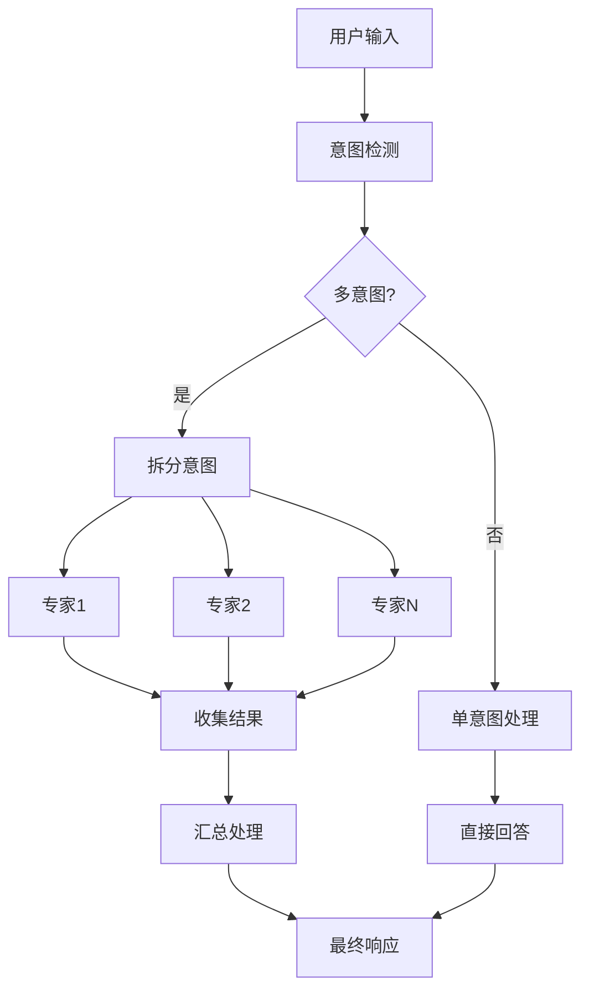
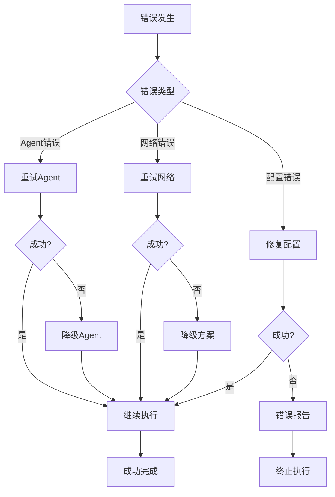

# Host MultiAgent 协作框架

<cite>
**本文档中引用的文件**
- [compose.go](file://flow/agent/multiagent/host/compose.go)
- [types.go](file://flow/agent/multiagent/host/types.go)
- [options.go](file://flow/agent/multiagent/host/options.go)
- [callback.go](file://flow/agent/multiagent/host/callback.go)
- [compose_test.go](file://flow/agent/multiagent/host/compose_test.go)
- [agent_option.go](file://flow/agent/agent_option.go)
- [types.go](file://compose/types.go)
</cite>

## 目录
1. [简介](#简介)
2. [核心架构](#核心架构)
3. [组件详解](#组件详解)
4. [编排机制](#编排机制)
5. [配置与使用](#配置与使用)
6. [高级特性](#高级特性)
7. [最佳实践](#最佳实践)
8. [故障排除](#故障排除)
9. [总结](#总结)

## 简介

Host MultiAgent协作框架是CloudWeGo Eino框架中的一个核心模块，专门用于构建多智能体系统。该框架采用主控-代理人的模式，通过一个中央Host Agent来协调多个专业化的Specialist Agent，实现复杂的任务分解和并行处理。

### 核心特性

- **主控-代理人模式**：Host Agent负责决策和任务分发，Specialist Agents专注于特定领域的任务执行
- **动态任务分配**：根据输入内容自动选择最适合的Specialist Agent
- **流式处理支持**：支持实时流式输出和增量响应
- **回调机制**：提供完整的生命周期事件回调，便于监控和调试
- **可扩展架构**：支持自定义Specialist Agent和Summarizer

## 核心架构

Host MultiAgent框架基于图编排引擎构建，采用节点-边的拓扑结构来组织各个Agent组件。



**图表来源**
- [compose.go](file://flow/agent/multiagent/host/compose.go#L39-L151)

### 架构层次

1. **应用层**：MultiAgent实例，提供统一的接口
2. **编排层**：Graph编排引擎，管理节点和边的关系
3. **执行层**：各个Agent节点，负责具体的任务执行
4. **回调层**：事件监听和处理机制

**章节来源**
- [compose.go](file://flow/agent/multiagent/host/compose.go#L39-L151)
- [types.go](file://flow/agent/multiagent/host/types.go#L32-L40)

## 组件详解

### MultiAgent核心结构

MultiAgent是整个框架的主要入口点，封装了所有Agent组件和编排逻辑。



**图表来源**
- [types.go](file://flow/agent/multiagent/host/types.go#L32-L200)

### Host Agent（主控Agent）

Host Agent是系统的核心决策者，负责：
- 分析用户输入和上下文
- 选择最适合的Specialist Agent
- 处理工具调用和任务分发
- 管理会话状态和历史记录

#### 主要功能

1. **输入预处理**：添加系统提示和上下文信息
2. **工具调用解析**：识别需要调用的Specialist Agent
3. **状态管理**：维护对话历史和意图状态
4. **输出格式化**：统一输出格式

**章节来源**
- [compose.go](file://flow/agent/multiagent/host/compose.go#L187-L202)

### Specialist Agent（专业代理）

Specialist Agent是专门处理特定领域任务的组件，可以是：

1. **聊天模型**：基于预训练的语言模型
2. **可调用函数**：自定义业务逻辑函数
3. **流式处理器**：支持实时流式输出

#### 配置方式



**图表来源**
- [compose.go](file://flow/agent/multiagent/host/compose.go#L154-L184)

**章节来源**
- [types.go](file://flow/agent/multiagent/host/types.go#L155-L175)

### Summarizer Agent（汇总器）

当系统检测到多个Specialist Agent被调用时，Summarizer负责将各个专家的回答进行整合和优化。

#### 默认行为

- **简单汇总**：直接连接所有响应消息
- **流式不支持**：默认汇总器不支持流式输出
- **自定义支持**：允许配置自定义的汇总逻辑

**章节来源**
- [types.go](file://flow/agent/multiagent/host/types.go#L172-L175)
- [compose.go](file://flow/agent/multiagent/host/compose.go#L286-L335)

## 编排机制

### 图编排流程

Host MultiAgent采用基于图的编排方式，通过节点和边来定义执行流程。



**图表来源**
- [compose.go](file://flow/agent/multiagent/host/compose.go#L49-L151)

### 流程控制机制

#### 分支判断逻辑

1. **直接回答分支**：Host Agent直接返回答案
2. **工具调用分支**：根据工具调用决定Specialist Agent
3. **多专家分支**：处理多个Specialist Agent的协调
4. **后处理分支**：根据意图数量决定后续处理

#### 状态同步

系统维护以下状态信息：
- `msgs`: 对话历史消息
- `isMultipleIntents`: 是否存在多个意图

**章节来源**
- [compose.go](file://flow/agent/multiagent/host/compose.go#L39-L42)
- [compose.go](file://flow/agent/multiagent/host/compose.go#L205-L283)

### 消息路由协议

#### 工具调用格式

Host Agent通过工具调用来指示Specialist Agent的选择：

```json
{
  "role": "assistant",
  "tool_calls": [
    {
      "function": {
        "name": "specialist_name",
        "arguments": "{\"reason\": \"选择原因\"}"
      }
    }
  ]
}
```

#### 消息流转

1. **输入转换**：将输入消息列表转换为流式格式
2. **专家调用**：根据工具调用参数调用对应Specialist Agent
3. **结果收集**：收集所有Specialist Agent的输出
4. **结果合并**：根据意图数量决定合并策略

**章节来源**
- [compose.go](file://flow/agent/multiagent/host/compose.go#L205-L283)

## 配置与使用

### 基本配置

#### 创建MultiAgent实例

```go
// 基本配置示例
config := &MultiAgentConfig{
    Host: Host{
        ToolCallingModel: hostModel,
        SystemPrompt: "你是一个专业的任务协调者。",
    },
    Specialists: []*Specialist{
        {
            AgentMeta: AgentMeta{
                Name: "research_assistant",
                IntendedUse: "进行学术研究和资料检索",
            },
            ChatModel: researchModel,
            SystemPrompt: "你是专门的研究助手，擅长查找学术资料。",
        },
        {
            AgentMeta: AgentMeta{
                Name: "code_expert",
                IntendedUse: "编写和审查代码",
            },
            Invokable: func(ctx context.Context, input []*schema.Message, opts ...agent.AgentOption) (*schema.Message, error) {
                // 自定义代码处理逻辑
                return &schema.Message{
                    Role: schema.Assistant,
                    Content: "这是代码处理结果",
                }, nil
            },
        },
    },
    Name: "research_and_code_multi_agent",
}
```

### 高级配置选项

#### 流式工具调用检查器

针对不同模型的流式输出特性，提供自定义的工具调用检查器：

```go
customChecker := func(ctx context.Context, modelOutput *schema.StreamReader[*schema.Message]) (bool, error) {
    defer modelOutput.Close()
    
    for {
        msg, err := modelOutput.Recv()
        if err != nil {
            if err == io.EOF {
                return false, nil
            }
            return false, err
        }
        
        // 检查是否有工具调用
        if len(msg.ToolCalls) > 0 {
            return true, nil
        }
        
        // 跳过空消息
        if len(msg.Content) == 0 {
            continue
        }
    }
}
```

#### 自定义汇总器

```go
config := &MultiAgentConfig{
    // ... 其他配置
    Summarizer: &Summarizer{
        ChatModel: summarizerModel,
        SystemPrompt: "你是一个优秀的文本摘要专家，能够将多个观点整合成连贯的总结。",
    },
}
```

**章节来源**
- [types.go](file://flow/agent/multiagent/host/types.go#L72-L100)
- [types.go](file://flow/agent/multiagent/host/types.go#L177-L200)

### 使用示例

#### 同步调用

```go
result, err := multiAgent.Generate(ctx, []*schema.Message{
    {
        Role: schema.User,
        Content: "请帮我分析这个项目的架构并编写测试代码",
    },
})
if err != nil {
    log.Fatal(err)
}
fmt.Println("最终结果:", result.Content)
```

#### 流式调用

```go
stream, err := multiAgent.Stream(ctx, []*schema.Message{
    {
        Role: schema.User,
        Content: "请详细解释这个算法的工作原理",
    },
})
if err != nil {
    log.Fatal(err)
}
defer stream.Close()

for {
    msg, err := stream.Recv()
    if err == io.EOF {
        break
    }
    if err != nil {
        log.Fatal(err)
    }
    fmt.Print(msg.Content)
}
```

**章节来源**
- [types.go](file://flow/agent/multiagent/host/types.go#L41-L61)

### 回调机制配置

#### 实现MultiAgentCallback接口

```go
type MyCallback struct{}

func (c *MyCallback) OnHandOff(ctx context.Context, info *HandOffInfo) context.Context {
    fmt.Printf("任务交接: 从Host到%s, 参数: %s\n", 
               info.ToAgentName, info.Argument)
    return ctx
}

// 使用回调
callbacks := []MultiAgentCallback{&MyCallback{}}
result, err := multiAgent.Generate(ctx, messages, 
                                   WithAgentCallbacks(callbacks...))
```

**章节来源**
- [callback.go](file://flow/agent/multiagent/host/callback.go#L30-L40)
- [options.go](file://flow/agent/multiagent/host/options.go#L25-L29)

## 高级特性

### 复杂任务分解

#### 多意图处理

当用户输入包含多个独立的意图时，系统会自动识别并分配给相应的Specialist Agent：



**图表来源**
- [compose.go](file://flow/agent/multiagent/host/compose.go#L222-L241)

#### 并行处理优势

1. **性能提升**：多个Specialist Agent可以同时处理不同的子任务
2. **资源利用**：充分利用计算资源，提高处理效率
3. **结果质量**：不同专家的视角有助于获得更全面的答案

### 容错处理

#### 错误恢复机制



#### 异常处理策略

1. **优雅降级**：当某个Specialist Agent失败时，系统自动切换到备用方案
2. **状态回滚**：在错误情况下恢复到安全的状态
3. **日志记录**：详细记录错误信息便于调试和分析

### 状态同步机制

#### 全局状态管理

系统维护全局状态以确保各个组件之间的协调：

```go
type state struct {
    msgs              []*schema.Message  // 对话历史
    isMultipleIntents bool               // 多意图标志
}
```

#### 状态传播

1. **初始化**：在每个新的请求开始时初始化状态
2. **更新**：在处理过程中持续更新状态信息
3. **传递**：通过预处理器将状态传递给各个节点

**章节来源**
- [compose.go](file://flow/agent/multiagent/host/compose.go#L39-L42)

## 最佳实践

### 设计原则

#### 1. 单一职责原则

每个Specialist Agent应该专注于一个特定的任务领域：

```go
// 推荐：专注的Specialist Agent
type ResearchSpecialist struct{}
func (r *ResearchSpecialist) Research(ctx context.Context, query string) (*schema.Message, error) {
    // 专门的搜索和分析逻辑
    return &schema.Message{
        Role: schema.Assistant,
        Content: "研究结果：" + query,
    }, nil
}

// 不推荐：多功能的通用Agent
type GeneralAgent struct{}
func (g *GeneralAgent) HandleTask(ctx context.Context, task string) (*schema.Message, error) {
    // 包含各种不相关的功能
    switch {
    case strings.Contains(task, "research"):
        return g.Research(ctx, task)
    case strings.Contains(task, "code"):
        return g.Code(ctx, task)
    default:
        return g.General(ctx, task)
    }
}
```

#### 2. 松耦合设计

Agent之间应该保持松散的耦合关系：

```go
// 通过标准化的消息格式进行通信
type TaskInput struct {
    Query     string `json:"query"`
    Context   string `json:"context"`
    Priority  int    `json:"priority"`
}

type TaskOutput struct {
    Result    string `json:"result"`
    Metadata  map[string]interface{} `json:"metadata"`
}
```

### 性能优化

#### 1. 连接池管理

合理管理模型连接，避免频繁的连接建立和销毁：

```go
// 使用连接池
type ModelPool struct {
    pool chan model.BaseChatModel
}

func (mp *ModelPool) GetModel() model.BaseChatModel {
    select {
    case model := <-mp.pool:
        return model
    default:
        return mp.createModel()
    }
}
```

#### 2. 缓存策略

对于重复的查询结果进行缓存：

```go
type CacheManager struct {
    cache map[string]string
    mu    sync.RWMutex
}

func (cm *CacheManager) Get(key string) (string, bool) {
    cm.mu.RLock()
    defer cm.mu.RUnlock()
    result, exists := cm.cache[key]
    return result, exists
}
```

### 监控和调试

#### 1. 日志记录

实施全面的日志记录策略：

```go
type LoggingInterceptor struct{}

func (li *LoggingInterceptor) Intercept(ctx context.Context, req interface{}, info *grpc.UnaryServerInfo, handler grpc.UnaryHandler) (interface{}, error) {
    logger := logrus.WithFields(logrus.Fields{
        "method": info.FullMethod,
        "request_id": ctx.Value("request_id"),
    })
    
    logger.Info("开始处理请求")
    startTime := time.Now()
    
    resp, err := handler(ctx, req)
    
    duration := time.Since(startTime)
    if err != nil {
        logger.WithError(err).Errorf("请求处理失败 (%v)", duration)
    } else {
        logger.Infof("请求处理完成 (%v)", duration)
    }
    
    return resp, err
}
```

#### 2. 指标收集

收集关键性能指标：

```go
type MetricsCollector struct {
    RequestCount prometheus.Counter
    ResponseTime prometheus.Histogram
    ErrorRate    prometheus.Gauge
}

func (mc *MetricsCollector) RecordRequest(duration time.Duration, isError bool) {
    mc.RequestCount.Inc()
    mc.ResponseTime.Observe(duration.Seconds())
    if isError {
        mc.ErrorRate.Set(1)
    } else {
        mc.ErrorRate.Set(0)
    }
}
```

### 安全考虑

#### 1. 输入验证

严格验证所有输入数据：

```go
func validateInput(messages []*schema.Message) error {
    if len(messages) == 0 {
        return errors.New("输入消息不能为空")
    }
    
    for _, msg := range messages {
        if msg.Role != schema.User && msg.Role != schema.Assistant {
            return fmt.Errorf("无效的角色: %v", msg.Role)
        }
        if len(msg.Content) > MAX_CONTENT_LENGTH {
            return fmt.Errorf("消息内容过长: %d > %d", len(msg.Content), MAX_CONTENT_LENGTH)
        }
    }
    
    return nil
}
```

#### 2. 访问控制

实施适当的访问控制机制：

```go
type AccessControl struct {
    authorizedUsers map[string]bool
    rateLimit       *rate.Limiter
}

func (ac *AccessControl) CheckPermission(userID string) error {
    if !ac.authorizedUsers[userID] {
        return errors.New("用户未授权")
    }
    
    if !ac.rateLimit.Allow() {
        return errors.New("请求频率过高")
    }
    
    return nil
}
```

## 故障排除

### 常见问题及解决方案

#### 1. 流式工具调用检查失败

**问题描述**：某些模型（如Claude）在流式输出中先输出文本再输出工具调用，导致默认检查器失效。

**解决方案**：
```go
// 实现自定义流式检查器
customChecker := func(ctx context.Context, modelOutput *schema.StreamReader[*schema.Message]) (bool, error) {
    defer modelOutput.Close()
    
    var hasToolCall bool
    var buffer strings.Builder
    
    for {
        msg, err := modelOutput.Recv()
        if err != nil {
            if err == io.EOF {
                return hasToolCall, nil
            }
            return false, err
        }
        
        // 累积文本内容
        buffer.WriteString(msg.Content)
        
        // 检查工具调用
        if len(msg.ToolCalls) > 0 {
            hasToolCall = true
            // 如果已经有工具调用，可以提前结束
            if hasToolCall && buffer.Len() > 0 {
                return true, nil
            }
        }
    }
}
```

#### 2. Specialist Agent调用失败

**诊断步骤**：
1. 检查Agent配置是否正确
2. 验证模型连接状态
3. 查看错误日志
4. 测试单个Agent功能

**解决方案**：
```go
// 添加错误处理和重试机制
func resilientSpecialistCall(ctx context.Context, specialist *Specialist, input []*schema.Message) (*schema.Message, error) {
    maxRetries := 3
    for i := 0; i < maxRetries; i++ {
        result, err := specialist.Call(ctx, input)
        if err == nil {
            return result, nil
        }
        
        // 记录错误但不中断整个流程
        log.Warnf("Specialist调用失败 (尝试 %d/%d): %v", i+1, maxRetries, err)
        
        if i < maxRetries-1 {
            time.Sleep(time.Duration(i+1) * time.Second)
        }
    }
    
    return nil, fmt.Errorf("所有重试都失败了")
}
```

#### 3. 多专家协作超时

**问题描述**：多个Specialist Agent同时工作时可能导致整体超时。

**解决方案**：
```go
// 设置合理的超时时间
type TimeoutManager struct {
    timeout time.Duration
}

func (tm *TimeoutManager) ExecuteWithTimeout(ctx context.Context, 
                                           tasks []SpecialistTask) ([]*schema.Message, error) {
    ctx, cancel := context.WithTimeout(ctx, tm.timeout)
    defer cancel()
    
    // 并行执行任务
    results := make(chan *schema.Message, len(tasks))
    errors := make(chan error, len(tasks))
    
    for _, task := range tasks {
        go func(t SpecialistTask) {
            result, err := t.Execute(ctx)
            if err != nil {
                errors <- err
            } else {
                results <- result
            }
        }(task)
    }
    
    // 收集结果
    var finalResults []*schema.Message
    for i := 0; i < len(tasks); i++ {
        select {
        case result := <-results:
            finalResults = append(finalResults, result)
        case err := <-errors:
            return nil, err
        case <-ctx.Done():
            return nil, ctx.Err()
        }
    }
    
    return finalResults, nil
}
```

### 性能调优

#### 1. 内存优化

```go
// 使用对象池减少GC压力
type MessagePool struct {
    pool *sync.Pool
}

func NewMessagePool() *MessagePool {
    return &MessagePool{
        pool: &sync.Pool{
            New: func() interface{} {
                return &schema.Message{
                    ToolCalls: make([]schema.ToolCall, 0, 5),
                }
            },
        },
    }
}

func (mp *MessagePool) Get() *schema.Message {
    return mp.pool.Get().(*schema.Message)
}

func (mp *MessagePool) Put(msg *schema.Message) {
    // 清空消息内容避免内存泄漏
    msg.Role = ""
    msg.Content = ""
    msg.ToolCalls = msg.ToolCalls[:0]
    mp.pool.Put(msg)
}
```

#### 2. 并发控制

```go
// 限制并发数防止资源耗尽
type ConcurrencyLimiter struct {
    sem chan struct{}
}

func NewConcurrencyLimiter(maxConcurrent int) *ConcurrencyLimiter {
    return &ConcurrencyLimiter{
        sem: make(chan struct{}, maxConcurrent),
    }
}

func (cl *ConcurrencyLimiter) Acquire(ctx context.Context) error {
    select {
    case cl.sem <- struct{}{}:
        return nil
    case <-ctx.Done():
        return ctx.Err()
    }
}

func (cl *ConcurrencyLimiter) Release() {
    <-cl.sem
}
```

## 总结

Host MultiAgent协作框架提供了一个强大而灵活的多智能体系统解决方案。通过主控-代理人的架构模式，它能够有效地处理复杂的任务分解和并行处理需求。

### 核心优势

1. **模块化设计**：清晰的职责分离使得系统易于理解和维护
2. **高度可扩展**：支持自定义Specialist Agent和Summarizer
3. **强大的编排能力**：基于图的编排引擎提供了丰富的流程控制选项
4. **完善的回调机制**：提供了完整的生命周期事件监听能力
5. **优秀的性能表现**：支持并行处理和流式输出

### 应用场景

- **智能客服系统**：结合不同领域的专家Agent提供综合服务
- **内容创作平台**：多个专业Agent协同完成复杂的内容生产任务
- **数据分析平台**：不同分析师Agent共同处理复杂的数据分析需求
- **教育培训系统**：多个教学专家Agent提供个性化的学习指导

### 发展方向

随着人工智能技术的不断发展，Host MultiAgent框架将在以下方面继续演进：

1. **更智能的决策机制**：引入更先进的算法来优化Agent选择和任务分配
2. **更强的自适应能力**：根据历史交互数据自动调整Agent配置
3. **更好的用户体验**：提供更直观的配置界面和监控工具
4. **更广泛的生态集成**：与其他AI服务和工具的深度集成

通过合理的设计和配置，Host MultiAgent协作框架能够为企业和开发者提供一个强大而可靠的多智能体系统基础，助力构建下一代智能化应用。