# MultiQueryRetriever 设计原理与实现详解

<cite>
**本文档引用的文件**
- [multi_query.go](file://flow/retriever/multiquery/multi_query.go)
- [multi_query_test.go](file://flow/retriever/multiquery/multi_query_test.go)
- [interface.go](file://components/retriever/interface.go)
- [utils.go](file://flow/retriever/utils/utils.go)
- [chatmodel.go](file://adk/chatmodel.go)
</cite>

## 目录
1. [简介](#简介)
2. [核心设计原理](#核心设计原理)
3. [架构概览](#架构概览)
4. [详细组件分析](#详细组件分析)
5. [查询扩展逻辑](#查询扩展逻辑)
6. [配置参数详解](#配置参数详解)
7. [RAG系统集成](#rag系统集成)
8. [性能优化与调优](#性能优化与调优)
9. [潜在问题与解决方案](#潜在问题与解决方案)
10. [最佳实践指南](#最佳实践指南)

## 简介

MultiQueryRetriever是Eino框架中的一个高级检索器组件，专门设计用于通过生成多个语义等价的查询来提升信息检索的召回率。它采用多查询策略，利用大语言模型（LLM）生成查询变体，然后并行检索这些变体的结果，最后通过融合算法合并去重得到最终结果。

这种设计特别适用于检索增强生成（RAG）系统，能够显著提高下游任务的性能，如问答系统、文档检索和知识问答等场景。

## 核心设计原理

### 多查询策略的核心思想

MultiQueryRetriever基于以下核心理念设计：

1. **语义多样性**：单个查询可能无法覆盖所有相关的文档表达方式，通过生成多个查询变体可以捕获更丰富的语义信息
2. **并行处理**：同时执行多个查询检索，充分利用计算资源，提高整体效率
3. **结果融合**：通过智能的去重和排序算法，确保最终结果的质量和多样性

### 技术架构优势

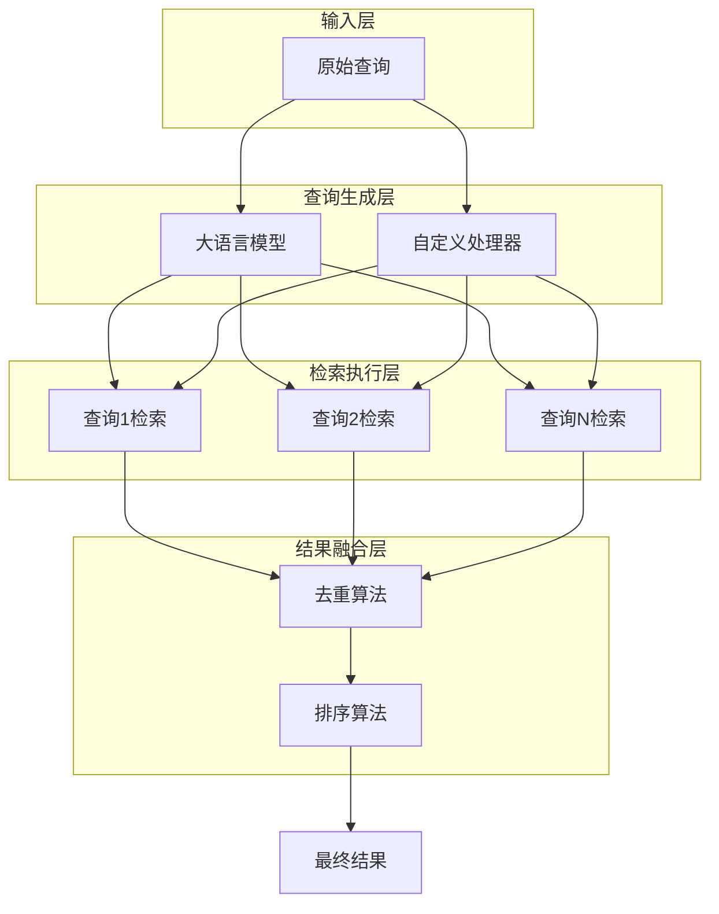

**图表来源**
- [multi_query.go](file://flow/retriever/multiquery/multi_query.go#L160-L195)
- [utils.go](file://flow/retriever/utils/utils.go#L40-L69)

## 架构概览

MultiQueryRetriever的整体架构遵循模块化设计原则，主要包含以下几个层次：

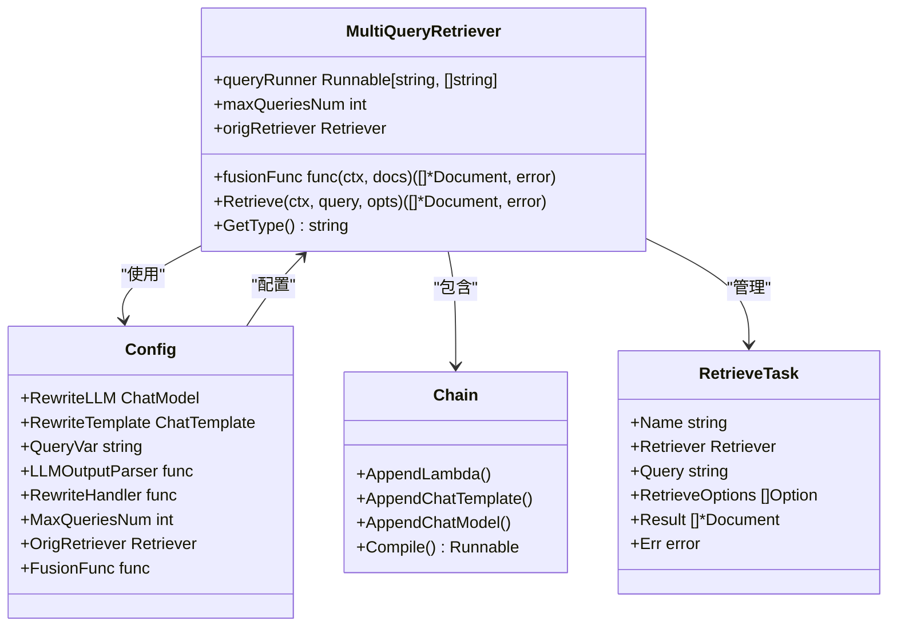

**图表来源**
- [multi_query.go](file://flow/retriever/multiquery/multi_query.go#L130-L151)
- [multi_query.go](file://flow/retriever/multiquery/multi_query.go#L153-L158)

**章节来源**
- [multi_query.go](file://flow/retriever/multiquery/multi_query.go#L1-L212)

## 详细组件分析

### MultiQueryRetriever核心结构

MultiQueryRetriever是整个系统的核心组件，实现了Retriever接口：

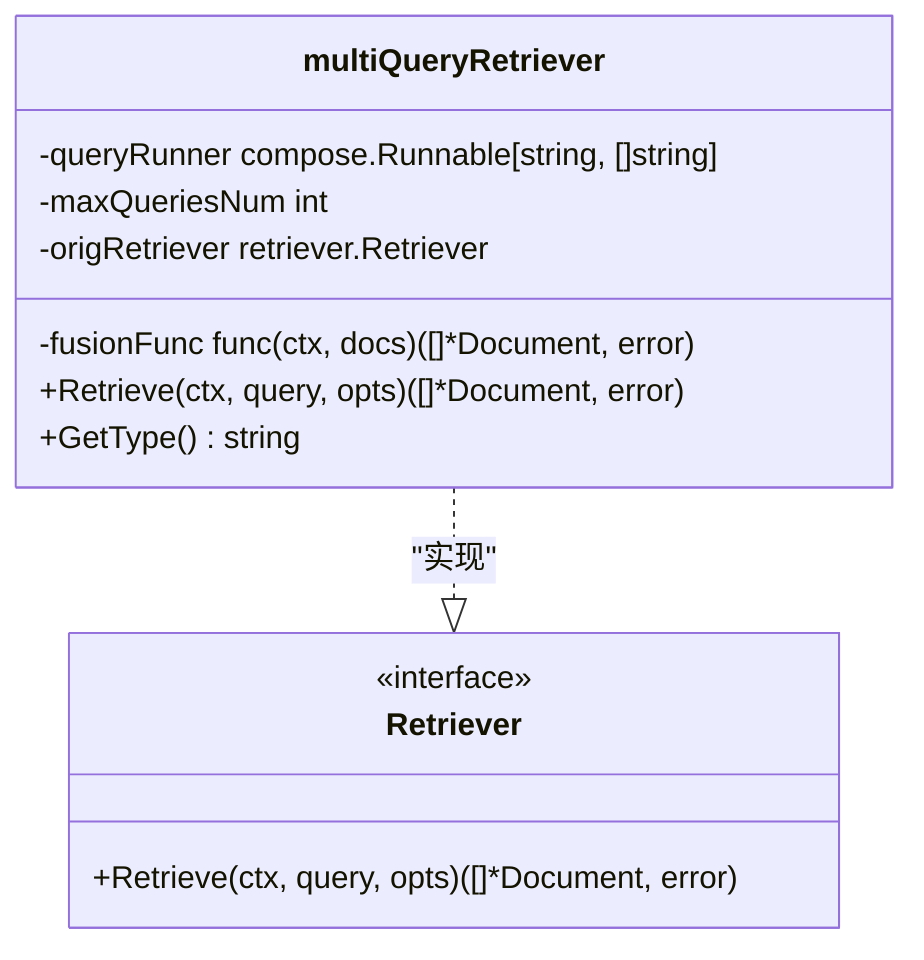

**图表来源**
- [multi_query.go](file://flow/retriever/multiquery/multi_query.go#L153-L158)
- [interface.go](file://components/retriever/interface.go#L39-L41)

### 查询生成链式处理

查询生成过程采用链式处理模式，支持灵活的配置：

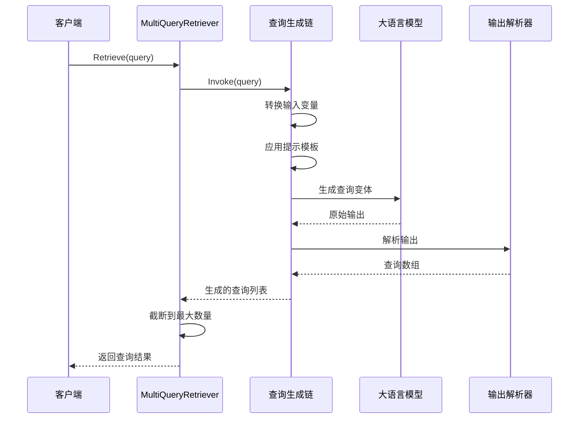

**图表来源**
- [multi_query.go](file://flow/retriever/multiquery/multi_query.go#L80-L106)

**章节来源**
- [multi_query.go](file://flow/retriever/multiquery/multi_query.go#L153-L195)

## 查询扩展逻辑

### 默认查询生成提示模板

MultiQueryRetriever提供了默认的查询生成提示模板，该模板经过精心设计以确保生成的查询具有语义多样性：

| 模板字段 | 描述 | 示例 |
|---------|------|------|
| 角色设定 | 明确助手的角色定位 | "You are an helpful assistant." |
| 任务目标 | 阐述查询生成的具体目标 | "create three different versions of the user query" |
| 输出格式 | 规定输出格式要求 | "Only provide the generated queries and separate them by newlines" |
| 输入变量 | 动态插入用户查询 | "{{query}}" |

### 查询生成流程

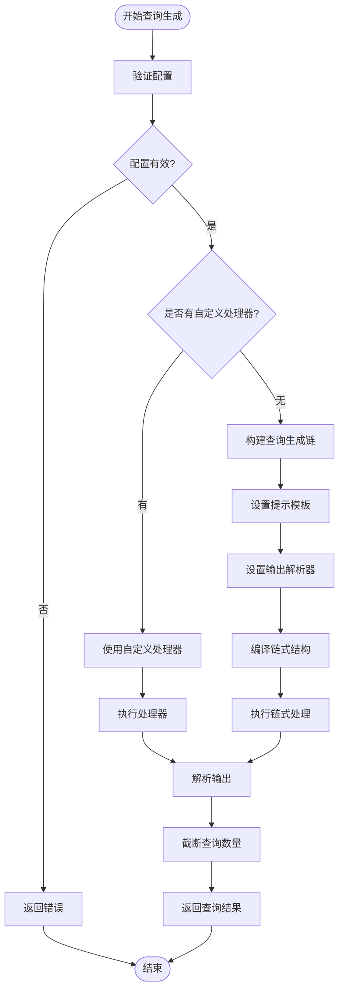

**图表来源**
- [multi_query.go](file://flow/retriever/multiquery/multi_query.go#L69-L127)

### 并行检索机制

MultiQueryRetriever采用并发检索策略，通过`ConcurrentRetrieveWithCallback`函数实现高效的并行处理：

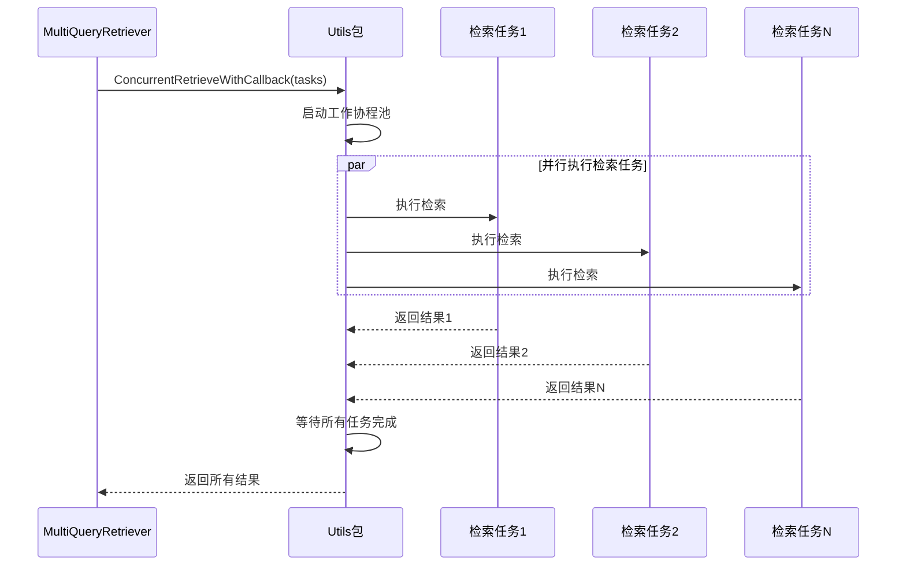

**图表来源**
- [utils.go](file://flow/retriever/utils/utils.go#L40-L69)

**章节来源**
- [multi_query.go](file://flow/retriever/multiquery/multi_query.go#L160-L195)
- [utils.go](file://flow/retriever/utils/utils.go#L40-L69)

## 配置参数详解

### Config结构体详解

MultiQueryRetriever的配置结构体提供了丰富的定制选项：

| 参数名称 | 类型 | 必需性 | 默认值 | 描述 |
|---------|------|--------|--------|------|
| RewriteLLM | model.ChatModel | 可选 | nil | 用于生成查询的大语言模型 |
| RewriteTemplate | prompt.ChatTemplate | 可选 | 默认模板 | 查询生成的提示模板 |
| QueryVar | string | 可选 | "query" | 自定义模板中的查询变量名 |
| LLMOutputParser | func | 可选 | 分割换行符 | 将LLM输出解析为查询数组的函数 |
| RewriteHandler | func | 可选 | nil | 自定义查询生成处理器 |
| MaxQueriesNum | int | 可选 | 5 | 最大生成查询数量 |
| OrigRetriever | retriever.Retriever | 必需 | - | 原始检索器实例 |
| FusionFunc | func | 可选 | deduplicateFusion | 结果融合函数 |

### 查询生成策略配置

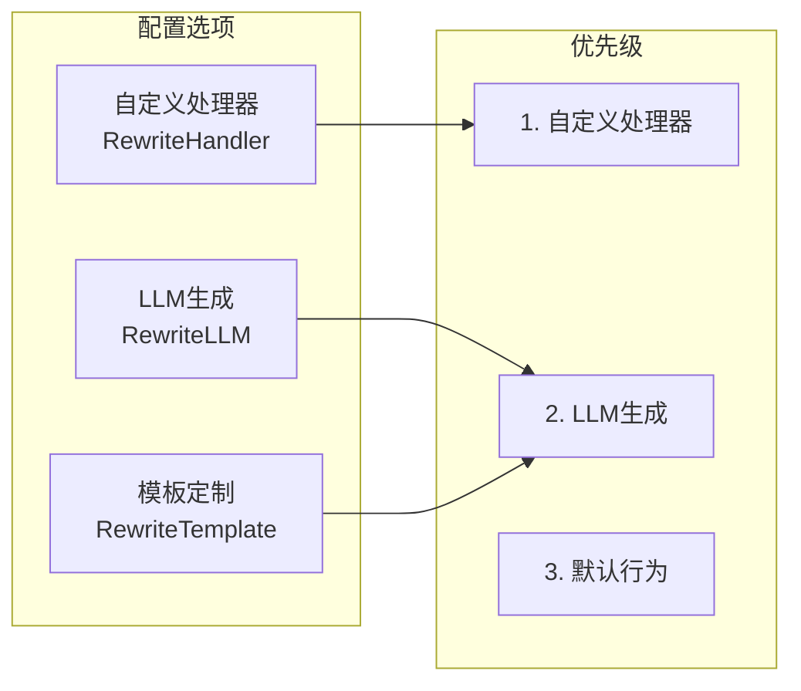

**图表来源**
- [multi_query.go](file://flow/retriever/multiquery/multi_query.go#L130-L151)

**章节来源**
- [multi_query.go](file://flow/retriever/multiquery/multi_query.go#L130-L151)

## RAG系统集成

### 在RAG系统中的典型应用场景

MultiQueryRetriever在RAG（检索增强生成）系统中发挥着关键作用：

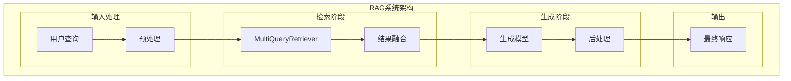

### 实践示例代码结构

以下是MultiQueryRetriever在RAG系统中的典型集成模式：

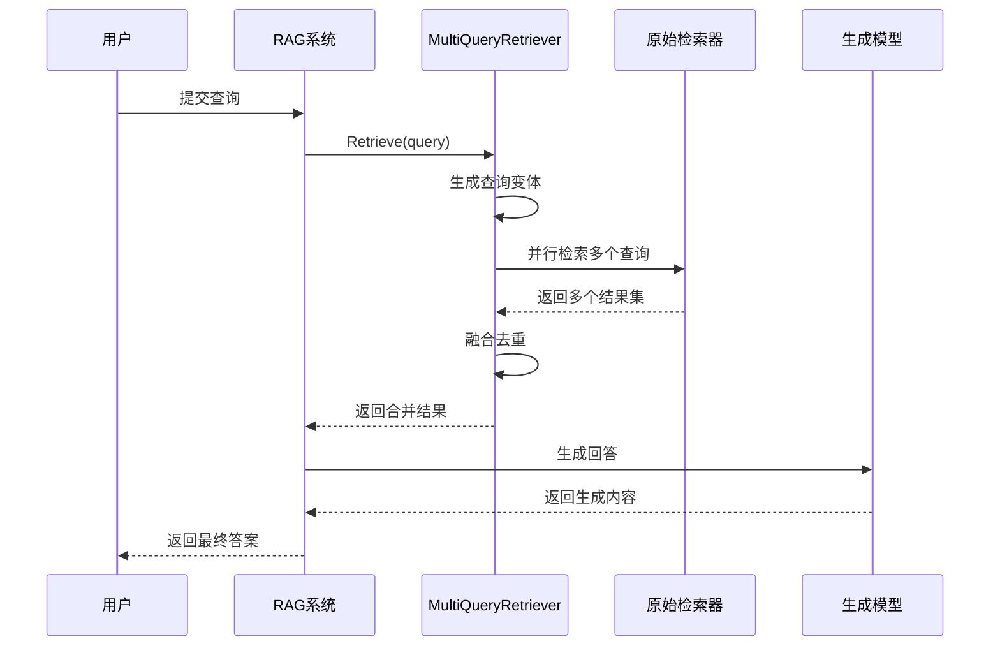

**图表来源**
- [multi_query_test.go](file://flow/retriever/multiquery/multi_query_test.go#L69-L118)

### 性能对比分析

| 检索策略 | 召回率 | 延迟 | 资源消耗 | 适用场景 |
|---------|--------|------|----------|----------|
| 单查询检索 | 中等 | 低 | 低 | 简单查询场景 |
| MultiQueryRetriever | 高 | 中等 | 中等 | 复杂查询场景 |
| 并行多检索器 | 很高 | 高 | 高 | 对准确性要求极高的场景 |

**章节来源**
- [multi_query_test.go](file://flow/retriever/multiquery/multi_query_test.go#L69-L118)

## 性能优化与调优

### 查询数量优化策略

MultiQueryRetriever提供了灵活的查询数量控制机制：

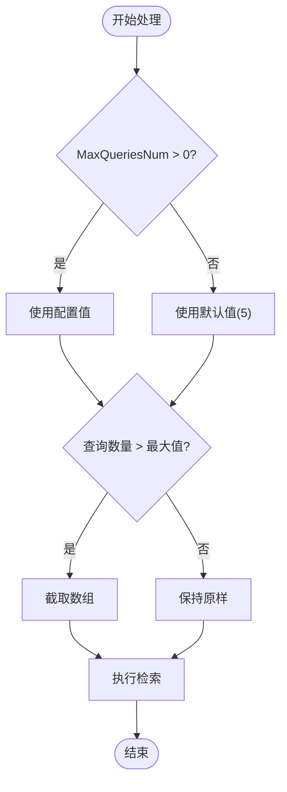

**图表来源**
- [multi_query.go](file://flow/retriever/multiquery/multi_query.go#L167-L169)

### 内存优化策略

1. **结果缓存**：合理配置融合函数，避免重复计算
2. **并发控制**：根据系统资源调整并发度
3. **内存回收**：及时释放不再需要的中间结果

### 性能监控指标

| 指标类型 | 关键指标 | 监控方法 | 优化目标 |
|---------|---------|----------|----------|
| 查询生成 | 生成时间、成功率 | 日志记录 | 减少延迟 |
| 检索性能 | 并发度、响应时间 | 性能计数器 | 提高吞吐量 |
| 结果质量 | 召回率、准确率 | A/B测试 | 改善效果 |
| 系统资源 | CPU使用率、内存占用 | 系统监控 | 资源优化 |

**章节来源**
- [multi_query.go](file://flow/retriever/multiquery/multi_query.go#L111-L114)

## 潜在问题与解决方案

### 查询冗余问题

**问题描述**：生成的查询变体可能存在语义重复，导致检索结果重复

**解决方案**：
1. 使用更复杂的查询生成策略
2. 实现查询相似度检测
3. 优化融合算法，更好地处理重复项

### 性能开销问题

**问题描述**：并行检索增加了系统复杂性和资源消耗

**解决方案**：
1. **动态调整查询数量**：根据查询复杂度动态调整MaxQueriesNum
2. **智能缓存机制**：缓存常见查询的生成结果
3. **异步处理**：将非关键路径的操作异步化

### 错误处理策略

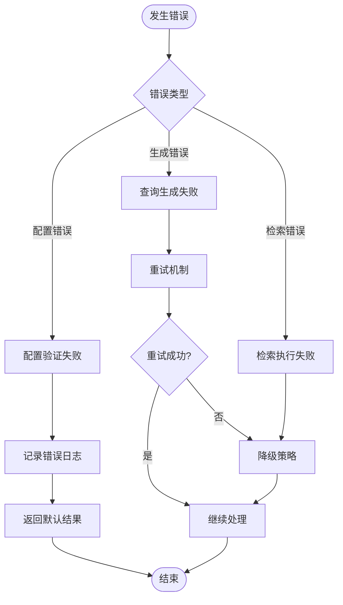

**图表来源**
- [utils.go](file://flow/retriever/utils/utils.go#L46-L66)

**章节来源**
- [utils.go](file://flow/retriever/utils/utils.go#L46-L66)

## 最佳实践指南

### 配置优化建议

1. **查询数量设置**：
   - 简单查询：3-5个
   - 复杂查询：5-10个
   - 资源受限：2-3个

2. **融合算法选择**：
   - 默认去重：适用于大多数场景
   - 排序融合：需要考虑相关性的场景
   - 权重融合：需要区分不同查询重要性的场景

3. **错误处理配置**：
   ```go
   // 示例配置
   config := &Config{
       RewriteLLM:    myChatModel,
       OrigRetriever: myOriginalRetriever,
       MaxQueriesNum: 5,
       FusionFunc: func(ctx context.Context, docs [][]*schema.Document) ([]*schema.Document, error) {
           // 实现自定义融合逻辑
           return customFusionAlgorithm(docs)
       },
   }
   ```

### 监控和调试

1. **启用回调监控**：利用Eino的回调系统监控各个阶段的性能
2. **日志记录**：记录查询生成、检索执行和融合过程的关键信息
3. **性能基准测试**：定期评估不同配置下的性能表现

### 扩展性考虑

1. **插件化设计**：支持自定义查询生成器和融合算法
2. **分布式部署**：支持大规模查询的分布式处理
3. **版本兼容**：保持向后兼容性，便于升级和维护

MultiQueryRetriever通过其创新的多查询策略和灵活的配置选项，为RAG系统提供了强大的检索能力。合理使用该组件，结合适当的优化策略，可以在保证性能的同时显著提升系统的检索效果。