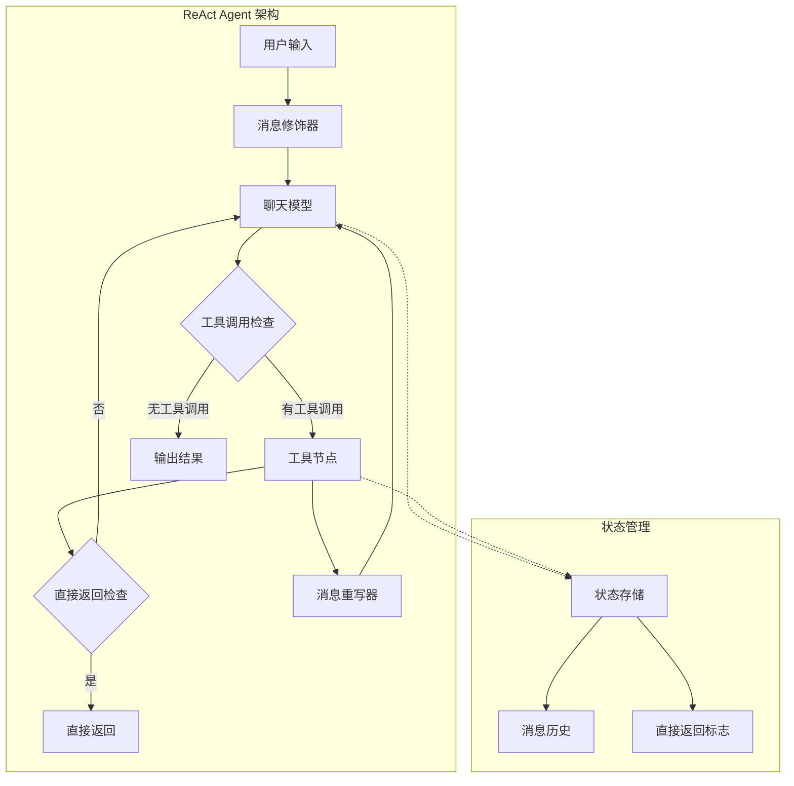
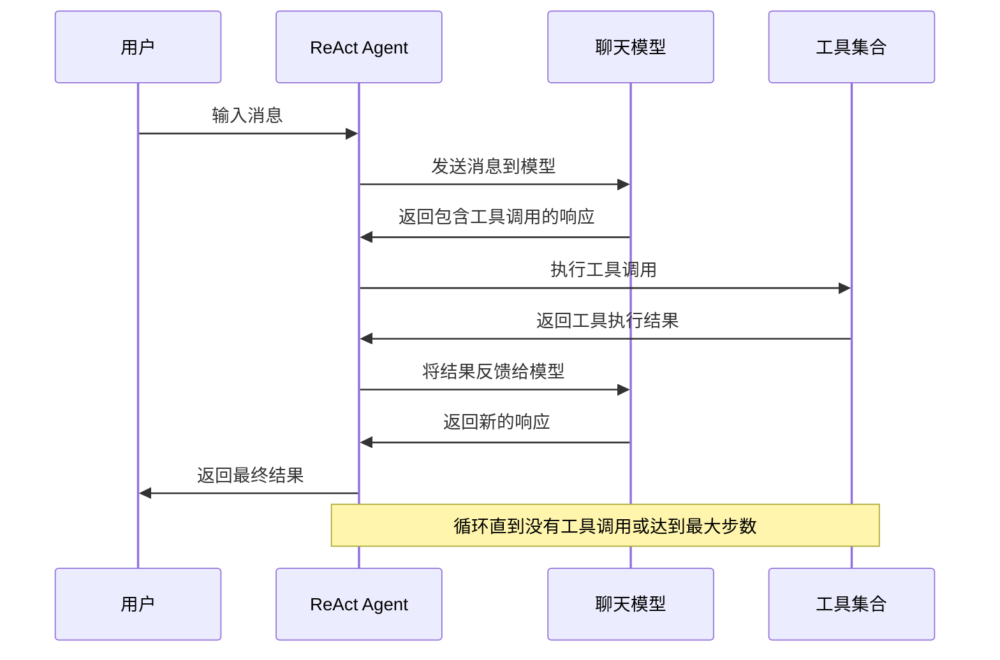
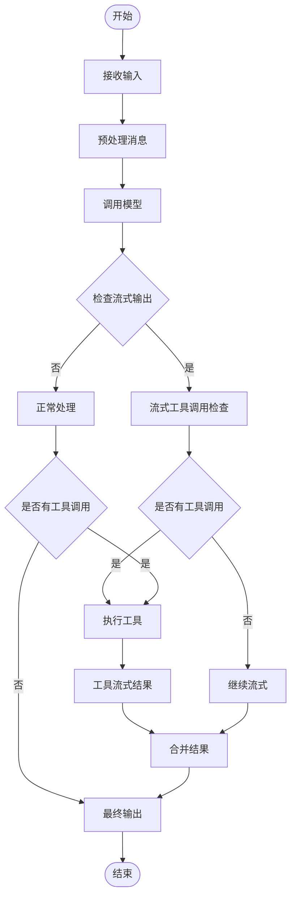
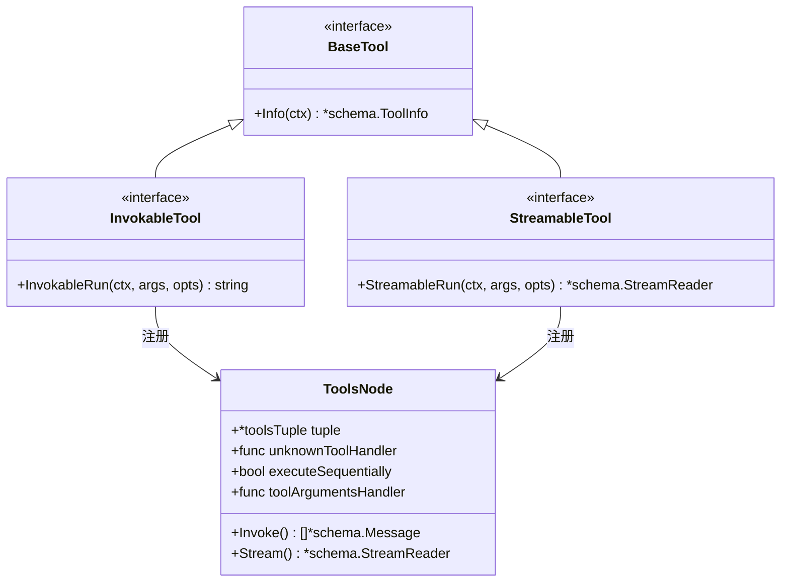
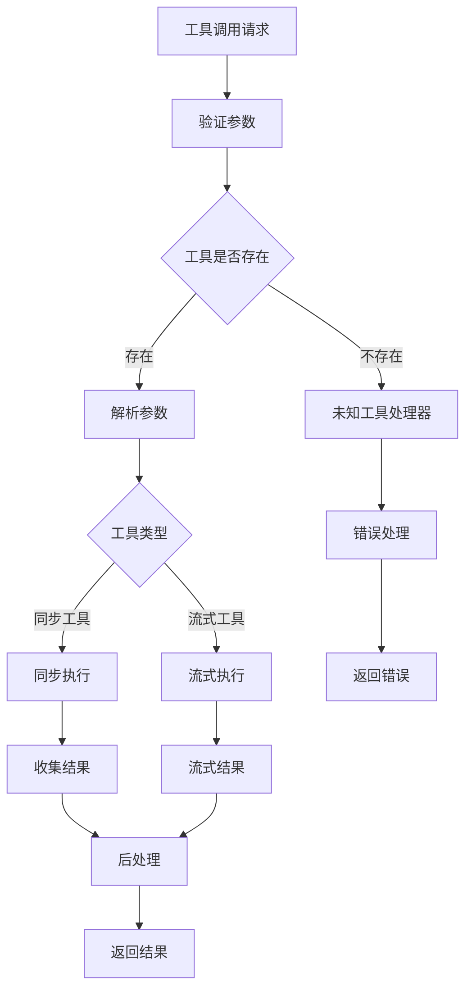
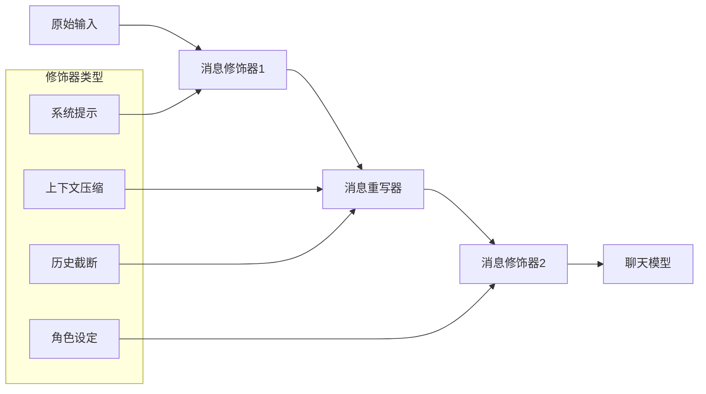
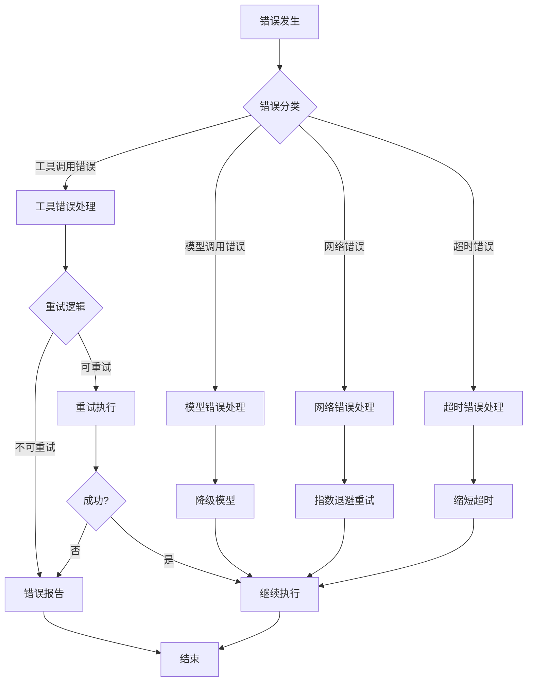
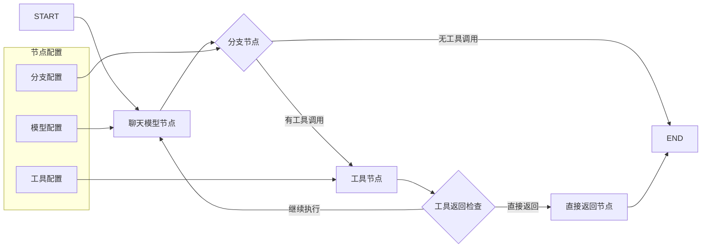
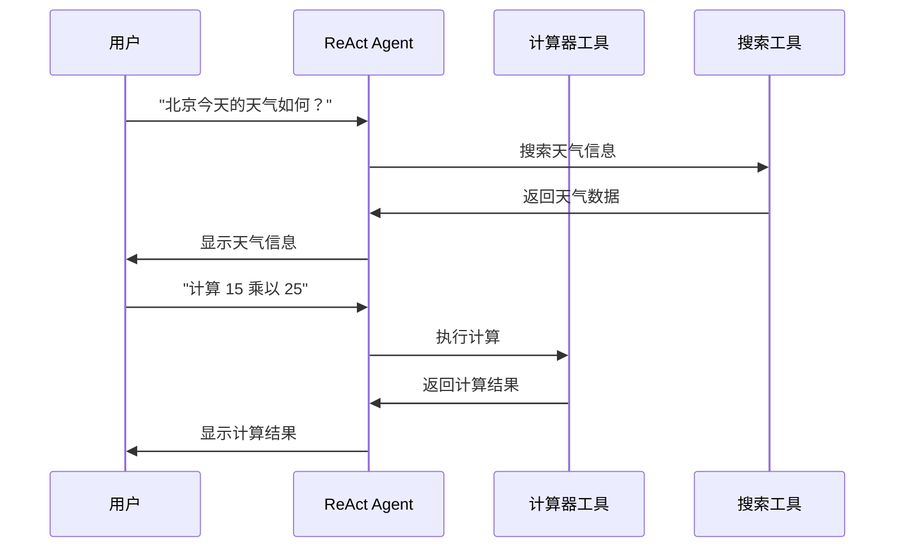

# ReAct Agent 详细开发文档

<cite>
**本文档引用的文件**
- [react.go](file://flow/agent/react/react.go)
- [callback.go](file://flow/agent/react/callback.go)
- [option.go](file://flow/agent/react/option.go)
- [react_test.go](file://flow/agent/react/react_test.go)
- [graph.go](file://compose/graph.go)
- [tool_node.go](file://compose/tool_node.go)
- [interface.go](file://components/tool/interface.go)
- [react.go](file://adk/react.go)
</cite>

## 目录
1. [简介](#简介)
2. [核心架构](#核心架构)
3. [ReAct Agent 实现原理](#react-agent-实现原理)
4. [内部状态管理](#内部状态管理)
5. [工具调用机制](#工具调用机制)
6. [提示工程设计](#提示工程设计)
7. [错误处理与重试逻辑](#错误处理与重试逻辑)
8. [使用示例](#使用示例)
9. [与 Compose.Graph 集成](#与-composegraph-集成)
10. [应用场景](#应用场景)
11. [常见问题与解决方案](#常见问题与解决方案)
12. [性能优化建议](#性能优化建议)

## 简介

ReAct Agent 是一个基于推理（Reasoning）与行动（Action）循环的智能代理系统，通过编排 `ChatModel` 和 `Tool` 组件实现 LLM 驱动的决策流程。该系统采用 ReAct（Reasoning and Acting）范式，能够在对话过程中动态地进行思考、规划和执行操作。

ReAct Agent 的核心特点：
- **循环推理机制**：通过不断迭代的思考和行动过程解决问题
- **工具集成能力**：支持多种类型的工具调用（同步和异步）
- **流式处理支持**：完整的流式输入输出处理
- **状态管理**：智能的消息历史管理和上下文维护
- **可扩展架构**：基于 Graph 的模块化设计

## 核心架构

ReAct Agent 基于 Eino 框架的 Compose 系统构建，采用图结构来组织各个组件之间的关系。



**图表来源**
- [react.go](file://flow/agent/react/react.go#L171-L398)
- [graph.go](file://compose/graph.go#L57-L90)

**章节来源**
- [react.go](file://flow/agent/react/react.go#L171-L192)

## ReAct Agent 实现原理

### 推理与行动循环机制

ReAct Agent 的核心在于其推理（Reasoning）与行动（Action）循环机制。该机制通过以下步骤实现：

1. **推理阶段**：模型分析当前上下文，决定是否需要调用工具
2. **行动阶段**：执行选定的工具调用
3. **反馈阶段**：将工具执行结果反馈给模型
4. **迭代判断**：根据结果决定是否继续循环



**图表来源**
- [react.go](file://flow/agent/react/react.go#L238-L292)
- [react.go](file://flow/agent/react/react.go#L304-L354)

### 流式处理机制

ReAct Agent 支持完整的流式处理，能够实时处理和传输数据：



**图表来源**
- [react.go](file://flow/agent/react/react.go#L274-L281)
- [option.go](file://flow/agent/react/option.go#L137-L260)

**章节来源**
- [react.go](file://flow/agent/react/react.go#L171-L192)
- [react.go](file://flow/agent/react/react.go#L238-L292)

## 内部状态管理

### 状态结构设计

ReAct Agent 使用专门的状态结构来管理对话历史和执行状态：

```mermaid
classDiagram
class state {
+[]*schema.Message Messages
+string ReturnDirectlyToolCallID
+generateState() *state
+processMessages() void
+checkReturnDirectly() bool
}
class AgentConfig {
+model.ToolCallingChatModel ToolCallingModel
+compose.ToolsNodeConfig ToolsConfig
+MessageModifier MessageModifier
+MessageRewriter MessageRewriter
+int MaxStep
+map[string]struct{} ToolReturnDirectly
+func StreamToolCallChecker
+string GraphName
+string ModelNodeName
+string ToolsNodeName
}
class Agent {
+compose.Runnable runnable
+*compose.Graph graph
+[]compose.GraphAddNodeOpt graphAddNodeOpts
+Generate() *schema.Message
+Stream() *schema.StreamReader
+ExportGraph() AnyGraph
}
AgentConfig --> state : 配置
Agent --> state : 使用
Agent --> AgentConfig : 配置
```

**图表来源**
- [react.go](file://flow/agent/react/react.go#L29-L36)
- [react.go](file://flow/agent/react/react.go#L46-L101)

### 状态生命周期

状态管理遵循以下生命周期：

1. **初始化**：创建新的状态实例，设置初始消息列表
2. **累积**：将新消息添加到状态中的消息历史
3. **重写**：根据配置的消息重写器处理历史消息
4. **修饰**：应用消息修饰器添加系统提示或其他内容
5. **检查**：验证是否满足终止条件
6. **清理**：在适当时候清理过期状态

**章节来源**
- [react.go](file://flow/agent/react/react.go#L234-L251)
- [react.go](file://flow/agent/react/react.go#L356-L368)

## 工具调用机制

### 工具类型支持

ReAct Agent 支持两种主要的工具类型：



**图表来源**
- [interface.go](file://components/tool/interface.go#L25-L43)
- [tool_node.go](file://compose/tool_node.go#L62-L75)

### 工具调用流程

工具调用遵循严格的流程控制：



**图表来源**
- [tool_node.go](file://compose/tool_node.go#L112-L131)
- [tool_node.go](file://compose/tool_node.go#L150-L198)

### 并行与串行执行

ReAct Agent 支持灵活的工具执行策略：

- **串行执行**：按顺序依次执行工具调用
- **并行执行**：同时执行多个独立的工具调用
- **混合模式**：根据工具依赖关系智能选择执行策略

**章节来源**
- [tool_node.go](file://compose/tool_node.go#L89-L99)
- [tool_node.go](file://compose/tool_node.go#L422-L471)

## 提示工程设计

### 消息修饰器系统

ReAct Agent 提供了强大的消息修饰功能，允许在发送给模型之前修改消息内容：



**图表来源**
- [react.go](file://flow/agent/react/react.go#L58-L67)
- [react.go](file://flow/agent/react/react.go#L119-L127)

### 流式工具调用检查

针对不同模型的流式输出特性，ReAct Agent 提供了灵活的工具调用检查机制：

| 检查器类型 | 适用模型 | 检查策略 | 性能特点 |
|------------|----------|----------|----------|
| `firstChunkStreamToolCallChecker` | 大部分模型 | 检查第一个数据块 | 快速响应，可能漏检 |
| 自定义检查器 | Claude等 | 检查整个流 | 准确度高，延迟较大 |
| 分段检查器 | 复杂场景 | 分段检查关键位置 | 平衡性能与准确性 |

**章节来源**
- [react.go](file://flow/agent/react/react.go#L129-L151)
- [react.go](file://flow/agent/react/react.go#L77-L90)

## 错误处理与重试逻辑

### 错误分类与处理

ReAct Agent 实现了多层次的错误处理机制：



**图表来源**
- [react.go](file://flow/agent/react/react.go#L304-L354)
- [option.go](file://flow/agent/react/option.go#L242-L251)

### 最大步数限制

为防止无限循环，ReAct Agent 实现了最大步数限制机制：

- **默认限制**：12 步（节点数量 + 10）
- **可配置**：通过 `MaxStep` 参数自定义
- **检测机制**：每步执行前检查剩余步数
- **优雅终止**：超出限制时抛出明确错误

**章节来源**
- [react.go](file://flow/agent/react/react.go#L69-L72)
- [react.go](file://flow/agent/react/react.go#L159-L169)

## 使用示例

### 基础使用示例

以下展示了如何创建和使用 ReAct Agent：

```go
// 创建基础配置
config := &react.AgentConfig{
    ToolCallingModel: chatModel,
    ToolsConfig: compose.ToolsNodeConfig{
        Tools: []tool.BaseTool{calculatorTool, webSearchTool},
    },
    MaxStep: 10,
}

// 创建 Agent
agent, err := react.NewAgent(ctx, config)
if err != nil {
    log.Fatalf("创建 Agent 失败: %v", err)
}

// 生成响应
messages := []*schema.Message{
    schema.UserMessage("计算 15 加 25 的结果"),
}
result, err := agent.Generate(ctx, messages)
if err != nil {
    log.Fatalf("生成响应失败: %v", err)
}
```

### 流式处理示例

```go
// 启用流式处理
stream, err := agent.Stream(ctx, messages)
if err != nil {
    log.Fatalf("创建流失败: %v", err)
}
defer stream.Close()

// 处理流式输出
var fullResponse string
for {
    msg, err := stream.Recv()
    if err != nil {
        if errors.Is(err, io.EOF) {
            break
        }
        log.Fatalf("读取流失败: %v", err)
    }
    
    fmt.Print(msg.Content)
    fullResponse += msg.Content
}
```

### 高级配置示例

```go
// 完整配置示例
config := &react.AgentConfig{
    ToolCallingModel: chatModel,
    ToolsConfig: compose.ToolsNodeConfig{
        Tools: []tool.BaseTool{advancedTool},
        ExecuteSequentially: true,
        UnknownToolsHandler: func(ctx context.Context, name, input string) (string, error) {
            return fmt.Sprintf("工具 %s 不可用，请稍后再试", name), nil
        },
    },
    MessageModifier: func(ctx context.Context, input []*schema.Message) []*schema.Message {
        return append([]*schema.Message{schema.SystemMessage("你是一个有用的助手")}, input...)
    },
    MessageRewriter: func(ctx context.Context, messages []*schema.Message) []*schema.Message {
        // 实现消息历史压缩逻辑
        return compressHistory(messages)
    },
    MaxStep: 20,
    ToolReturnDirectly: map[string]struct{}{
        "calculator": {},
    },
    StreamToolCallChecker: customStreamChecker,
    GraphName: "MyCustomAgent",
    ModelNodeName: "CustomModel",
    ToolsNodeName: "CustomTools",
}
```

**章节来源**
- [react.go](file://flow/agent/react/react.go#L189-L302)
- [react_test.go](file://flow/agent/react/react_test.go#L40-L128)

## 与 Compose.Graph 集成

### 图结构组织

ReAct Agent 基于 Compose.Graph 系统构建，形成了清晰的图结构：



**图表来源**
- [react.go](file://flow/agent/react/react.go#L254-L289)
- [graph.go](file://compose/graph.go#L36-L41)

### 编译选项配置

ReAct Agent 支持丰富的编译选项配置：

| 配置项 | 功能描述 | 默认值 | 用途 |
|--------|----------|--------|------|
| `WithMaxRunSteps` | 设置最大运行步数 | 12 | 防止无限循环 |
| `WithNodeTriggerMode` | 节点触发模式 | `AnyPredecessor` | 控制执行顺序 |
| `WithGraphName` | 图名称 | `"ReActAgent"` | 调试和监控 |
| `WithCheckPointStore` | 检查点存储 | `nil` | 状态恢复 |
| `WithSerializer` | 序列化器 | `nil` | 状态持久化 |

**章节来源**
- [react.go](file://flow/agent/react/react.go#L291-L296)
- [graph.go](file://compose/graph.go#L160-L169)

## 应用场景

### 问答系统

ReAct Agent 在问答场景中表现出色：



### 自动化任务

支持复杂的自动化工作流：

- **数据处理**：多步骤的数据清洗和转换
- **API 调用**：组合多个 API 完成复杂任务
- **决策制定**：基于规则和数据的智能决策
- **内容生成**：结合多种工具的内容创作

### 对话增强

提供更智能的对话体验：

- **上下文理解**：长期对话的记忆和理解
- **多轮交互**：复杂的多轮对话管理
- **个性化响应**：基于用户偏好的定制化回答
- **情感识别**：理解用户情绪并调整响应策略

## 常见问题与解决方案

### 工具调用失败

**问题现象**：工具调用返回错误或无响应

**排查步骤**：
1. 检查工具注册是否正确
2. 验证工具参数格式
3. 确认工具依赖服务可用性
4. 查看工具执行日志

**解决方案**：
```go
// 添加工具执行监控
toolsConfig := compose.ToolsNodeConfig{
    Tools: []tool.BaseTool{myTool},
    UnknownToolsHandler: func(ctx context.Context, name, input string) (string, error) {
        log.Printf("工具 %s 调用失败，输入: %s", name, input)
        return fmt.Sprintf("工具 %s 当前不可用，请稍后再试", name), nil
    },
}
```

### 无限循环问题

**问题现象**：Agent 持续循环调用工具而不产生最终结果

**排查方法**：
1. 检查 `MaxStep` 设置是否合理
2. 分析工具调用逻辑是否存在循环依赖
3. 查看消息历史是否被正确更新

**解决方案**：
```go
// 设置合理的最大步数
config := &react.AgentConfig{
    MaxStep: 15, // 根据任务复杂度调整
    // 其他配置...
}
```

### 流式处理问题

**问题现象**：流式输出不完整或中断

**排查步骤**：
1. 检查 `StreamToolCallChecker` 实现
2. 验证模型流式输出格式
3. 确认网络连接稳定性

**解决方案**：
```go
// 实现自定义流式检查器
customChecker := func(ctx context.Context, sr *schema.StreamReader[*schema.Message]) (bool, error) {
    defer sr.Close()
    
    var hasToolCall bool
    for {
        msg, err := sr.Recv()
        if err != nil {
            if errors.Is(err, io.EOF) {
                return hasToolCall, nil
            }
            return false, err
        }
        
        if len(msg.ToolCalls) > 0 {
            hasToolCall = true
        }
    }
}
```

### 性能优化问题

**问题现象**：响应时间过长或资源消耗过高

**优化策略**：
1. 合理设置 `MaxStep` 限制
2. 使用消息历史压缩
3. 优化工具执行策略
4. 启用适当的缓存机制

**章节来源**
- [react.go](file://flow/agent/react/react.go#L191-L193)
- [option.go](file://flow/agent/react/option.go#L137-L260)

## 性能优化建议

### 内存管理优化

1. **消息历史压缩**：定期压缩对话历史，移除冗余信息
2. **状态清理**：及时清理不再需要的状态数据
3. **流式处理**：优先使用流式接口减少内存占用

### 并发处理优化

1. **工具并行执行**：对于独立工具启用并行执行
2. **异步处理**：利用 Go 协程提高并发性能
3. **资源池化**：复用模型连接和工具实例

### 网络优化

1. **连接复用**：启用 HTTP/2 连接复用
2. **超时控制**：合理设置请求超时时间
3. **重试策略**：实现指数退避重试机制

### 监控与调试

1. **性能指标**：监控关键性能指标
2. **错误统计**：记录和分析错误模式
3. **日志优化**：使用结构化日志提高可读性

通过以上优化措施，ReAct Agent 可以在保持功能完整性的同时，显著提升性能表现和用户体验。