# 预定义流程

<cite>
**本文档引用的文件**
- [flow/agent/react/react.go](file://flow/agent/react/react.go)
- [flow/agent/react/option.go](file://flow/agent/react/option.go)
- [flow/agent/react/react_test.go](file://flow/agent/react/react_test.go)
- [flow/retriever/multiquery/multi_query.go](file://flow/retriever/multiquery/multi_query.go)
- [flow/retriever/multiquery/multi_query_test.go](file://flow/retriever/multiquery/multi_query_test.go)
- [flow/agent/multiagent/host/compose.go](file://flow/agent/multiagent/host/compose.go)
- [flow/agent/multiagent/host/types.go](file://flow/agent/multiagent/host/types.go)
- [flow/agent/multiagent/host/compose_test.go](file://flow/agent/multiagent/host/compose_test.go)
- [flow/agent/multiagent/host/options.go](file://flow/agent/multiagent/host/options.go)
- [adk/flow.go](file://adk/flow.go)
- [adk/react.go](file://adk/react.go)
</cite>

## 目录
1. [简介](#简介)
2. [架构概览](#架构概览)
3. [ReAct Agent（思考-行动循环）](#react-agent思考-行动循环)
4. [MultiQueryRetriever（多查询检索器）](#multiqueryretriever多查询检索器)
5. [Host MultiAgent（主机多智能体）](#host-multiagent主机多智能体)
6. [底层编排系统](#底层编排系统)
7. [使用示例与最佳实践](#使用示例与最佳实践)
8. [性能优化与配置](#性能优化与配置)
9. [故障排除指南](#故障排除指南)
10. [总结](#总结)

## 简介

Eino提供了开箱即用的高级应用模式，称为预定义流程（Flows）。这些流程是经过精心设计的复杂AI行为模式，能够自动组合底层组件来实现特定的功能目标。本文档详细介绍了三个核心预定义流程：ReAct Agent、MultiQueryRetriever和Host MultiAgent的设计原理、实现细节和使用方法。

预定义流程的核心价值在于：
- **简化开发**：开发者无需从头构建复杂的AI逻辑
- **最佳实践**：内置了经过验证的架构模式
- **可扩展性**：基于统一的编排系统，易于定制和扩展
- **高性能**：针对特定场景优化的执行路径

## 架构概览

预定义流程建立在Eino强大的编排系统之上，该系统提供了灵活的工作流编排能力。整个架构采用分层设计，从底层组件到高层流程形成完整的生态系统。

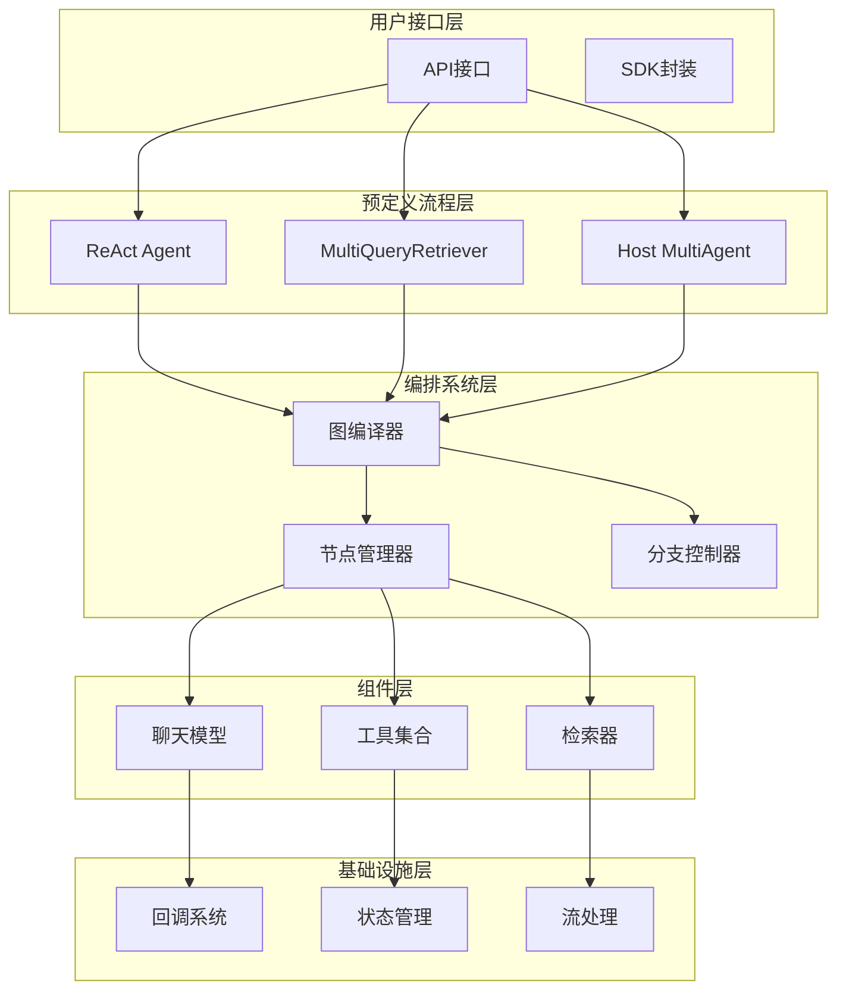

**图表来源**
- [adk/flow.go](file://adk/flow.go#L1-L50)
- [flow/agent/react/react.go](file://flow/agent/react/react.go#L1-L50)
- [flow/agent/multiagent/host/compose.go](file://flow/agent/multiagent/host/compose.go#L1-L50)

## ReAct Agent（思考-行动循环）

ReAct Agent实现了经典的"思考-行动"循环模式，这是现代AI代理的标准范式。它通过结合推理和工具调用来解决复杂问题。

### 设计原理

ReAct Agent基于以下核心理念设计：

1. **迭代推理**：通过多次思考-行动循环逐步解决问题
2. **工具集成**：无缝集成外部工具和API调用
3. **状态管理**：维护对话历史和当前状态
4. **流式处理**：支持实时响应和中断机制

### 核心组件架构

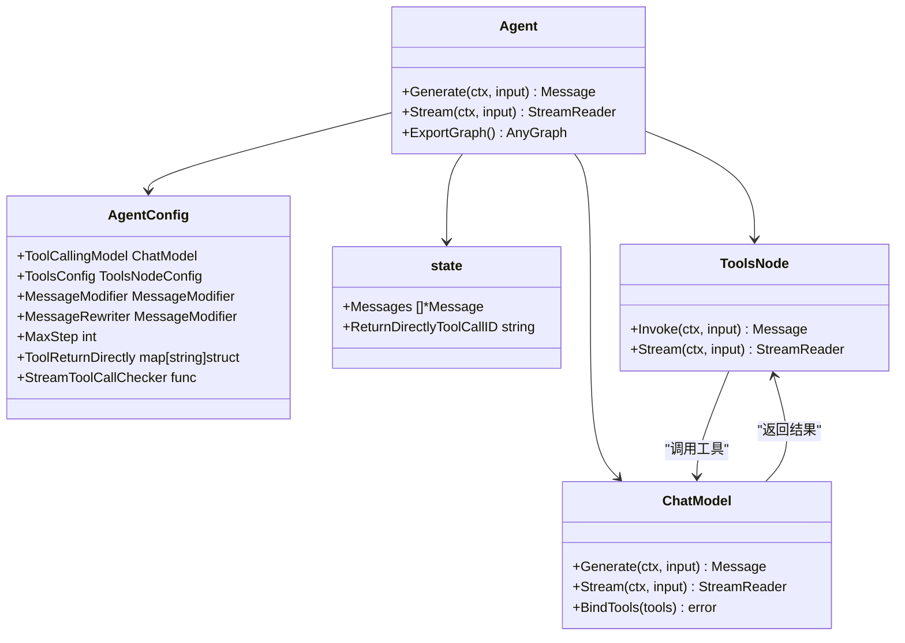

**图表来源**
- [flow/agent/react/react.go](file://flow/agent/react/react.go#L29-L42)
- [flow/agent/react/react.go](file://flow/agent/react/react.go#L47-L101)

### 实现细节

ReAct Agent的实现包含以下关键特性：

#### 1. 思考-行动循环机制

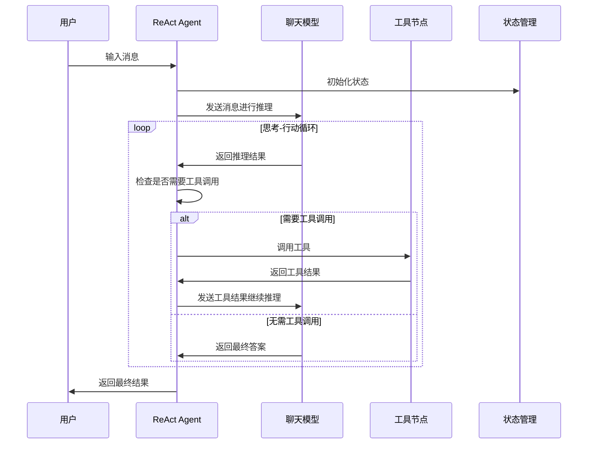

**图表来源**
- [flow/agent/react/react.go](file://flow/agent/react/react.go#L189-L301)
- [adk/react.go](file://adk/react.go#L121-L260)

#### 2. 流式处理支持

ReAct Agent支持流式处理，允许实时响应和中断：

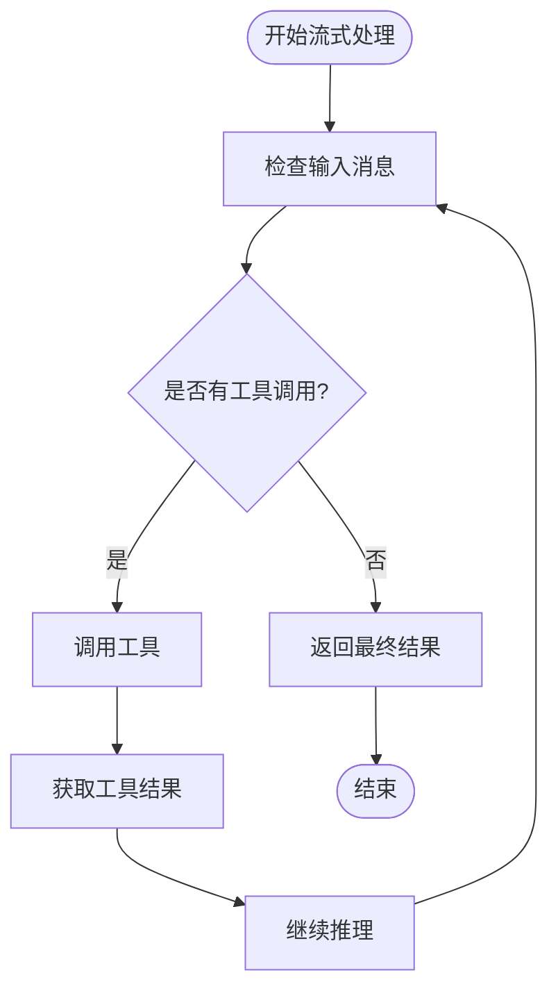

**图表来源**
- [flow/agent/react/react.go](file://flow/agent/react/react.go#L274-L280)
- [adk/react.go](file://adk/react.go#L195-L211)

#### 3. 配置选项详解

ReAct Agent提供了丰富的配置选项：

| 配置项 | 类型 | 描述 | 默认值 |
|--------|------|------|--------|
| ToolCallingModel | ToolCallingChatModel | 具备工具调用能力的聊天模型 | 必需 |
| ToolsConfig | ToolsNodeConfig | 工具配置 | 空配置 |
| MessageModifier | MessageModifier | 消息修改器 | 无 |
| MessageRewriter | MessageModifier | 消息重写器 | 无 |
| MaxStep | int | 最大执行步数 | 12 |
| ToolReturnDirectly | map[string]struct | 直接返回的工具列表 | 空映射 |
| StreamToolCallChecker | func | 流式工具调用检查器 | 第一块检查器 |

**节段来源**
- [flow/agent/react/react.go](file://flow/agent/react/react.go#L47-L101)
- [flow/agent/react/option.go](file://flow/agent/react/option.go#L32-L62)

### 使用方法

#### 基本用法

```go
// 创建ReAct Agent
agent, err := react.NewAgent(ctx, &react.AgentConfig{
    ToolCallingModel: myModel,
    ToolsConfig: compose.ToolsNodeConfig{
        Tools: []tool.BaseTool{myTool},
    },
    MaxStep: 20,
})

// 生成响应
result, err := agent.Generate(ctx, []*schema.Message{
    schema.UserMessage("请帮我查询天气并计算平均温度"),
})
```

#### 高级配置

```go
// 使用工具配置
toolOptions, err := react.WithTools(ctx, weatherTool, calculatorTool)
if err != nil {
    // 处理错误
}

// 创建带工具的Agent
agent, err := react.NewAgent(ctx, &react.AgentConfig{
    ToolCallingModel: myModel,
    MaxStep: 30,
    ToolReturnDirectly: map[string]struct{}{
        "weather_tool": {},
    },
})

// 使用工具选项
result, err := agent.Generate(ctx, messages, toolOptions...)
```

**节段来源**
- [flow/agent/react/react_test.go](file://flow/agent/react/react_test.go#L40-L128)
- [flow/agent/react/option.go](file://flow/agent/react/option.go#L64-L106)

## MultiQueryRetriever（多查询检索器）

MultiQueryRetriever是一个智能检索增强生成（RAG）组件，通过生成多个查询来提升检索效果。它解决了单一查询可能遗漏重要信息的问题。

### 设计原理

MultiQueryRetriever基于以下核心思想：

1. **查询多样性**：生成多个不同角度的查询来覆盖更多信息
2. **检索融合**：将多个检索结果合并为高质量的上下文
3. **并行处理**：同时执行多个检索任务以提高效率
4. **去重优化**：去除重复文档避免冗余

### 架构设计

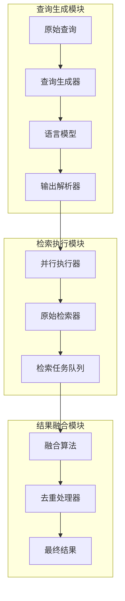

**图表来源**
- [flow/retriever/multiquery/multi_query.go](file://flow/retriever/multiquery/multi_query.go#L69-L127)

### 实现细节

#### 1. 查询生成策略

MultiQueryRetriever支持两种查询生成方式：

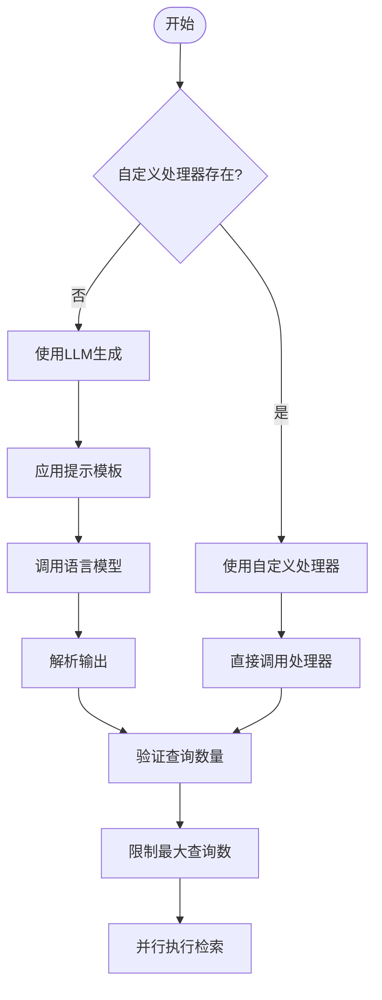

**图表来源**
- [flow/retriever/multiquery/multi_query.go](file://flow/retriever/multiquery/multi_query.go#L79-L106)

#### 2. 并行检索机制

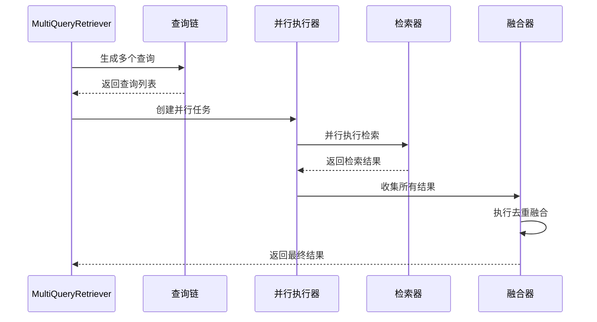

**图表来源**
- [flow/retriever/multiquery/multi_query.go](file://flow/retriever/multiquery/multi_query.go#L160-L194)

#### 3. 融合算法

默认的融合算法实现了简单的去重功能：

```go
var deduplicateFusion = func(ctx context.Context, docs [][]*schema.Document) ([]*schema.Document, error) {
    m := map[string]bool{}
    var ret []*schema.Document
    for i := range docs {
        for j := range docs[i] {
            if _, ok := m[docs[i][j].ID]; !ok {
                m[docs[i][j].ID] = true
                ret = append(ret, docs[i][j])
            }
        }
    }
    return ret, nil
}
```

### 使用方法

#### 基本用法

```go
// 创建MultiQueryRetriever
retriever := multiquery.NewRetriever(ctx, &multiquery.Config{
    RewriteLLM: myModel,
    OrigRetriever: myOriginalRetriever,
    MaxQueriesNum: 5,
})

// 执行检索
documents, err := retriever.Retrieve(ctx, "如何构建AI代理系统？")
```

#### 自定义查询生成

```go
// 使用自定义查询生成器
retriever := multiquery.NewRetriever(ctx, &multiquery.Config{
    RewriteHandler: func(ctx context.Context, query string) ([]string, error) {
        // 自定义查询生成逻辑
        return []string{
            query,
            "AI代理系统架构",
            "构建智能助手指南",
        }, nil
    },
    OrigRetriever: myRetriever,
})
```

**节段来源**
- [flow/retriever/multiquery/multi_query_test.go](file://flow/retriever/multiquery/multi_query_test.go#L70-L118)

## Host MultiAgent（主机多智能体）

Host MultiAgent实现了一个复杂的多智能体协作系统，其中主机智能体负责决策，专业智能体负责具体任务执行。

### 设计原理

Host MultiAgent基于以下核心概念：

1. **角色分离**：主机负责决策，专业智能体负责执行
2. **动态分配**：根据任务需求动态选择合适的专业智能体
3. **协作机制**：支持单个和多个专业智能体的协作
4. **总结功能**：对多个结果进行汇总和整合

### 架构设计

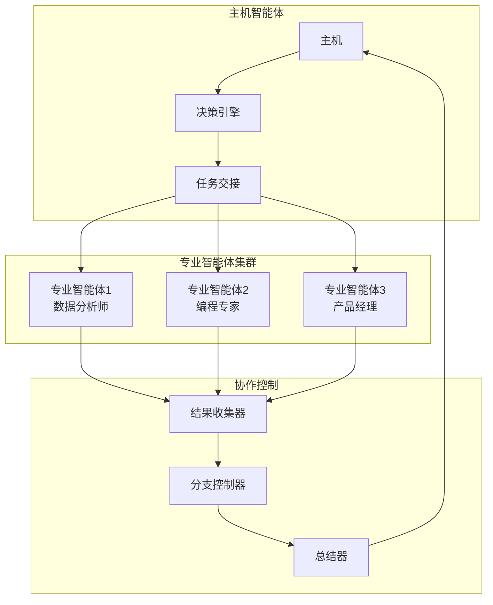

**图表来源**
- [flow/agent/multiagent/host/compose.go](file://flow/agent/multiagent/host/compose.go#L39-L151)

### 核心组件

#### 1. 主机智能体配置

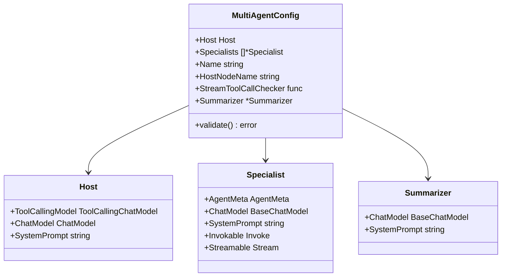

**图表来源**
- [flow/agent/multiagent/host/types.go](file://flow/agent/multiagent/host/types.go#L72-L175)

#### 2. 协作流程

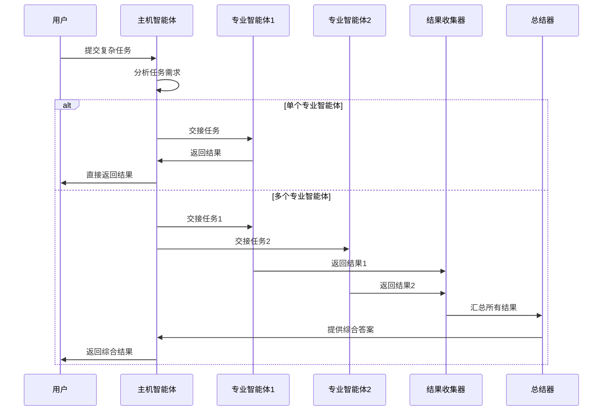

**图表来源**
- [flow/agent/multiagent/host/compose.go](file://flow/agent/multiagent/host/compose.go#L205-L241)

### 实现细节

#### 1. 动态任务分配

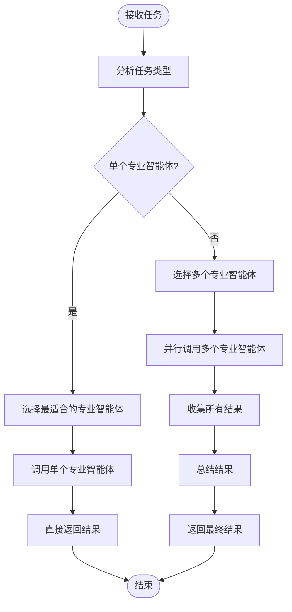

**图表来源**
- [flow/agent/multiagent/host/compose.go](file://flow/agent/multiagent/host/compose.go#L222-L241)

#### 2. 专业智能体类型

Host MultiAgent支持三种类型的专业智能体：

| 类型 | 特征 | 使用场景 |
|------|------|----------|
| ChatModel | 基于聊天模型的智能体 | 简单问答、信息查询 |
| Invokable | 可调用函数 | 特定业务逻辑处理 |
| Streamable | 流式响应智能体 | 长时间运行的任务 |

**节段来源**
- [flow/agent/multiagent/host/types.go](file://flow/agent/multiagent/host/types.go#L155-L169)

### 使用方法

#### 基本配置

```go
// 定义专业智能体
dataAnalyst := &host.Specialist{
    AgentMeta: host.AgentMeta{
        Name:        "data_analyst",
        IntendedUse: "数据分析和统计",
    },
    ChatModel: myDataAnalyzer,
    SystemPrompt: "你是一位专业的数据分析师，擅长处理各种统计和分析任务。",
}

programmer := &host.Specialist{
    AgentMeta: host.AgentMeta{
        Name:        "programmer",
        IntendedUse: "编程和软件开发",
    },
    Invokable: func(ctx context.Context, input []*schema.Message, opts ...agent.AgentOption) (*schema.Message, error) {
        // 编程逻辑实现
        return &schema.Message{
            Role:    schema.Assistant,
            Content: "这里是编程解决方案",
        }, nil
    },
}

// 创建主机多智能体
multiAgent, err := host.NewMultiAgent(ctx, &host.MultiAgentConfig{
    Host: host.Host{
        ToolCallingModel: hostModel,
    },
    Specialists: []*host.Specialist{
        dataAnalyst,
        programmer,
    },
})
```

#### 高级配置

```go
// 带总结器的多智能体
summarizer := &host.Summarizer{
    ChatModel: summaryModel,
    SystemPrompt: "你是一位专业的总结专家，能够将多个观点整合成清晰的结论。",
}

multiAgent, err := host.NewMultiAgent(ctx, &host.MultiAgentConfig{
    Host: host.Host{
        ToolCallingModel: hostModel,
        SystemPrompt: "作为团队负责人，你需要协调各个专业智能体完成复杂任务。",
    },
    Specialists: specialists,
    Summarizer: summarizer,
    MaxStep: 10,
})
```

**节段来源**
- [flow/agent/multiagent/host/compose_test.go](file://flow/agent/multiagent/host/compose_test.go#L36-L198)

## 底层编排系统

预定义流程都建立在Eino强大的编排系统之上，该系统提供了统一的工作流编排能力。

### 图编译器

图编译器是整个编排系统的核心，负责将抽象的流程定义转换为可执行的图结构：

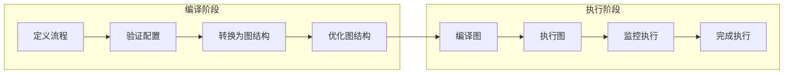

**图表来源**
- [adk/flow.go](file://adk/flow.go#L310-L320)

### 节点管理

编排系统支持多种类型的节点：

| 节点类型 | 功能描述 | 使用场景 |
|----------|----------|----------|
| ChatModelNode | 聊天模型节点 | 对话处理、推理计算 |
| ToolsNode | 工具节点 | 工具调用、API集成 |
| LambdaNode | 函数节点 | 数据转换、逻辑处理 |
| BranchNode | 分支节点 | 条件判断、流程控制 |
| PassthroughNode | 透传节点 | 数据传递、状态保持 |

### 状态管理

编排系统提供了完整的状态管理机制：

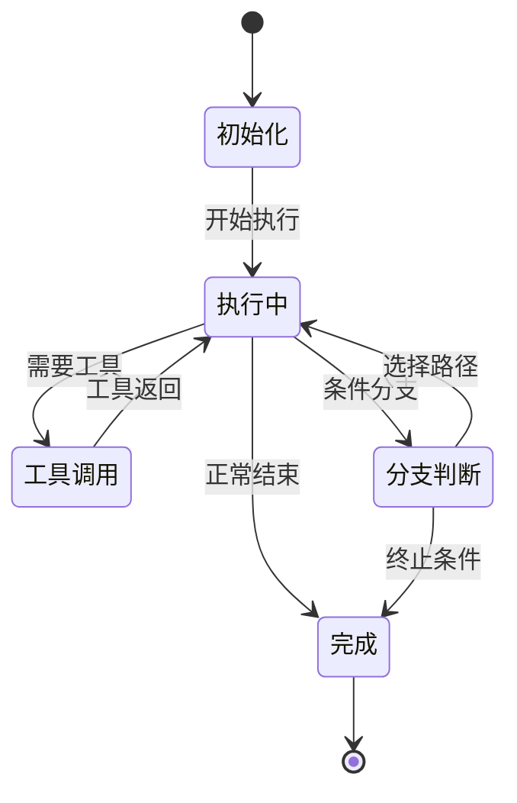

**节段来源**
- [adk/flow.go](file://adk/flow.go#L31-L40)

## 使用示例与最佳实践

### ReAct Agent最佳实践

#### 1. 工具集成模式

```go
// 创建工具
calculator := &CalculatorTool{}
weatherAPI := &WeatherAPITool{}

// 配置工具选项
toolOptions, err := react.WithTools(ctx, calculator, weatherAPI)
if err != nil {
    log.Fatalf("工具配置失败: %v", err)
}

// 创建Agent
agent, err := react.NewAgent(ctx, &react.AgentConfig{
    ToolCallingModel: model,
    MaxStep: 15,
    ToolReturnDirectly: map[string]struct{}{
        "calculator": {},
    },
})

// 使用工具
result, err := agent.Generate(ctx, messages, toolOptions...)
```

#### 2. 消息处理模式

```go
// 自定义消息修改器
messageModifier := func(ctx context.Context, input []*schema.Message) []*schema.Message {
    // 添加系统提示
    res := make([]*schema.Message, 0, len(input)+1)
    res = append(res, schema.SystemMessage("你是一个专业的助手，请提供准确的回答"))
    res = append(res, input...)
    return res
}

// 自定义消息重写器
messageRewriter := func(ctx context.Context, messages []*schema.Message) []*schema.Message {
    // 压缩历史记录以适应上下文窗口
    if len(messages) > 10 {
        return messages[len(messages)-10:]
    }
    return messages
}

agent, err := react.NewAgent(ctx, &react.AgentConfig{
    ToolCallingModel: model,
    MessageModifier: messageModifier,
    MessageRewriter: messageRewriter,
    MaxStep: 20,
})
```

### MultiQueryRetriever最佳实践

#### 1. 查询生成策略

```go
// 基于LLM的查询生成
retriever := multiquery.NewRetriever(ctx, &multiquery.Config{
    RewriteLLM: model,
    RewriteTemplate: prompt.FromMessages(
        schema.Jinja2,
        schema.UserMessage(`
            你是一个查询生成助手。
            你的任务是基于用户查询生成{{num_queries}}个不同的查询版本。
            目标是通过从不同角度生成文本来改进相似度搜索的性能。
            只提供生成的查询，并用换行符分隔。
            用户查询: {{query}}
        `),
    ),
    QueryVar: "query",
    LLMOutputParser: func(ctx context.Context, message *schema.Message) ([]string, error) {
        return strings.Split(message.Content, "\n"), nil
    },
    MaxQueriesNum: 5,
})

// 自定义查询生成
retriever := multiquery.NewRetriever(ctx, &multiquery.Config{
    RewriteHandler: func(ctx context.Context, query string) ([]string, error) {
        return []string{
            query,
            "关于" + query,
            query + "详细说明",
            "如何" + query,
            "解释" + query,
        }, nil
    },
    OrigRetriever: originalRetriever,
})
```

#### 2. 结果融合优化

```go
// 自定义融合算法
customFusion := func(ctx context.Context, docs [][]*schema.Document) ([]*schema.Document, error) {
    // 实现更复杂的融合逻辑
    // 例如：基于相似度重新排序、权重合并等
    return defaultFusion(ctx, docs)
}

retriever := multiquery.NewRetriever(ctx, &multiquery.Config{
    OrigRetriever: originalRetriever,
    FusionFunc: customFusion,
})
```

### Host MultiAgent最佳实践

#### 1. 专业智能体设计

```go
// 数据分析智能体
dataAnalyst := &host.Specialist{
    AgentMeta: host.AgentMeta{
        Name:        "data_analyst",
        IntendedUse: "数据分析、统计计算、可视化",
    },
    ChatModel: dataAnalysisModel,
    SystemPrompt: `
        你是一位专业的数据分析师。
        你的职责包括：
        - 分析数据趋势和模式
        - 执行统计测试
        - 创建数据可视化
        - 提供数据驱动的见解
    `,
}

// 编程智能体
programmer := &host.Specialist{
    AgentMeta: host.AgentMeta{
        Name:        "programmer",
        IntendedUse: "代码编写、调试、架构设计",
    },
    Invokable: func(ctx context.Context, input []*schema.Message, opts ...agent.AgentOption) (*schema.Message, error) {
        // 实现具体的编程逻辑
        return processProgrammingRequest(ctx, input)
    },
}

// 写作智能体
writer := &host.Specialist{
    AgentMeta: host.AgentMeta{
        Name:        "writer",
        IntendedUse: "内容创作、文案撰写、报告编写",
    },
    Streamable: func(ctx context.Context, input []*schema.Message, opts ...agent.AgentOption) (*schema.StreamReader[*schema.Message], error) {
        return createContentStream(ctx, input)
    },
}
```

#### 2. 主机智能体配置

```go
// 高级主机配置
hostAgent, err := host.NewMultiAgent(ctx, &host.MultiAgentConfig{
    Host: host.Host{
        ToolCallingModel: hostModel,
        SystemPrompt: `
            作为团队负责人，你的职责是：
            1. 分析用户需求
            2. 选择最适合的专业智能体
            3. 协调多个智能体的工作
            4. 提供最终的综合回答
            
            当需要多个智能体协作时，确保他们处理不同的子任务，
            并在完成后提供清晰的总结。
        `,
    },
    Specialists: []*host.Specialist{
        dataAnalyst,
        programmer,
        writer,
    },
    Summarizer: &host.Summarizer{
        ChatModel: summaryModel,
        SystemPrompt: `
            作为总结专家，你的任务是：
            - 整合多个专业智能体的结果
            - 提供清晰、连贯的最终答案
            - 突出关键信息和结论
            - 保持回答的专业性和准确性
        `,
    },
    MaxStep: 15,
    StreamToolCallChecker: customToolCallChecker,
})
```

## 性能优化与配置

### ReAct Agent性能优化

#### 1. 并发控制

```go
// 合理设置最大步数
agent, err := react.NewAgent(ctx, &react.AgentConfig{
    ToolCallingModel: model,
    MaxStep: 10, // 根据任务复杂度调整
})

// 使用工具直接返回减少不必要的步骤
agent, err := react.NewAgent(ctx, &react.AgentConfig{
    ToolCallingModel: model,
    ToolReturnDirectly: map[string]struct{}{
        "fast_calculator": {},  // 计算类工具直接返回
        "simple_lookup": {},   // 查找类工具直接返回
    },
})
```

#### 2. 内存优化

```go
// 使用消息重写器压缩历史
messageRewriter := func(ctx context.Context, messages []*schema.Message) []*schema.Message {
    // 保留最近的对话轮次
    const maxHistory = 8
    if len(messages) > maxHistory {
        return messages[len(messages)-maxHistory:]
    }
    return messages
}

agent, err := react.NewAgent(ctx, &react.AgentConfig{
    MessageRewriter: messageRewriter,
    MaxStep: 12,
})
```

### MultiQueryRetriever性能优化

#### 1. 查询数量控制

```go
// 根据资源限制调整查询数量
retriever := multiquery.NewRetriever(ctx, &multiquery.Config{
    RewriteLLM: model,
    OrigRetriever: retriever,
    MaxQueriesNum: 3, // 在质量和速度间平衡
})
```

#### 2. 并行度优化

```go
// 使用自定义并行执行器
type customParallelExecutor struct {
    concurrencyLimit int
}

func (e *customParallelExecutor) Execute(tasks []retrievalTask) [][]*schema.Document {
    // 实现自定义并发控制
    return defaultParallelExecution(tasks)
}
```

### Host MultiAgent性能优化

#### 1. 任务分配策略

```go
// 基于任务复杂度选择智能体
decisionStrategy := func(task string) []string {
    if strings.Contains(task, "数据分析") {
        return []string{"data_analyst"}
    } else if strings.Contains(task, "代码编写") {
        return []string{"programmer"}
    } else {
        return []string{"data_analyst", "programmer"} // 复杂任务需要协作
    }
}
```

#### 2. 资源管理

```go
// 设置合理的超时时间
context.WithTimeout(ctx, 30*time.Second)

// 监控资源使用情况
monitor := &ResourceMonitor{
    MaxMemory: 1024 * 1024 * 1024, // 1GB
    MaxDuration: 60 * time.Second,
}
```

## 故障排除指南

### 常见问题及解决方案

#### 1. ReAct Agent问题

**问题：工具调用失败**
```go
// 检查工具配置
toolOptions, err := react.WithTools(ctx, myTool)
if err != nil {
    log.Printf("工具配置错误: %v", err)
    // 尝试单独配置工具
    agent, err := react.NewAgent(ctx, &react.AgentConfig{
        ToolCallingModel: model,
        ToolsConfig: compose.ToolsNodeConfig{
            Tools: []tool.BaseTool{myTool},
        },
    })
}
```

**问题：流式处理中断**
```go
// 实现自定义工具调用检查器
customChecker := func(ctx context.Context, stream *schema.StreamReader[*schema.Message]) (bool, error) {
    defer stream.Close()
    // 实现更健壮的检查逻辑
    return robustToolCallDetection(stream)
}

agent, err := react.NewAgent(ctx, &react.AgentConfig{
    StreamToolCallChecker: customChecker,
})
```

#### 2. MultiQueryRetriever问题

**问题：查询生成质量差**
```go
// 检查提示模板
template := prompt.FromMessages(
    schema.Jinja2,
    schema.UserMessage(`
        你是一个查询生成专家。
        基于用户查询 "{{query}}"，生成 {{num_queries}} 个不同的查询版本。
        确保每个查询都有独特的视角和关键词。
    `),
)

// 或使用更复杂的生成策略
retriever := multiquery.NewRetriever(ctx, &multiquery.Config{
    RewriteHandler: func(ctx context.Context, query string) ([]string, error) {
        // 实现语义相似查询生成
        return generateSemanticallySimilarQueries(query)
    },
})
```

**问题：检索结果重复**
```go
// 自定义去重算法
customDedup := func(ctx context.Context, docs [][]*schema.Document) ([]*schema.Document, error) {
    // 实现基于语义相似度的去重
    return semanticDeduplication(docs)
}

retriever := multiquery.NewRetriever(ctx, &multiquery.Config{
    FusionFunc: customDedup,
})
```

#### 3. Host MultiAgent问题

**问题：任务分配不当**
```go
// 实现智能任务分析
taskAnalyzer := func(task string) TaskAnalysis {
    // 分析任务特征
    return TaskAnalysis{
        Complexity: assessComplexity(task),
        Type: identifyTaskType(task),
        RequiredSkills: determineRequiredSkills(task),
    }
}

// 基于分析结果选择智能体
selectedAgents := selectAppropriateAgents(analyzedTask)
```

**问题：协作效率低**
```go
// 实现任务分解
taskDecomposer := func(task string) []SubTask {
    // 将复杂任务分解为子任务
    return decomposeComplexTask(task)
}

// 并行执行子任务
parallelExecutor := func(subTasks []SubTask) []Result {
    // 并行执行分解的任务
    return executeSubTasksInParallel(subTasks)
}
```

### 调试技巧

#### 1. 启用详细日志

```go
// 使用消息未来功能获取详细信息
option, future := react.WithMessageFuture()

agent, err := react.NewAgent(ctx, &react.AgentConfig{
    ToolCallingModel: model,
    // 其他配置...
})

result, err := agent.Generate(ctx, messages, option)

// 异步获取消息
go func() {
    for {
        msg, hasNext, err := future.GetMessages().Next()
        if err != nil {
            log.Printf("获取消息错误: %v", err)
            break
        }
        if !hasNext {
            break
        }
        log.Printf("消息: %+v", msg)
    }
}()
```

#### 2. 监控执行过程

```go
// 实现回调监控
callback := &ExecutionMonitor{
    OnStart: func(info *callbacks.RunInfo) {
        log.Printf("开始执行: %s", info.Name)
    },
    OnEnd: func(info *callbacks.RunInfo, output callbacks.CallbackOutput) {
        log.Printf("执行完成: %s, 耗时: %v", info.Name, info.Duration)
    },
    OnError: func(info *callbacks.RunInfo, err error) {
        log.Printf("执行错误: %s, 错误: %v", info.Name, err)
    },
}

agent, err := react.NewAgent(ctx, &react.AgentConfig{
    // 配置...
})

result, err := agent.Generate(ctx, messages, 
    agent.WithComposeOptions(compose.WithCallbacks(callback)))
```

## 总结

Eino的预定义流程为开发者提供了强大而灵活的AI应用构建能力。通过ReAct Agent、MultiQueryRetriever和Host MultiAgent这三个核心流程，开发者可以快速构建复杂的AI应用程序。

### 关键优势

1. **开箱即用**：提供经过验证的最佳实践模式
2. **高度可配置**：支持深度定制和扩展
3. **性能优化**：内置多种性能优化策略
4. **易于集成**：与现有系统无缝集成

### 适用场景

- **智能客服**：ReAct Agent + 多查询检索
- **知识问答系统**：MultiQueryRetriever + RAG
- **复杂任务处理**：Host MultiAgent + 专业智能体
- **数据分析平台**：多智能体协作 + 专业分析

### 发展方向

随着AI技术的不断发展，预定义流程将继续演进：

1. **更智能的决策**：基于更大规模模型的更好决策能力
2. **更高效的协作**：更智能的任务分配和协作机制
3. **更强的适应性**：更好的自适应学习和优化能力
4. **更广的应用范围**：支持更多垂直领域的专门化流程

通过深入理解和合理运用这些预定义流程，开发者可以快速构建出功能强大、性能优异的AI应用程序，为用户提供卓越的体验。