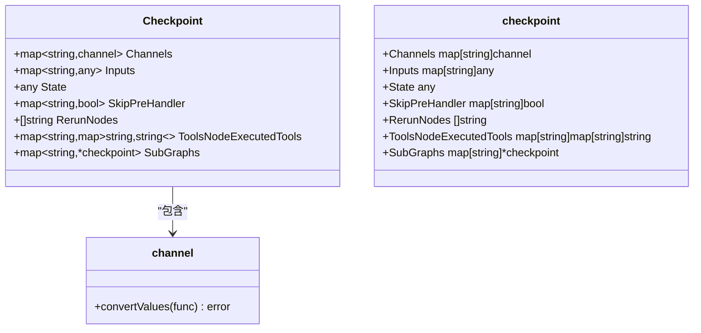
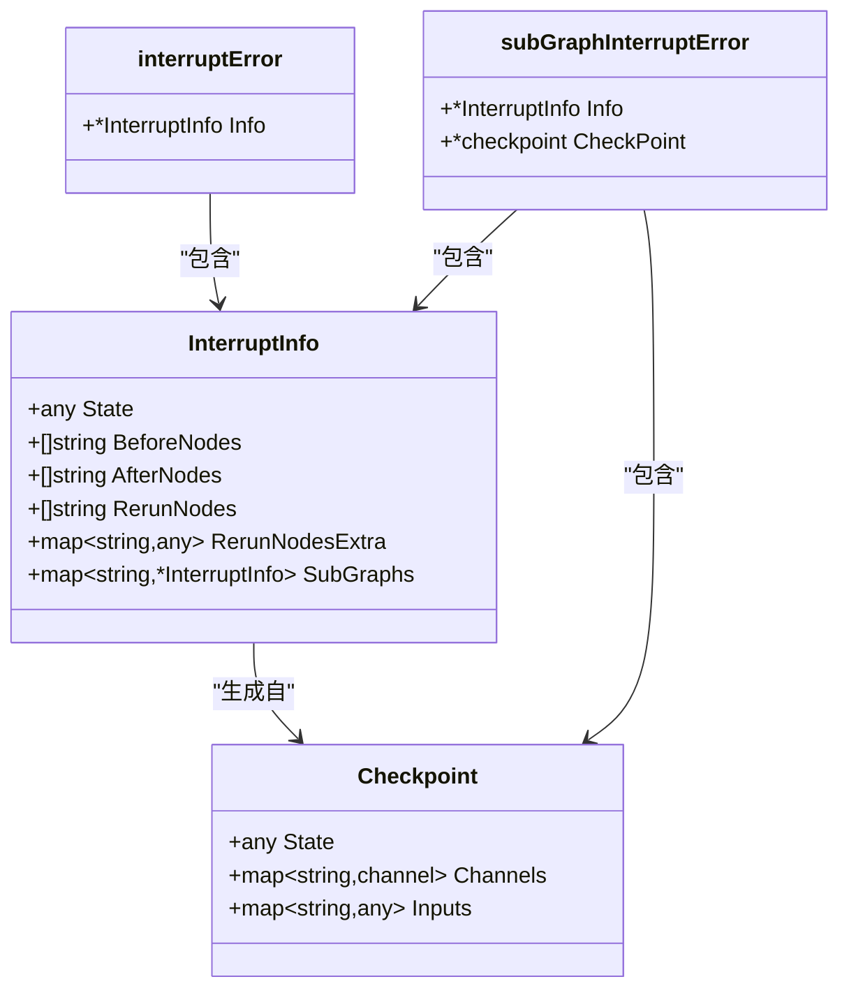
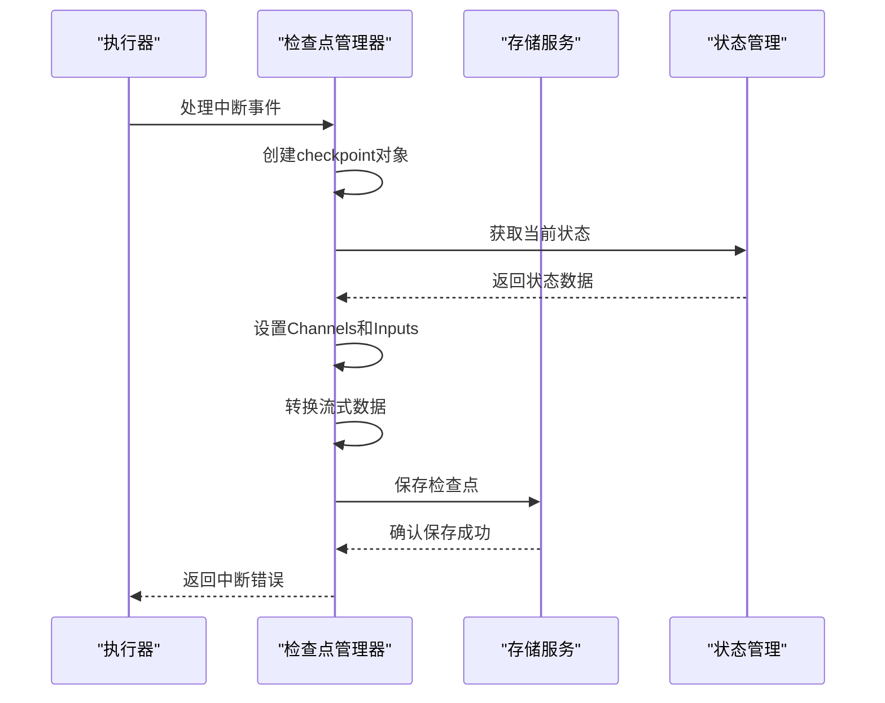
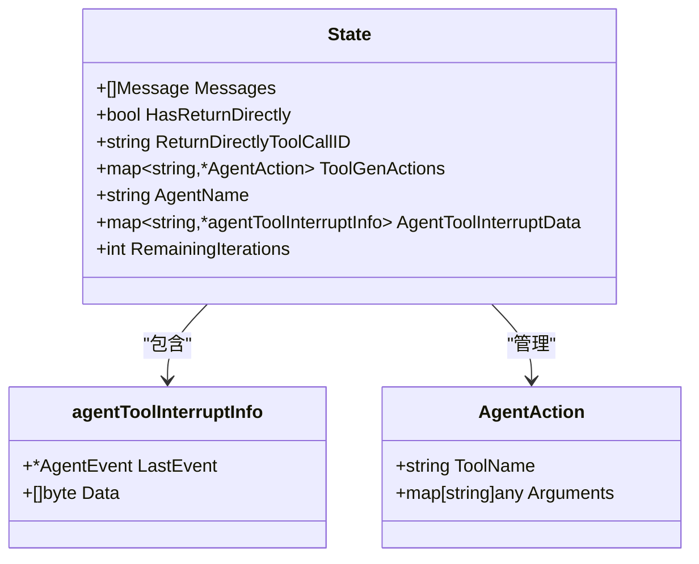
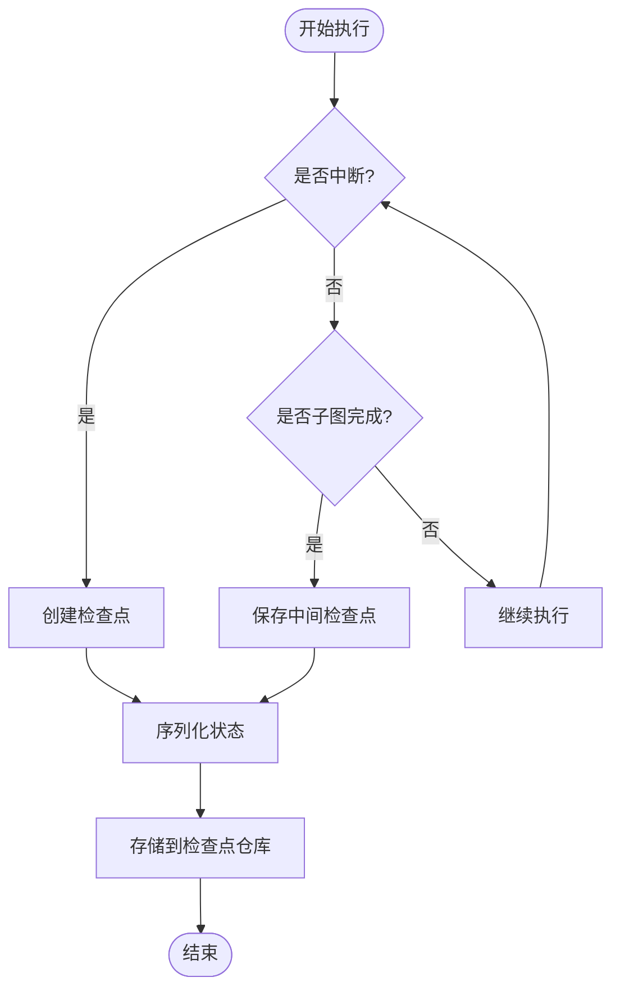
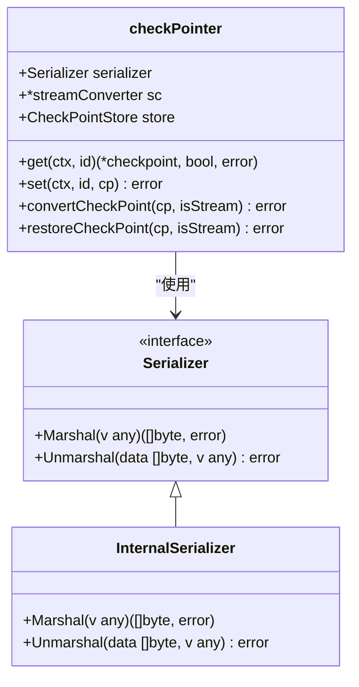
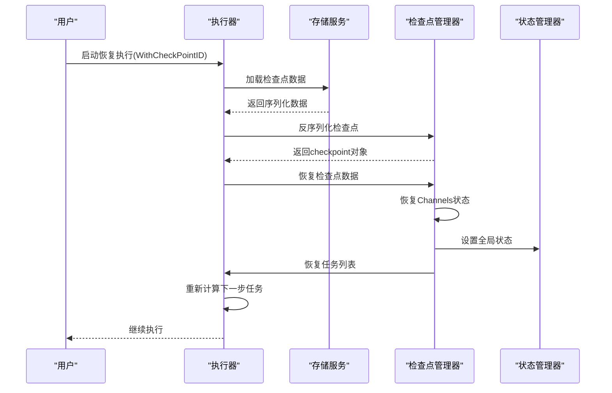
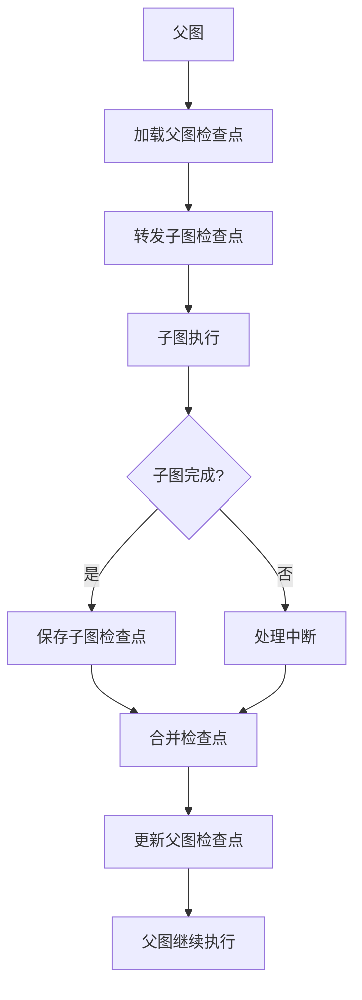

# 检查点与恢复机制

<cite>
**本文档引用的文件**
- [compose/checkpoint.go](file://compose/checkpoint.go)
- [compose/interrupt.go](file://compose/interrupt.go)
- [adk/react.go](file://adk/react.go)
- [compose/state.go](file://compose/state.go)
- [compose/graph_run.go](file://compose/graph_run.go)
- [compose/types.go](file://compose/types.go)
- [compose/checkpoint_test.go](file://compose/checkpoint_test.go)
</cite>

## 目录
1. [简介](#简介)
2. [检查点结构设计](#检查点结构设计)
3. [中断机制集成](#中断机制集成)
4. [ReAct Agent状态持久化](#react-agent状态持久化)
5. [检查点生成与保存](#检查点生成与保存)
6. [恢复机制实现](#恢复机制实现)
7. [API使用示例](#api使用示例)
8. [性能考虑与最佳实践](#性能考虑与最佳实践)
9. [应用场景](#应用场景)
10. [总结](#总结)

## 简介

Eino框架的检查点（Checkpoint）与执行恢复机制是其核心容错和长时运行能力的重要组成部分。该机制通过序列化当前执行状态，实现流程的持久化存储，并在需要时能够从中断点恢复执行，确保复杂工作流的可靠性和连续性。

检查点机制主要包含以下核心组件：
- **Checkpoint结构体**：负责序列化保存当前执行状态
- **InterruptInfo结构体**：保存中断时的状态快照
- **状态序列化管理**：处理可序列化类型注册和状态转换
- **恢复上下文传递**：在子图间传递检查点信息

## 检查点结构设计

### Checkpoint核心结构

`Checkpoint`结构体是整个检查点机制的核心数据结构，定义了需要保存的所有执行状态信息：



**图表来源**
- [compose/checkpoint.go](file://compose/checkpoint.go#L119-L128)

### State字段的序列化机制

`State`字段是检查点中最重要的部分，它保存了当前执行的全局状态。该字段的设计体现了以下特点：

1. **通用性设计**：使用`any`类型允许保存任意类型的用户状态
2. **序列化支持**：通过`schema.RegisterName`机制支持自定义类型的序列化
3. **状态隔离**：每个节点的状态独立保存，便于精确恢复

**章节来源**
- [compose/checkpoint.go](file://compose/checkpoint.go#L119-L128)

## 中断机制集成

### InterruptInfo与检查点的关系

中断机制与检查点系统紧密集成，通过`InterruptInfo`结构体保存中断时的状态快照：



**图表来源**
- [compose/interrupt.go](file://compose/interrupt.go#L63-L69)
- [compose/interrupt.go](file://compose/interrupt.go#L91-L113)

### 中断时的检查点生成

当发生中断时，系统会自动创建检查点来保存当前状态：



**图表来源**
- [compose/graph_run.go](file://compose/graph_run.go#L465-L511)

**章节来源**
- [compose/interrupt.go](file://compose/interrupt.go#L63-L69)
- [compose/graph_run.go](file://compose/graph_run.go#L465-L511)

## ReAct Agent状态持久化

### State结构体设计

ReAct Agent的迭代状态通过专门的`State`结构体进行持久化，特别关注迭代控制：



**图表来源**
- [adk/react.go](file://adk/react.go#L31-L44)

### 迭代状态的持久化

`RemainingIterations`字段是ReAct Agent状态持久化的关键，它控制着Agent的最大迭代次数：

1. **初始化**：根据配置设置最大迭代次数，默认为20次
2. **递减机制**：每次迭代完成后递减计数器
3. **终止条件**：当计数器为0时触发`ErrExceedMaxIterations`错误

**章节来源**
- [adk/react.go](file://adk/react.go#L31-L44)
- [adk/react.go](file://adk/react.go#L159-L161)

## 检查点生成与保存

### 检查点生成时机

检查点在以下情况下自动生成：

1. **中断发生时**：当执行过程中遇到中断信号
2. **子图完成时**：子图执行完成后保存中间状态
3. **手动触发**：通过API显式请求保存检查点



**图表来源**
- [compose/graph_run.go](file://compose/graph_run.go#L215-L226)
- [compose/graph_run.go](file://compose/graph_run.go#L329-L375)

### 序列化与反序列化

检查点系统使用统一的序列化机制处理不同类型的数据：



**图表来源**
- [compose/checkpoint.go](file://compose/checkpoint.go#L54-L57)
- [compose/checkpoint.go](file://compose/checkpoint.go#L200-L212)

**章节来源**
- [compose/graph_run.go](file://compose/graph_run.go#L465-L511)
- [compose/checkpoint.go](file://compose/checkpoint.go#L200-L212)

## 恢复机制实现

### 恢复流程

检查点恢复是一个复杂的多步骤过程，涉及状态重建、通道恢复和任务重放：



**图表来源**
- [compose/graph_run.go](file://compose/graph_run.go#L166-L188)
- [compose/graph_run.go](file://compose/graph_run.go#L366-L398)

### 子图检查点传递

在嵌套的子图结构中，检查点需要正确地在父子图之间传递：



**图表来源**
- [compose/checkpoint.go](file://compose/checkpoint.go#L188-L197)
- [compose/graph_run.go](file://compose/graph_run.go#L577-L603)

**章节来源**
- [compose/graph_run.go](file://compose/graph_run.go#L166-L188)
- [compose/graph_run.go](file://compose/graph_run.go#L366-L398)

## API使用示例

### 基本检查点操作

以下是检查点机制的基本API使用模式：

#### 创建检查点
```go
// 创建图形并启用检查点功能
g := compose.NewGraph[string, string](
    compose.WithGenLocalState(func(ctx context.Context) *MyState {
        return &MyState{Count: 0}
    }),
)

// 编译时启用检查点存储
runner, err := g.Compile(ctx, 
    compose.WithCheckPointStore(myStore),
    compose.WithInterruptAfterNodes([]string{"node1"}),
)

// 执行时保存检查点
result, err := runner.Invoke(ctx, input, 
    compose.WithCheckPointID("my-checkpoint-id"),
)
```

#### 加载检查点
```go
// 从检查点恢复执行
result, err := runner.Invoke(ctx, input,
    compose.WithCheckPointID("my-checkpoint-id"),
    compose.WithStateModifier(func(ctx context.Context, path compose.NodePath, state any) error {
        // 在恢复时修改状态
        currentState := state.(*MyState)
        currentState.Count = 42
        return nil
    }),
)
```

#### 强制新运行
```go
// 忽略现有检查点，强制从头开始
result, err := runner.Invoke(ctx, input,
    compose.WithCheckPointID("my-checkpoint-id"),
    compose.WithForceNewRun(),
)
```

### 高级恢复场景

#### 分离写入检查点ID
```go
// 从现有检查点加载，但保存到新的位置
result, err := runner.Invoke(ctx, input,
    compose.WithCheckPointID("existing-checkpoint"),
    compose.WithWriteToCheckPointID("new-checkpoint"),
)
```

#### 自定义状态修改器
```go
result, err := runner.Invoke(ctx, input,
    compose.WithCheckPointID("my-checkpoint"),
    compose.WithStateModifier(func(ctx context.Context, path compose.NodePath, state any) error {
        if len(path.path) == 0 { // 主图级别
            state.(*MyState).A = "modified-state"
        } else { // 子图级别
            state.(*MyState).B = "subgraph-state"
        }
        return nil
    }),
)
```

**章节来源**
- [compose/checkpoint.go](file://compose/checkpoint.go#L87-L117)
- [compose/checkpoint_test.go](file://compose/checkpoint_test.go#L61-L137)

## 性能考虑与最佳实践

### 性能开销分析

检查点机制虽然提供了强大的恢复能力，但也带来一定的性能开销：

1. **序列化成本**：大型状态对象的序列化可能消耗较多CPU时间
2. **存储开销**：频繁保存检查点会增加存储空间需求
3. **网络延迟**：分布式环境下的检查点同步可能引入延迟

### 数据一致性挑战

检查点系统面临的主要一致性挑战包括：

1. **并发访问**：多个执行实例同时访问同一检查点
2. **状态竞争**：不同节点对共享状态的竞争修改
3. **部分失败**：检查点保存过程中出现的不一致状态

### 最佳实践建议

#### 避免序列化的资源

```go
// ❌ 不推荐：在状态中保存不可序列化的资源
type BadState struct {
    Mutex sync.Mutex    // 不可序列化
    Conn  net.Conn      // 不可序列化
    Ctx   context.Context // 不可序列化
}

// ✅ 推荐：只保存可序列化的数据
type GoodState struct {
    Count int
    Data  map[string]string
    Config MyConfig
}
```

#### 检查点频率控制

```go
// 根据业务需求调整检查点保存频率
g := compose.NewGraph[string, string](
    compose.WithGenLocalState(func(ctx context.Context) *MyState {
        return &MyState{SaveFrequency: 10} // 每10个节点保存一次
    }),
)
```

#### 错误处理策略

```go
// 实现健壮的检查点恢复逻辑
func robustResume(ctx context.Context, runner *compose.Runner, checkpointID string) (result any, err error) {
    defer func() {
        if r := recover(); r != nil {
            // 处理恢复过程中的异常
            err = fmt.Errorf("recovery failed: %v", r)
        }
    }()
    
    return runner.Invoke(ctx, input, compose.WithCheckPointID(checkpointID))
}
```

**章节来源**
- [compose/checkpoint.go](file://compose/checkpoint.go#L34-L47)
- [compose/state.go](file://compose/state.go#L133-L141)

## 应用场景

### 长时运行任务

检查点机制特别适用于需要长时间运行的任务：

1. **批量数据处理**：处理大量数据时的断点续传
2. **机器学习训练**：模型训练过程中的检查点保存
3. **科学计算**：复杂算法的中间结果保存

### 容错处理

在分布式系统中，检查点提供了重要的容错能力：

1. **节点故障恢复**：单个节点失败后的状态恢复
2. **网络分区处理**：网络中断后的状态重建
3. **系统升级**：平滑的系统维护和升级过程

### 开发调试

检查点机制也为开发和调试提供了便利：

1. **状态检查**：随时查看执行过程中的状态
2. **问题重现**：快速定位和重现问题场景
3. **性能分析**：分析不同执行路径的性能特征

## 总结

Eino框架的检查点与恢复机制通过精心设计的架构，实现了复杂工作流的可靠执行和优雅恢复。该机制的核心优势包括：

1. **完整的状态捕获**：通过`Checkpoint`结构体保存所有必要的执行状态
2. **无缝的中断处理**：与中断机制深度集成，提供透明的恢复体验
3. **灵活的恢复选项**：支持多种恢复策略和状态修改机制
4. **良好的扩展性**：通过接口设计支持自定义存储和序列化方案

通过合理使用检查点机制，开发者可以构建更加可靠、可维护的复杂应用系统，特别是在需要长时间运行或处理关键业务流程的场景中。然而，在实际应用中也需要权衡性能开销和功能需求，选择合适的检查点策略。