# 状态处理机制

<cite>
**本文档引用的文件**
- [compose/state.go](file://compose/state.go)
- [adk/react.go](file://adk/react.go)
- [adk/call_option.go](file://adk/call_option.go)
- [compose/graph_add_node_options.go](file://compose/graph_add_node_options.go)
- [compose/times.go](file://compose/times.go)
- [compose/utils.go](file://compose/utils.go)
- [flow/agent/react/react.go](file://flow/agent/react/react.go)
- [compose/state_test.go](file://compose/state_test.go)
</cite>

## 目录
1. [简介](#简介)
2. [核心接口设计](#核心接口设计)
3. [内部架构分析](#内部架构分析)
4. [状态处理器详解](#状态处理器详解)
5. [并发安全机制](#并发安全机制)
6. [ReAct Agent中的应用](#react-agent中的应用)
7. [配置选项与使用](#配置选项与使用)
8. [最佳实践与调试](#最佳实践与调试)
9. [总结](#总结)

## 简介

Eino框架的状态处理机制是一个精心设计的系统，用于在图节点执行前后安全地传递和操作共享状态。该机制通过泛型接口、并发控制和类型安全的设计，为复杂的异步工作流提供了强大的状态管理能力。

核心特性包括：
- 泛型状态处理器接口
- 并发安全的状态访问
- 类型安全的状态验证
- 流式处理支持
- 自动错误处理

## 核心接口设计

### StatePreHandler 和 StatePostHandler 接口

框架定义了两个核心状态处理器接口，分别在节点执行前后调用：

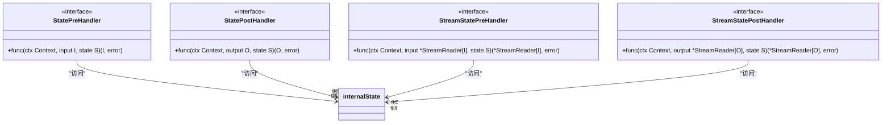

**图表来源**
- [compose/state.go](file://compose/state.go#L39-L51)

这些接口的设计遵循以下原则：
- **泛型支持**：支持任意输入输出类型和状态类型
- **上下文感知**：接收完整的Context以便访问会话信息
- **错误处理**：统一的错误返回机制
- **流式支持**：专门的流处理器处理异步数据流

**章节来源**
- [compose/state.go](file://compose/state.go#L39-L51)

### 内部状态结构

框架使用`internalState`结构体封装实际状态数据：

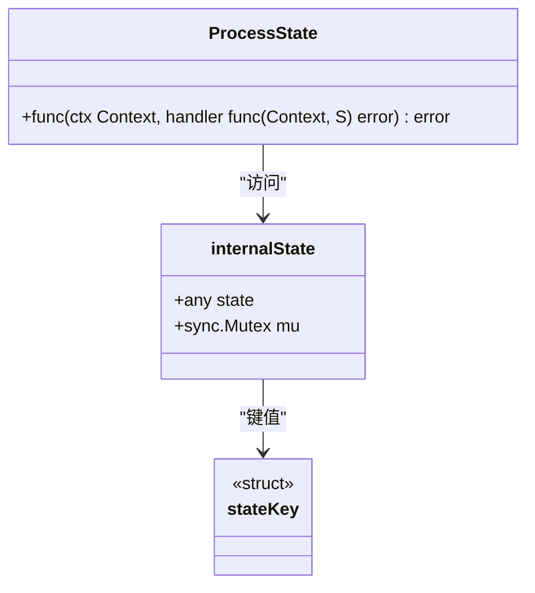

**图表来源**
- [compose/state.go](file://compose/state.go#L34-L37)

**章节来源**
- [compose/state.go](file://compose/state.go#L34-L37)

## 内部架构分析

### 状态获取机制

状态获取过程通过`getState`函数实现，该函数负责从Context中提取并验证状态：

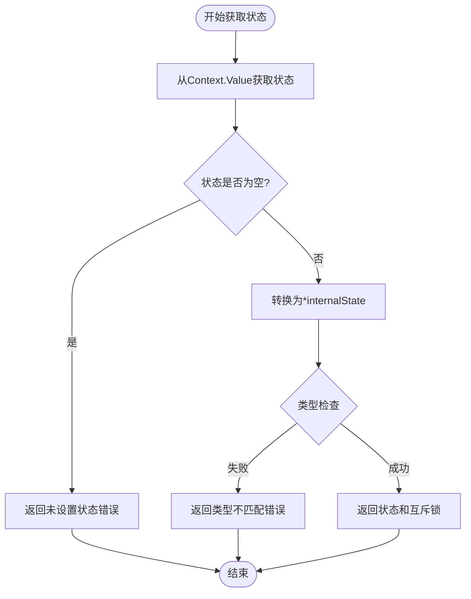

**图表来源**
- [compose/state.go](file://compose/state.go#L143-L161)

### 转换器模式

框架使用转换器模式将通用处理器转换为可执行的节点处理器：

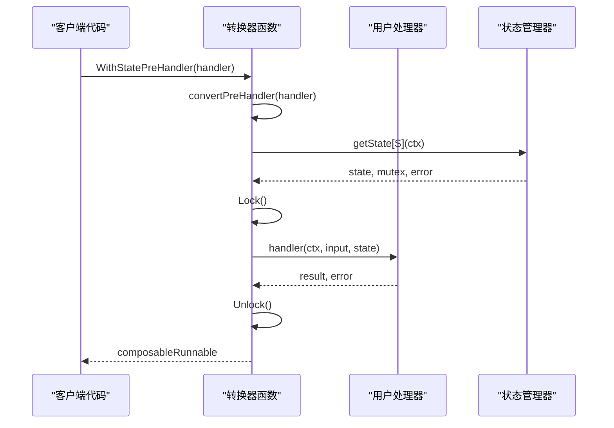

**图表来源**
- [compose/state.go](file://compose/state.go#L53-L81)

**章节来源**
- [compose/state.go](file://compose/state.go#L53-L81)

## 状态处理器详解

### ProcessState 函数

`ProcessState`是框架提供的核心API，用于安全地访问和修改状态：

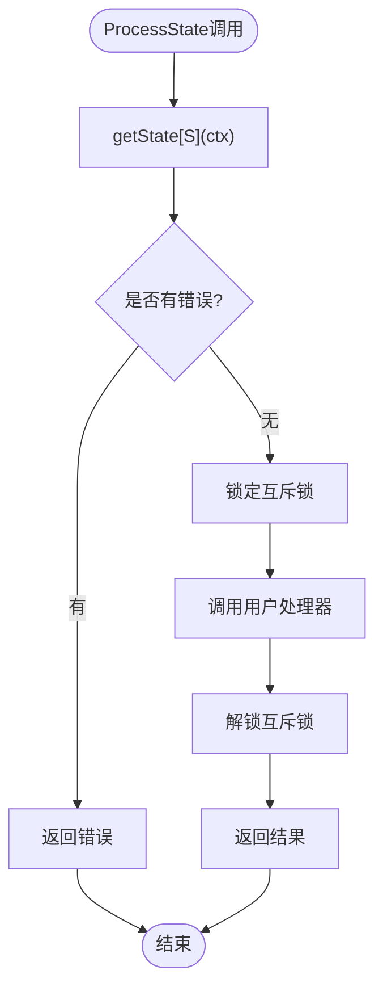

**图表来源**
- [compose/state.go](file://compose/state.go#L133-L141)

该函数的设计特点：
- **自动锁定**：自动管理互斥锁的获取和释放
- **类型安全**：编译时类型检查确保状态类型正确
- **错误传播**：透明地处理各种错误情况
- **资源清理**：保证即使发生错误也能正确释放资源

**章节来源**
- [compose/state.go](file://compose/state.go#L113-L141)

### 流式状态处理器

对于流式处理，框架提供了专门的处理器类型：

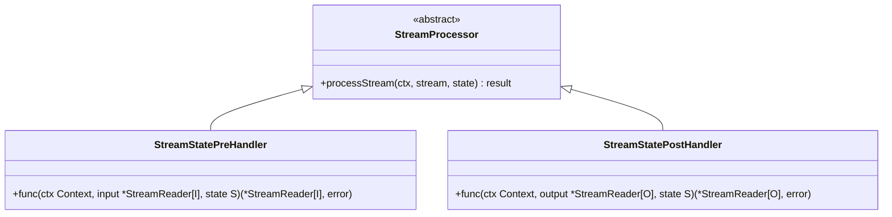

**图表来源**
- [compose/state.go](file://compose/state.go#L47-L51)

**章节来源**
- [compose/state.go](file://compose/state.go#L47-L51)

## 并发安全机制

### Mutex 锁机制

框架通过`sync.Mutex`确保状态修改的线程安全：

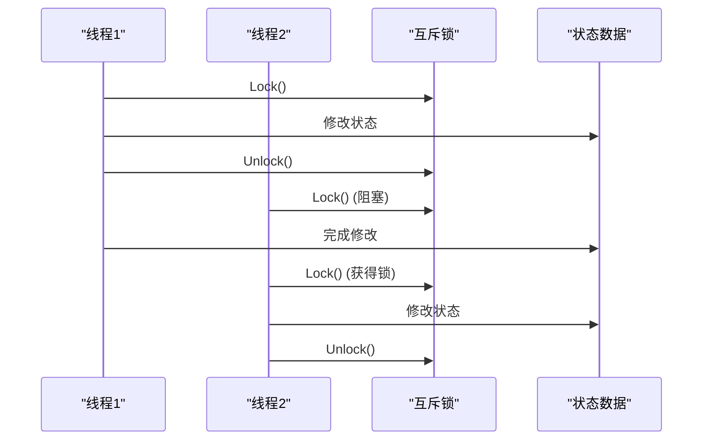

**图表来源**
- [compose/state.go](file://compose/state.go#L138-L140)

### 避免竞态条件

框架通过以下机制避免竞态条件：

1. **单一入口点**：所有状态访问都通过`ProcessState`函数
2. **自动锁定**：每次访问自动获取和释放锁
3. **类型检查**：编译时确保类型安全
4. **错误处理**：清晰的错误传播机制

**章节来源**
- [compose/state.go](file://compose/state.go#L133-L141)

## ReAct Agent中的应用

### State 结构体设计

ReAct Agent使用专门的状态结构体管理对话历史和工具调用：

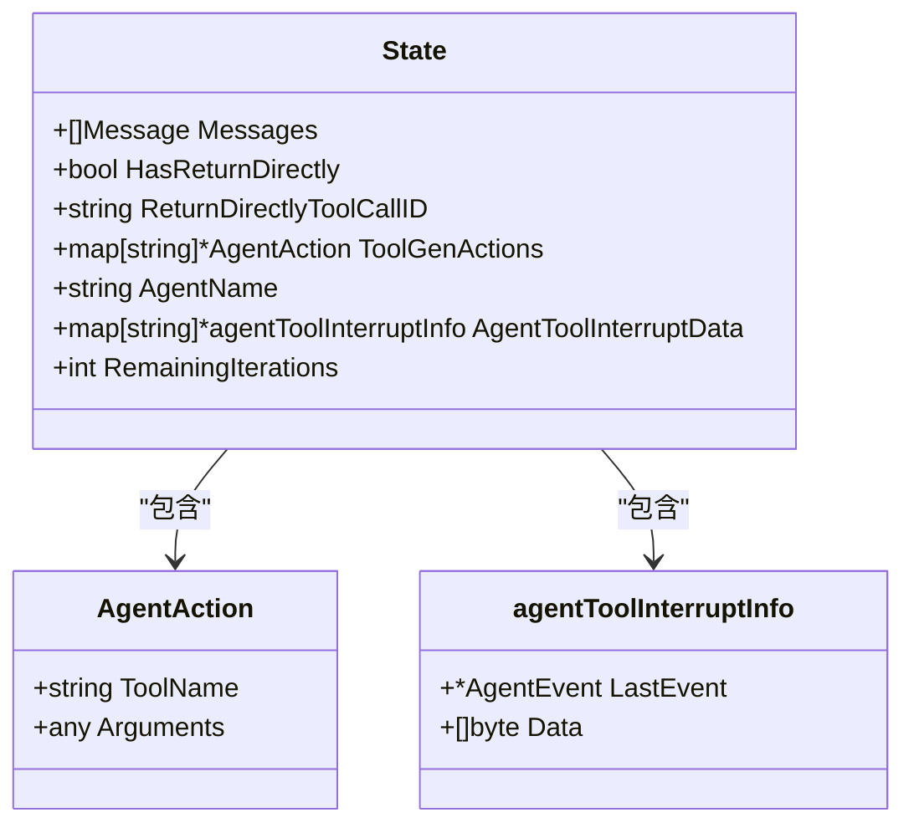

**图表来源**
- [adk/react.go](file://adk/react.go#L31-L44)

### 状态字段详解

| 字段名 | 类型 | 用途 | 更新时机 |
|--------|------|------|----------|
| Messages | []Message | 对话历史记录 | 模型预处理器 |
| HasReturnDirectly | bool | 是否直接返回标志 | 工具节点预处理器 |
| ReturnDirectlyToolCallID | string | 直接返回的工具调用ID | 工具节点预处理器 |
| ToolGenActions | map[string]*AgentAction | 生成的工具动作 | 工具生成处理器 |
| AgentName | string | 代理名称 | 初始化时设置 |
| AgentToolInterruptData | map[string]*agentToolInterruptInfo | 工具中断数据 | 工具执行期间 |
| RemainingIterations | int | 剩余迭代次数 | 模型预处理器 |

**章节来源**
- [adk/react.go](file://adk/react.go#L31-L44)

### 实际使用示例

在ReAct Agent中，状态处理器的典型使用模式：

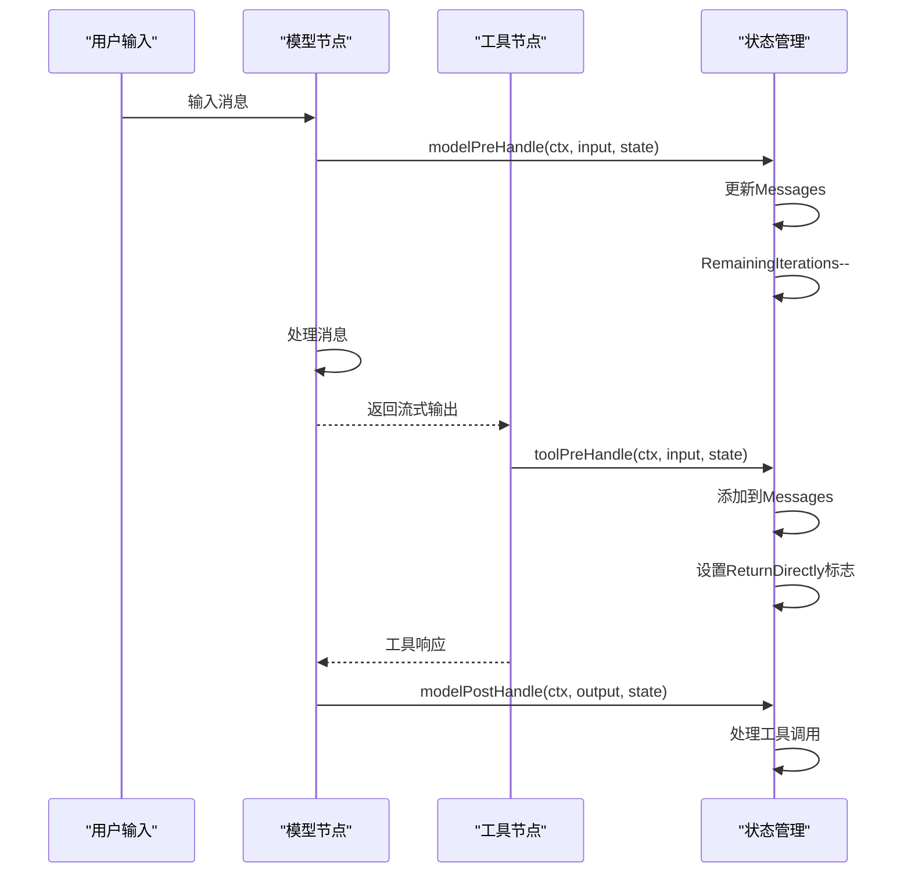

**图表来源**
- [adk/react.go](file://adk/react.go#L158-L210)

**章节来源**
- [adk/react.go](file://adk/react.go#L158-L210)

## 配置选项与使用

### WithStatePreHandler 配置

配置节点执行前的状态处理器：

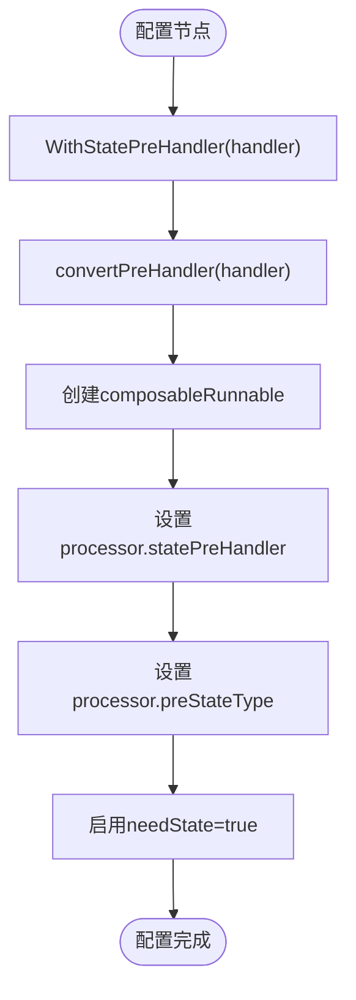

**图表来源**
- [compose/graph_add_node_options.go](file://compose/graph_add_node_options.go#L95-L103)

### WithStatePostHandler 配置

配置节点执行后的状态处理器：

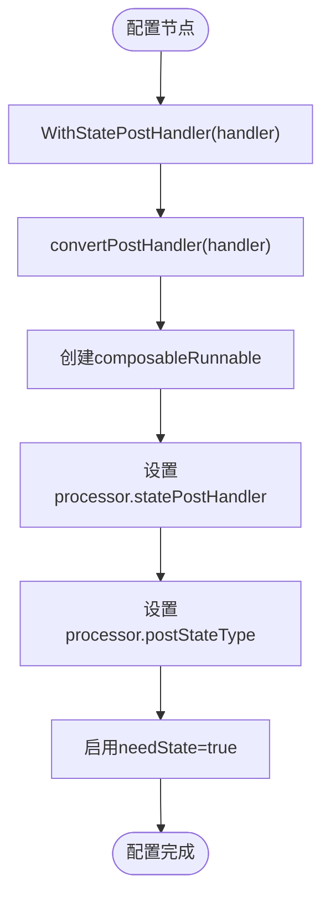

**图表来源**
- [compose/graph_add_node_options.go](file://compose/graph_add_node_options.go#L109-L117)

### 使用示例代码

以下是完整的状态处理器配置示例：

```go
// 定义状态结构体
type MyState struct {
    Count int
    Data  map[string]string
}

// 创建图并配置状态处理器
graph := compose.NewGraph[string, string](compose.WithGenLocalState(func(ctx context.Context) *MyState {
    return &MyState{
        Count: 0,
        Data:  make(map[string]string),
    }
}))

// 配置预处理器
preHandler := func(ctx context.Context, input string, state *MyState) (string, error) {
    state.Count++
    state.Data["last_input"] = input
    return input, nil
}

// 配置后处理器
postHandler := func(ctx context.Context, output string, state *MyState) (string, error) {
    state.Data["last_output"] = output
    return output, nil
}

// 添加节点并应用状态处理器
graph.AddLambdaNode("node1", lambdaFunc,
    compose.WithStatePreHandler(preHandler),
    compose.WithStatePostHandler(postHandler))
```

**章节来源**
- [compose/graph_add_node_options.go](file://compose/graph_add_node_options.go#L83-L131)

## 最佳实践与调试

### 常见并发错误

1. **忘记锁定**：直接访问状态而不使用`ProcessState`
2. **类型不匹配**：处理器签名与状态类型不一致
3. **死锁风险**：在处理器中进行长时间阻塞操作
4. **竞态条件**：多个处理器同时修改同一状态

### 调试建议

1. **使用日志**：在状态处理器中添加详细的日志记录
2. **类型检查**：利用编译器的类型检查功能
3. **单元测试**：为状态处理器编写专门的测试
4. **并发测试**：使用race detector检测竞态条件

### 性能优化

1. **最小化锁定时间**：尽快释放互斥锁
2. **批量操作**：合并多个状态修改操作
3. **避免深度嵌套**：减少处理器间的依赖关系
4. **内存管理**：及时清理不需要的状态数据

**章节来源**
- [compose/state_test.go](file://compose/state_test.go#L171-L330)

## 总结

Eino框架的状态处理机制通过精心设计的接口和并发控制，为复杂的异步工作流提供了强大而安全的状态管理能力。其主要优势包括：

1. **类型安全**：编译时类型检查确保状态一致性
2. **并发安全**：自动化的锁机制防止竞态条件
3. **灵活配置**：丰富的配置选项适应不同场景
4. **性能优化**：高效的实现减少不必要的开销
5. **易于使用**：简洁的API降低学习成本

该机制特别适用于需要维护复杂状态的工作流系统，如ReAct Agent、多步骤推理链和流式处理管道。通过合理使用状态处理器，开发者可以构建出既高效又可靠的异步应用程序。