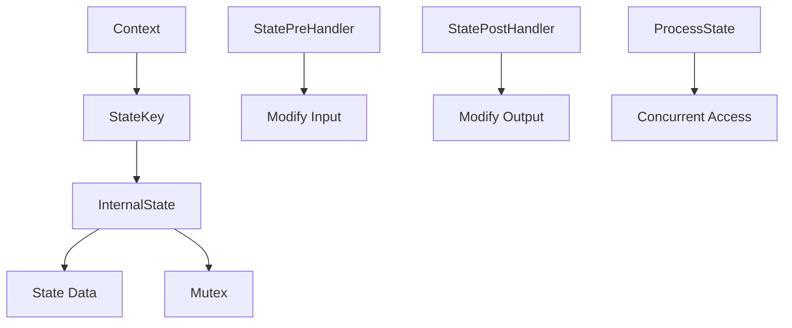

# 状态管理

<cite>
**本文档引用的文件**
- [compose/state.go](file://compose/state.go)
- [adk/react.go](file://adk/react.go)
- [compose/checkpoint.go](file://compose/checkpoint.go)
- [compose/graph.go](file://compose/graph.go)
- [compose/graph_add_node_options.go](file://compose/graph_add_node_options.go)
</cite>

## 目录
1. [引言](#引言)
2. [状态管理核心设计](#状态管理核心设计)
3. [状态接口与函数详解](#状态接口与函数详解)
4. [内部状态实现与并发安全](#内部状态实现与并发安全)
5. [ReAct Agent中的状态应用](#react-agent中的状态应用)
6. [检查点机制与状态持久化](#检查点机制与状态持久化)
7. [状态处理器配置与最佳实践](#状态处理器配置与最佳实践)
8. [总结](#总结)

## 引言
Eino框架提供了一套完整的状态管理机制，用于在复杂的执行流程中安全地传递和修改共享状态。该机制基于`context.Context`实现，通过类型安全的接口和并发保护确保状态操作的正确性。本文档将深入分析`compose/state.go`中的核心接口和函数，探讨`internalState`结构体和`stateKey`类型如何实现状态的封装与并发安全，并结合`adk/react.go`中的`State`结构体说明在ReAct Agent等复杂流程中的具体应用。

## 状态管理核心设计

Eino框架的状态管理机制围绕`context.Context`构建，通过将状态存储在上下文中实现跨组件的安全传递。该设计确保了状态的类型安全和并发安全，同时提供了灵活的接口供开发者在执行流程的各个阶段访问和修改状态。



**图源**
- [compose/state.go](file://compose/state.go#L32-L37)
- [compose/state.go](file://compose/state.go#L39-L45)

## 状态接口与函数详解

### StatePreHandler 与 StatePostHandler

`StatePreHandler`和`StatePostHandler`是Eino框架中用于在节点执行前后处理状态的核心接口。`StatePreHandler`在节点执行前被调用，允许根据当前状态修改输入数据或更新状态本身；`StatePostHandler`在节点执行后被调用，可用于根据输出结果更新状态或转换输出数据。

```go
type StatePreHandler[I, S any] func(ctx context.Context, in I, state S) (I, error)
type StatePostHandler[O, S any] func(ctx context.Context, out O, state S) (O, error)
```

这些处理器通过`WithStatePreHandler`和`WithStatePostHandler`选项配置到图的节点上，确保在执行流程中自动调用。处理器函数在调用时会获得对状态的独占访问权，通过内部的互斥锁保证并发安全。

**节源**
- [compose/state.go](file://compose/state.go#L39-L45)
- [compose/graph_add_node_options.go](file://compose/graph_add_node_options.go#L83-L110)

### ProcessState 函数

`ProcessState`是推荐的访问和修改状态的方式，它提供了一个安全的闭包执行环境。该函数接收一个处理函数，该函数在执行时会获得对状态的独占访问权，确保所有状态修改都是线程安全的。

```go
func ProcessState[S any](ctx context.Context, handler func(context.Context, S) error) error
```

使用`ProcessState`可以避免直接操作状态可能带来的竞态条件，是自定义节点中访问和修改状态的首选方法。

**节源**
- [compose/state.go](file://compose/state.go#L113-L141)

## 内部状态实现与并发安全

### internalState 结构体

`internalState`结构体是Eino框架状态管理的内部实现，它封装了实际的状态数据和用于保护并发访问的互斥锁。该结构体不直接暴露给用户，而是通过`context.Context`的值存储机制进行管理。

```go
type internalState struct {
    state any
    mu    sync.Mutex
}
```

通过将`internalState`实例存储在`context.Context`中，Eino框架实现了状态的跨组件传递，同时利用`sync.Mutex`确保了对状态数据的并发访问安全。

**节源**
- [compose/state.go](file://compose/state.go#L34-L37)

### stateKey 类型

`stateKey`是一个空结构体，用作在`context.Context`中存储和检索状态的键。由于其零内存占用和唯一性，`stateKey`是理想的上下文键类型，确保了状态存储的安全性和效率。

```go
type stateKey struct{}
```

通过使用私有的`stateKey`类型，Eino框架防止了外部代码意外修改或访问状态数据，增强了状态管理的安全性。

**节源**
- [compose/state.go](file://compose/state.go#L32)

## ReAct Agent中的状态应用

### State 结构体

在`adk/react.go`中定义的`State`结构体是ReAct Agent执行流程中的核心状态容器。它包含了代理的对话历史、工具调用动作、剩余迭代次数等关键信息。

```go
type State struct {
    Messages []Message
    HasReturnDirectly        bool
    ReturnDirectlyToolCallID string
    ToolGenActions map[string]*AgentAction
    AgentName string
    AgentToolInterruptData map[string]*agentToolInterruptInfo
    RemainingIterations int
}
```

该结构体作为ReAct Agent执行流程的共享状态，贯穿于整个对话和决策过程，确保了代理行为的一致性和可追溯性。

**节源**
- [adk/react.go](file://adk/react.go#L31-L44)

### 状态字段用途

- **Messages**: 存储代理的对话历史，包括用户输入和代理响应，用于维护对话上下文。
- **ToolGenActions**: 存储生成的工具调用动作，供后续执行和处理。
- **RemainingIterations**: 控制代理的最大迭代次数，防止无限循环。

这些字段通过`ProcessState`函数在执行流程中被安全地访问和修改，确保了ReAct Agent行为的正确性和可靠性。

**节源**
- [adk/react.go](file://adk/react.go#L32-L43)

## 检查点机制与状态持久化

### 检查点与状态结合

Eino框架的检查点机制与状态管理紧密结合，实现了执行流程的持久化和恢复。通过`WithCheckPointID`和`WithCheckPointStore`等选项，可以将当前执行状态序列化并存储到外部存储中，以便在后续恢复执行。

```go
func WithCheckPointID(checkPointID string) Option
func WithCheckPointStore(store CheckPointStore) GraphCompileOption
```

当执行流程被中断时，可以通过检查点ID恢复到上次保存的状态，继续执行未完成的任务，这对于长时间运行的代理流程尤为重要。

**节源**
- [compose/checkpoint.go](file://compose/checkpoint.go#L88-L92)
- [compose/checkpoint.go](file://compose/checkpoint.go#L59-L63)

### CheckPointStore 接口

`CheckPointStore`接口定义了检查点数据的存储和检索方法，允许开发者根据需要实现不同的存储后端，如内存、文件系统或数据库。

```go
type CheckPointStore interface {
    Get(ctx context.Context, checkPointID string) ([]byte, bool, error)
    Set(ctx context.Context, checkPointID string, checkPoint []byte) error
}
```

通过实现`CheckPointStore`接口，可以灵活地选择最适合应用需求的持久化策略。

**节源**
- [compose/checkpoint.go](file://compose/checkpoint.go#L49-L52)

## 状态处理器配置与最佳实践

### 配置状态处理器

在`Graph`中使用`WithStatePreHandler`等选项可以方便地配置状态处理器。这些选项允许在节点执行前后插入自定义逻辑，以根据状态修改输入输出或更新状态本身。

```go
g.AddLambdaNode("node_name", lambdaFunc, 
    WithStatePreHandler(preHandler), 
    WithStatePostHandler(postHandler))
```

通过合理配置状态处理器，可以实现复杂的业务逻辑，如输入验证、输出转换和状态更新。

**节源**
- [compose/graph_add_node_options.go](file://compose/graph_add_node_options.go#L83-L110)

### 最佳实践与常见陷阱

- **并发安全**: 始终使用`ProcessState`或状态处理器来访问和修改状态，避免直接操作状态数据。
- **类型安全**: 确保状态处理器的类型与图的状态类型匹配，避免运行时类型错误。
- **性能考虑**: 避免在状态处理器中执行耗时操作，以免影响整体执行性能。
- **错误处理**: 在状态处理器中妥善处理错误，避免因单个节点的失败导致整个流程中断。

遵循这些最佳实践可以确保状态管理的正确性和高效性，提升应用的稳定性和可维护性。

**节源**
- [compose/state_test.go](file://compose/state_test.go#L171-L222)
- [compose/graph_test.go](file://compose/graph_test.go#L1608-L1668)

## 总结
Eino框架的状态管理机制通过`context.Context`、`internalState`和`stateKey`等核心组件，实现了安全、高效的状态传递和修改。`StatePreHandler`、`StatePostHandler`和`ProcessState`等接口和函数提供了灵活的编程模型，支持在执行流程的各个阶段安全地访问和修改状态。结合`adk/react.go`中的`State`结构体和检查点机制，Eino框架为构建复杂的代理和工作流应用提供了强大的状态管理能力。通过遵循最佳实践，开发者可以充分利用这一机制，构建出健壮、可靠的AI应用。