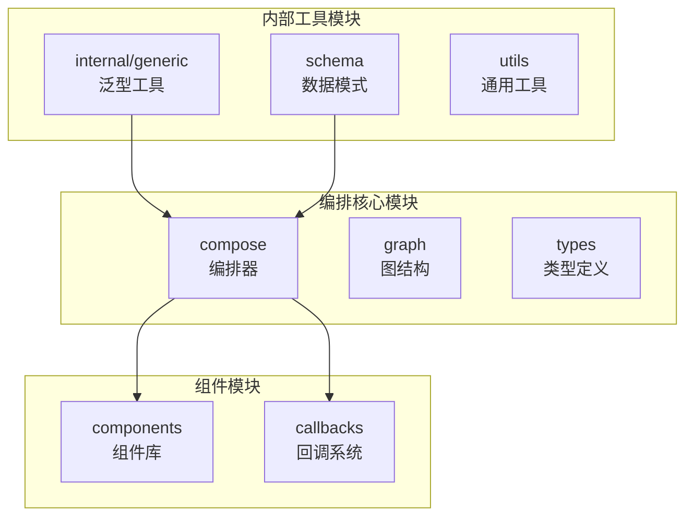
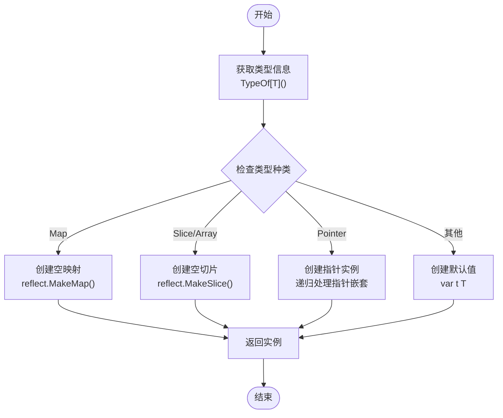
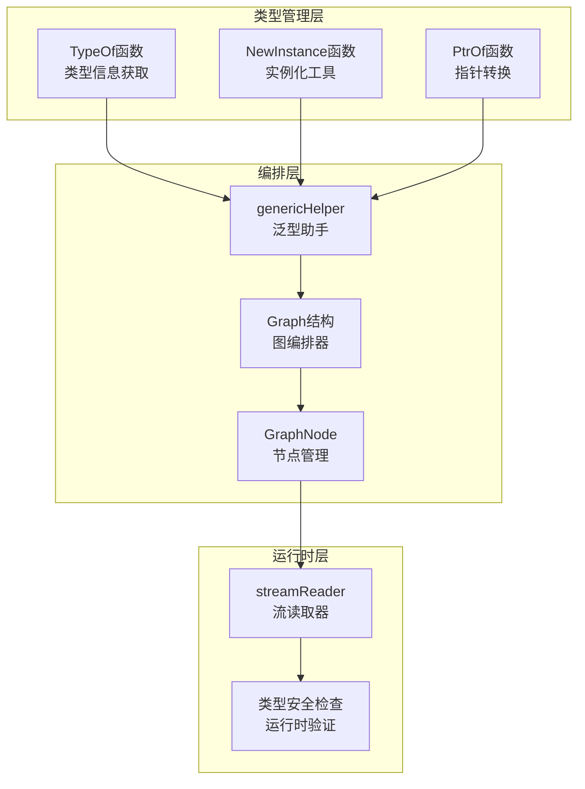
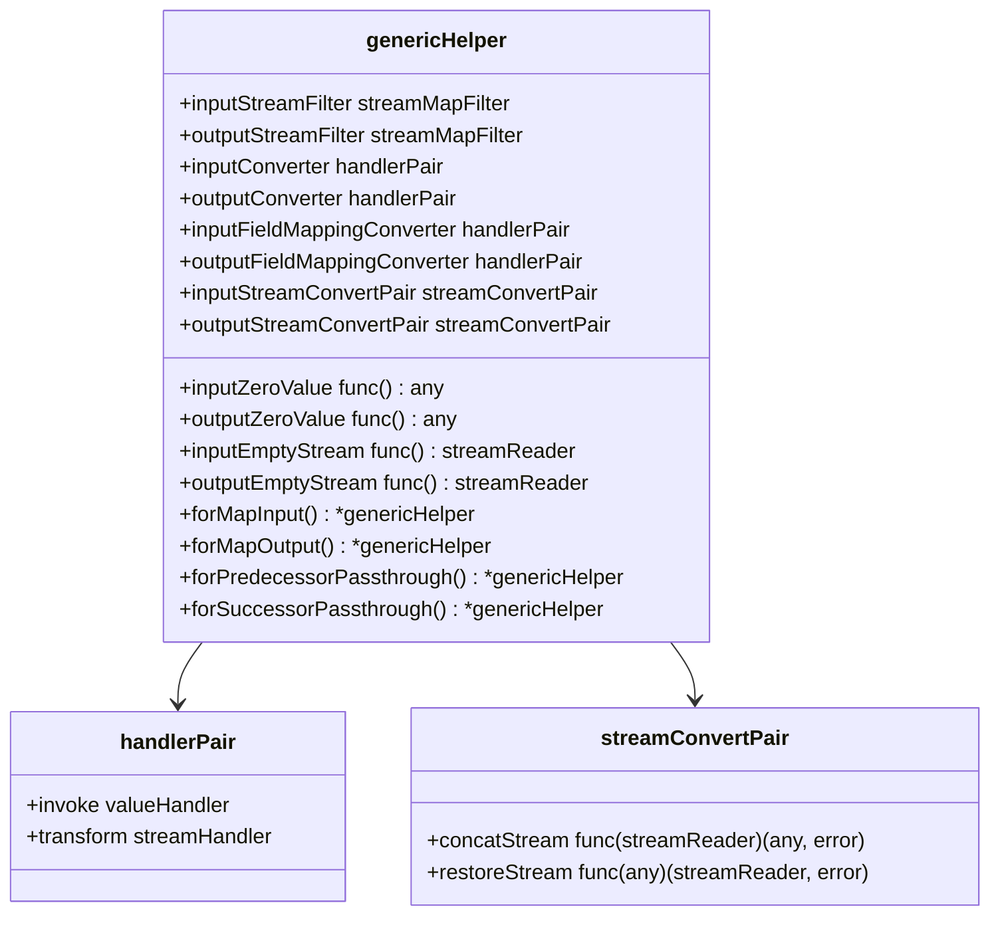
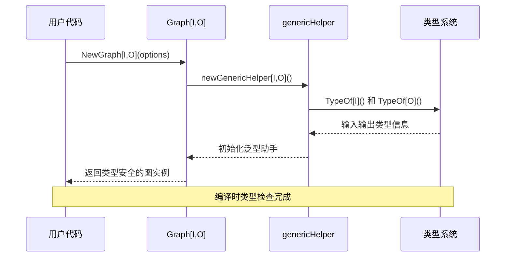
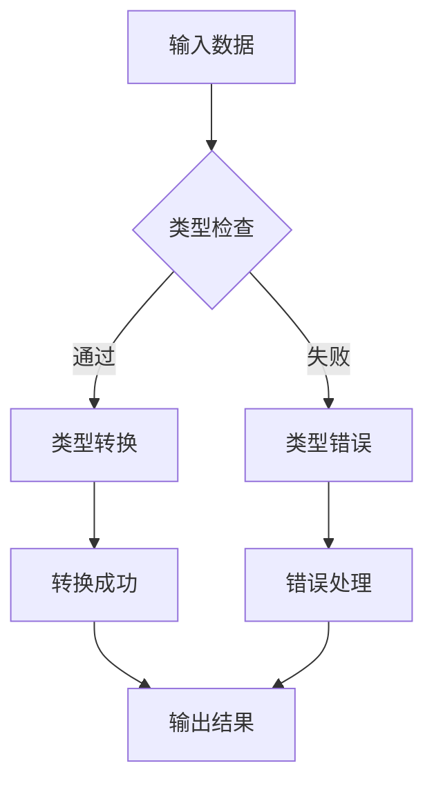
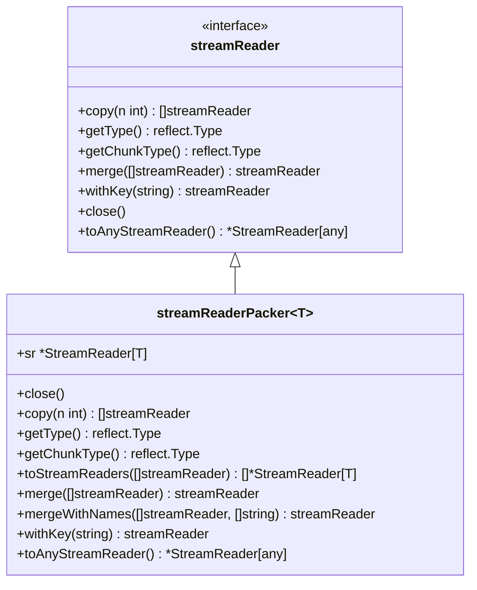

# 类型安全与泛型

<cite>
**本文档中引用的文件**
- [internal/generic/generic.go](file://internal/generic/generic.go)
- [internal/generic/type_name.go](file://internal/generic/type_name.go)
- [compose/generic_helper.go](file://compose/generic_helper.go)
- [compose/generic_graph.go](file://compose/generic_graph.go)
- [compose/graph.go](file://compose/graph.go)
- [compose/utils.go](file://compose/utils.go)
- [compose/stream_reader.go](file://compose/stream_reader.go)
- [compose/types.go](file://compose/types.go)
- [internal/generic/generic_test.go](file://internal/generic/generic_test.go)
</cite>

## 目录
1. [简介](#简介)
2. [项目结构概览](#项目结构概览)
3. [核心泛型工具](#核心泛型工具)
4. [架构设计](#架构设计)
5. [详细组件分析](#详细组件分析)
6. [类型安全机制](#类型安全机制)
7. [实际应用场景](#实际应用场景)
8. [性能考量](#性能考量)
9. [最佳实践](#最佳实践)
10. [总结](#总结)

## 简介

Eino框架是一个强大的工作流编排系统，它深度集成了Go语言的泛型特性来实现类型安全的数据流处理。通过精心设计的泛型工具，Eino能够在编译时确保节点间数据类型的正确性，避免运行时类型错误，同时提供灵活的类型转换和处理能力。

本文档将深入探讨Eino框架如何利用Go泛型实现类型安全，重点分析`internal/generic/generic.go`中的核心泛型辅助函数，以及它们在`compose`包编排器中如何确保节点间数据流的类型一致性。

## 项目结构概览

Eino框架采用模块化设计，主要包含以下核心模块：



**图表来源**
- [internal/generic/generic.go](file://internal/generic/generic.go#L1-L91)
- [compose/generic_graph.go](file://compose/generic_graph.go#L1-L155)

**章节来源**
- [internal/generic/generic.go](file://internal/generic/generic.go#L1-L91)
- [compose/generic_graph.go](file://compose/generic_graph.go#L1-L155)

## 核心泛型工具

### NewInstance[T any]() 函数

`NewInstance`函数是Eino框架中最核心的泛型工具之一，它能够根据给定的类型参数创建该类型的实例，支持各种复杂类型的初始化。

#### 实现原理



**图表来源**
- [internal/generic/generic.go](file://internal/generic/generic.go#L27-L50)

#### 使用场景

1. **基础类型初始化**：为基本类型（如`int`、`string`）提供零值
2. **复合类型初始化**：为结构体、切片、映射等复杂类型创建实例
3. **指针类型处理**：智能处理多层指针嵌套的情况

### TypeOf[T any]() 函数

`TypeOf`函数提供了编译时类型信息获取能力，是实现类型安全的核心基础设施。

#### 特点
- 编译时确定类型信息
- 支持任意类型约束
- 高效的类型查询机制

### PtrOf[T any](v T) *T 函数

`PtrOf`函数简化了值到指针的转换过程，特别适用于配置参数传递等场景。

#### 应用价值
- 减少显式指针操作代码
- 提供统一的指针创建接口
- 支持链式调用和函数式编程风格

**章节来源**
- [internal/generic/generic.go](file://internal/generic/generic.go#L27-L66)

## 架构设计

Eino框架的泛型架构采用了分层设计，从底层的类型信息管理到上层的编排逻辑，形成了完整的类型安全保障体系。



**图表来源**
- [compose/generic_helper.go](file://compose/generic_helper.go#L28-L55)
- [compose/generic_graph.go](file://compose/generic_graph.go#L100-L115)

## 详细组件分析

### 泛型助手（genericHelper）

`genericHelper`是Eino框架中负责类型转换和处理的核心组件，它为不同的数据类型提供了统一的处理接口。

#### 核心功能



**图表来源**
- [compose/generic_helper.go](file://compose/generic_helper.go#L57-L69)

#### 类型转换机制

1. **默认流过滤器**：`defaultStreamMapFilter[T any]`用于从映射中提取特定键的值
2. **流转换器**：`defaultStreamConverter[T any]`确保流数据的类型一致性
3. **值检查器**：`defaultValueChecker[T any]`提供运行时类型验证

### 图编排器（Graph）

图编排器是Eino框架的核心执行引擎，它利用泛型工具确保整个数据流的类型安全性。

#### 类型约束



**图表来源**
- [compose/generic_graph.go](file://compose/generic_graph.go#L68-L84)
- [compose/generic_helper.go](file://compose/generic_helper.go#L28-L55)

**章节来源**
- [compose/generic_helper.go](file://compose/generic_helper.go#L28-L257)
- [compose/generic_graph.go](file://compose/generic_graph.go#L68-L155)

## 类型安全机制

### 编译时类型检查

Eino框架通过Go泛型在编译时就确保类型的安全性：

1. **输入输出类型匹配**：图的输入类型I必须与第一个节点的输入类型匹配
2. **节点间类型传递**：每个节点的输出类型必须与下一个节点的输入类型兼容
3. **字段映射验证**：字段映射转换在编译时验证类型兼容性

### 运行时类型验证

虽然编译时检查提供了强类型保证，但Eino还提供了运行时类型验证机制：



**图表来源**
- [compose/generic_helper.go](file://compose/generic_helper.go#L236-L242)

### 流读取器类型安全

流读取器系统通过泛型包装器确保流数据的类型一致性：



**图表来源**
- [compose/stream_reader.go](file://compose/stream_reader.go#L26-L35)
- [compose/stream_reader.go](file://compose/stream_reader.go#L37-L40)

**章节来源**
- [compose/generic_helper.go](file://compose/generic_helper.go#L225-L242)
- [compose/stream_reader.go](file://compose/stream_reader.go#L115-L129)

## 实际应用场景

### 自定义组件开发

开发者可以利用泛型工具创建类型安全的自定义组件：

```go
// 示例：类型安全的文本处理器组件
type TextProcessor[T any] struct {
    transformer func(string) T
}

func (tp *TextProcessor[T]) Process(text string) T {
    return tp.transformer(text)
}
```

### 编排逻辑优化

在复杂的编排场景中，泛型工具确保数据流的类型一致性：

```go
// 示例：多步骤文本处理流程
graph := compose.NewGraph[string, []string](
    compose.WithGenLocalState(func(ctx context.Context) *ProcessingState {
        return &ProcessingState{}
    })
)

// 添加类型安全的处理节点
graph.AddNode("preprocess", preprocessNode)
graph.AddNode("analyze", analyzeNode)
graph.AddNode("postprocess", postprocessNode)

// 类型安全的边连接
graph.AddEdge("preprocess", "analyze")
graph.AddEdge("analyze", "postprocess")
```

### 类型转换场景

泛型工具在复杂类型转换场景中发挥重要作用：

1. **结构体到映射的转换**：自动提取字段值
2. **映射到结构体的转换**：字段映射和类型验证
3. **流数据的类型转换**：运行时类型检查和转换

**章节来源**
- [compose/utils.go](file://compose/utils.go#L30-L150)
- [compose/generic_helper.go](file://compose/generic_helper.go#L198-L223)

## 性能考量

### 编译时开销

泛型的使用会增加编译时间，特别是在大量使用的情况下：

- **类型实例化**：编译器需要为每种类型组合生成对应的代码
- **内联优化**：编译器可能无法像非泛型代码那样进行深度内联优化

### 运行时性能

泛型工具的运行时性能特点：

1. **类型信息缓存**：`TypeOf`函数的结果会被缓存，避免重复计算
2. **反射优化**：对于简单类型，反射调用的开销相对较小
3. **内存分配**：泛型实例化可能导致额外的内存分配

### 性能优化建议

1. **合理使用泛型**：在类型安全要求高的地方使用泛型
2. **避免过度抽象**：保持适当的抽象层次
3. **性能测试**：在关键路径上进行性能基准测试

## 最佳实践

### 泛型使用原则

1. **明确类型约束**：始终使用具体的类型约束而非`any`
2. **保持接口简洁**：泛型接口应该保持简单和专注
3. **文档化类型关系**：清晰地说明类型间的依赖关系

### 错误处理策略

```go
// 示例：类型转换的错误处理
func safeConvert[T any](value any) (T, error) {
    var zero T
    result, ok := value.(T)
    if !ok {
        return zero, fmt.Errorf("类型转换失败: 期望 %T, 实际 %T", zero, value)
    }
    return result, nil
}
```

### 测试策略

1. **单元测试覆盖**：为每种类型组合编写测试
2. **边界条件测试**：测试空值、nil和特殊类型
3. **性能测试**：验证泛型实现的性能表现

**章节来源**
- [internal/generic/generic_test.go](file://internal/generic/generic_test.go#L23-L104)

## 总结

Eino框架通过深度集成Go泛型技术，构建了一个强大而安全的工作流编排系统。核心泛型工具如`NewInstance`、`TypeOf`和`PtrOf`不仅提供了编译时类型检查能力，还在运行时确保了数据流的类型一致性。

### 主要优势

1. **编译时类型安全**：在编译阶段发现类型错误
2. **运行时类型验证**：提供额外的类型安全保障
3. **灵活的类型转换**：支持复杂的类型转换场景
4. **高性能实现**：通过缓存和优化减少性能开销

### 技术创新

- **泛型助手模式**：提供统一的类型处理接口
- **流读取器泛型包装**：确保流数据的类型一致性
- **编译时类型推导**：减少运行时类型检查的需要

### 应用前景

Eino框架的泛型类型安全机制为构建可靠的工作流系统奠定了坚实基础，其设计理念和实现方式值得在其他类似项目中借鉴和应用。随着Go语言泛型生态的不断发展，这种类型安全的设计模式将在更多的系统中得到应用和推广。