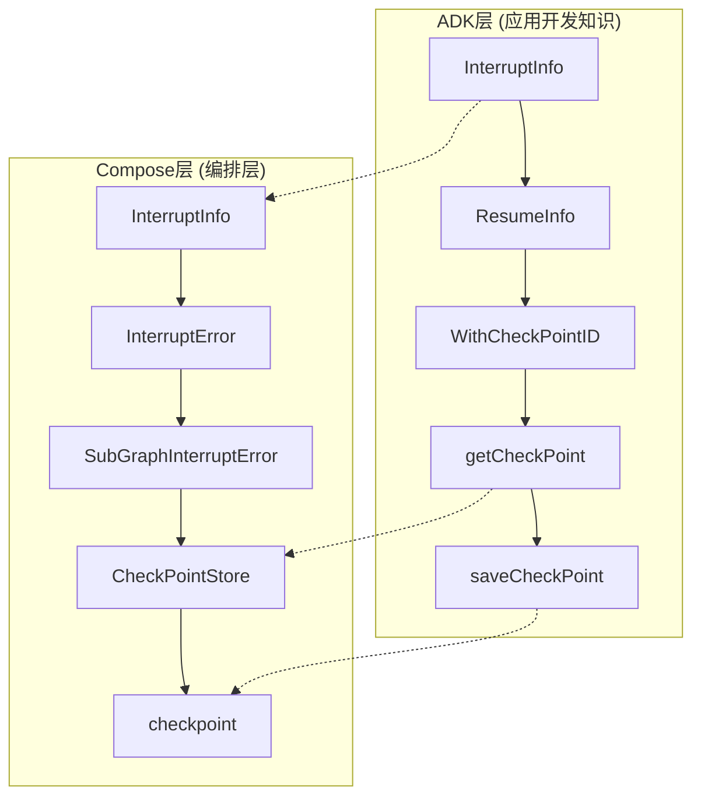
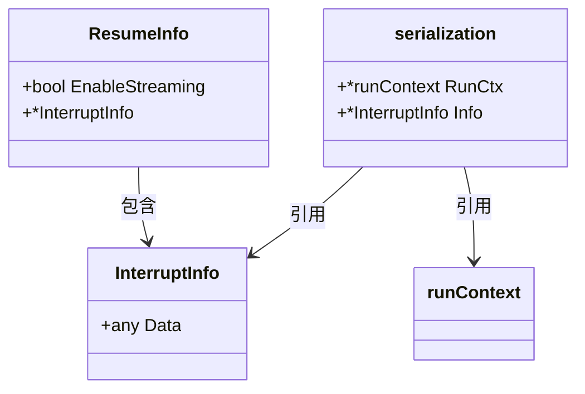
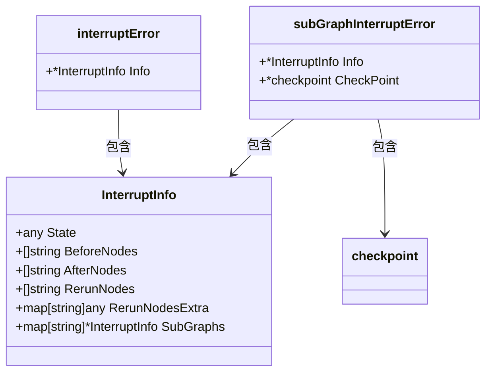
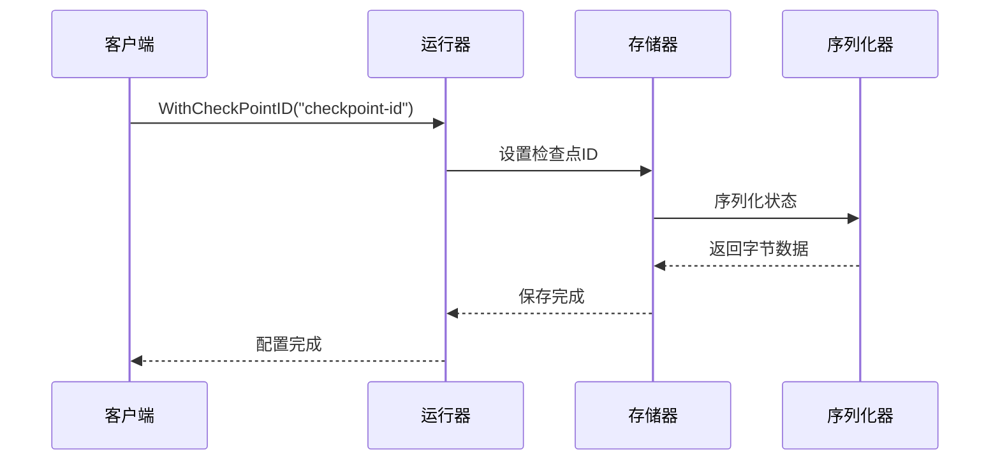
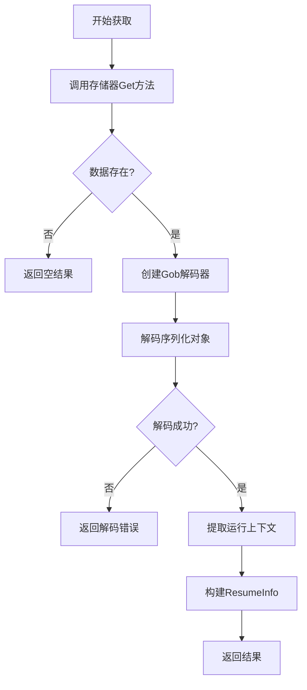
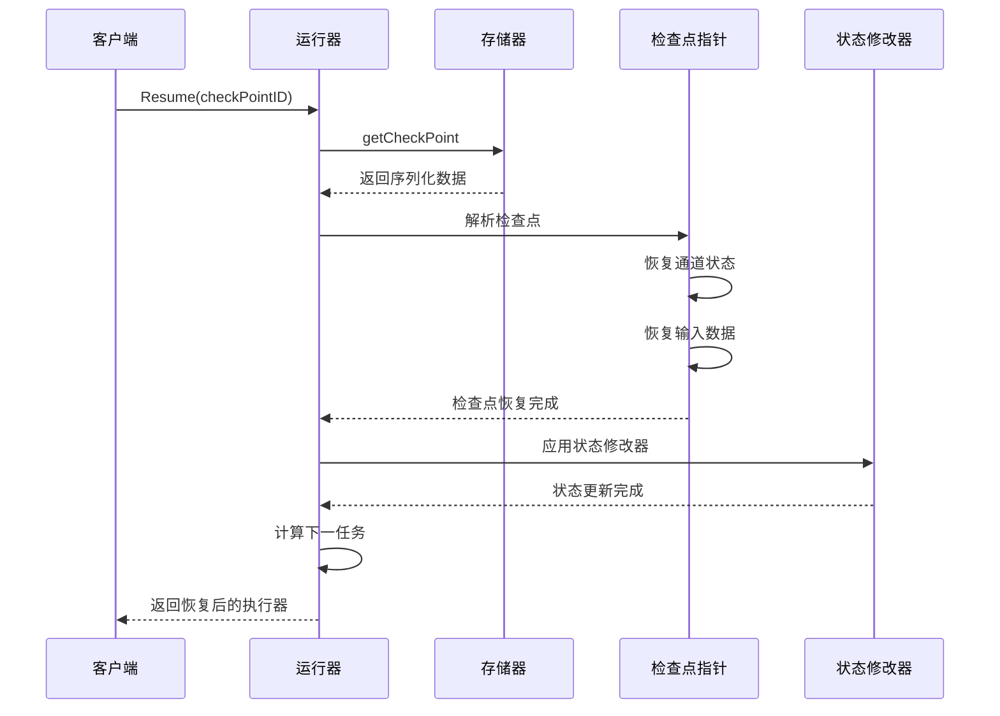
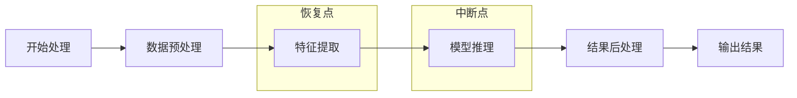

# 错误处理与中断

<cite>
**本文档引用的文件**
- [adk/interrupt.go](file://adk/interrupt.go)
- [compose/interrupt.go](file://compose/interrupt.go)
- [compose/checkpoint.go](file://compose/checkpoint.go)
- [adk/runctx.go](file://adk/runctx.go)
- [adk/call_option.go](file://adk/call_option.go)
- [adk/interrupt_test.go](file://adk/interrupt_test.go)
- [compose/checkpoint_test.go](file://compose/checkpoint_test.go)
</cite>

## 目录
1. [简介](#简介)
2. [核心架构概览](#核心架构概览)
3. [中断信息结构体详解](#中断信息结构体详解)
4. [检查点存储机制](#检查点存储机制)
5. [中断恢复流程](#中断恢复流程)
6. [实际应用场景](#实际应用场景)
7. [性能考量与最佳实践](#性能考量与最佳实践)
8. [总结](#总结)

## 简介

Eino框架提供了一套完整的错误处理与执行中断机制，支持在长时间运行的任务中实现优雅的中断和恢复功能。该机制通过检查点（Checkpoint）技术，能够保存和恢复复杂的执行状态，确保在中断发生后可以从精确的断点继续执行。

## 核心架构概览

Eino的中断处理机制分为两个主要层次：



**图表来源**
- [adk/interrupt.go](file://adk/interrupt.go#L33-L35)
- [compose/interrupt.go](file://compose/interrupt.go#L62-L69)
- [compose/checkpoint.go](file://compose/checkpoint.go#L48-L52)

**章节来源**
- [adk/interrupt.go](file://adk/interrupt.go#L1-L130)
- [compose/interrupt.go](file://compose/interrupt.go#L1-L132)

## 中断信息结构体详解

### ADK层的InterruptInfo和ResumeInfo

ADK层提供了基础的中断信息封装：



**图表来源**
- [adk/interrupt.go](file://adk/interrupt.go#L33-L35)
- [adk/interrupt.go](file://adk/interrupt.go#L28-L31)
- [adk/interrupt.go](file://adk/interrupt.go#L50-L53)

#### InterruptInfo结构体

`InterruptInfo`是ADK层的核心中断信息容器，包含任意类型的数据：

- **Data字段**：存储中断时需要保留的上下文数据，可以是任何实现了`encoding/gob`序列化的类型
- **用途**：用于在中断发生时捕获当前执行状态的关键信息

#### ResumeInfo结构体

`ResumeInfo`扩展了基本的中断信息，增加了流式处理的支持：

- **EnableStreaming字段**：指示是否启用了流式处理模式
- **嵌入InterruptInfo**：继承中断信息的所有属性
- **作用**：为恢复操作提供必要的元数据

**章节来源**
- [adk/interrupt.go](file://adk/interrupt.go#L28-L35)

### Compose层的InterruptInfo

Compose层的`InterruptInfo`更加复杂，专门针对编排流程设计：



**图表来源**
- [compose/interrupt.go](file://compose/interrupt.go#L62-L69)
- [compose/interrupt.go](file://compose/interrupt.go#L91-L93)
- [compose/interrupt.go](file://compose/interrupt.go#L110-L113)

#### State字段的作用

`State`字段在编排流程中断时扮演关键角色：

- **状态保存**：记录当前执行阶段的状态信息
- **恢复依据**：作为恢复执行时的状态基准
- **类型灵活性**：支持任意可序列化的状态类型

#### 节点控制字段

- **BeforeNodes**：中断前应该执行的节点列表
- **AfterNodes**：中断后应该执行的节点列表  
- **RerunNodes**：需要重新执行的节点列表
- **RerunNodesExtra**：重新执行节点的额外参数

**章节来源**
- [compose/interrupt.go](file://compose/interrupt.go#L62-L69)

## 检查点存储机制

### WithCheckPointID选项

`WithCheckPointID`选项是启用中断恢复功能的关键：



**图表来源**
- [adk/interrupt.go](file://adk/interrupt.go#L37-L41)
- [compose/checkpoint.go](file://compose/checkpoint.go#L87-L91)

### getCheckPoint和saveCheckPoint函数

这两个核心函数实现了状态的序列化与持久化：

#### saveCheckPoint函数流程

```mermaid
flowchart TD
A[开始保存] --> B[创建缓冲区]
B --> C[创建Gob编码器]
C --> D[编码序列化对象]
D --> E{编码成功?}
E --> |否| F[返回错误]
E --> |是| G[调用存储器Set方法]
G --> H{存储成功?}
H --> |否| I[返回存储错误]
H --> |是| J[保存完成]
```



**图表来源**
- [adk/interrupt.go](file://adk/interrupt.go#L81-L98)

#### getCheckPoint函数流程



**图表来源**
- [adk/interrupt.go](file://adk/interrupt.go#L54-L80)

### CheckPointStore接口

`CheckPointStore`定义了检查点存储的标准接口：

| 方法 | 参数 | 返回值 | 描述 |
|------|------|--------|------|
| Get | ctx context.Context, checkPointID string | ([]byte, bool, error) | 获取指定ID的检查点数据 |
| Set | ctx context.Context, checkPointID string, checkPoint []byte | error | 设置指定ID的检查点数据 |

**章节来源**
- [adk/interrupt.go](file://adk/interrupt.go#L54-L98)
- [compose/checkpoint.go](file://compose/checkpoint.go#L48-L52)

## 中断恢复流程

### 恢复过程的完整流程



**图表来源**
- [compose/graph_run.go](file://compose/graph_run.go#L372-L413)

### 状态恢复机制

状态恢复涉及多个层面的数据重建：

1. **通道状态恢复**：重建消息传递通道
2. **输入数据恢复**：恢复节点输入参数
3. **状态修改器应用**：应用自定义状态调整逻辑
4. **任务重新计算**：确定下一步执行计划

**章节来源**
- [compose/graph_run.go](file://compose/graph_run.go#L372-L413)

## 实际应用场景

### 场景示例：长周期任务的中断恢复

假设我们有一个需要处理大量数据的AI工作流：



**图表来源**
- [compose/checkpoint_test.go](file://compose/checkpoint_test.go#L855-L900)

#### 具体实现步骤

1. **配置中断点**：
   ```go
   // 在特征提取节点设置中断
   g.AddLambdaNode("extract", extractFunc, 
     WithStatePreHandler(extractHandler),
     WithInterruptAfterNodes([]string{"extract"})
   )
   ```

2. **执行与中断**：
   ```go
   // 执行到中断点
   _, err := runner.Invoke(ctx, inputData, WithCheckPointID("session-1"))
   // 发生中断，保存状态
   ```

3. **恢复执行**：
   ```go
   // 从检查点恢复
   runner, err := runner.Resume(ctx, "session-1")
   // 继续执行后续节点
   ```

### 容错机制的价值

1. **系统稳定性**：避免因单点故障导致整个任务失败
2. **用户体验**：减少用户等待时间，提高任务成功率
3. **资源效率**：避免重复执行已完成的工作
4. **调试支持**：便于问题定位和状态分析

**章节来源**
- [adk/interrupt_test.go](file://adk/interrupt_test.go#L72-L124)
- [compose/checkpoint_test.go](file://compose/checkpoint_test.go#L697-L737)

## 性能考量与最佳实践

### 存储后端要求

#### 内存存储
- **优点**：访问速度快，适合开发测试
- **限制**：进程重启后数据丢失
- **适用场景**：快速原型开发、短期任务

#### 数据库存储
- **优点**：持久性强，支持分布式部署
- **考虑因素**：查询性能、并发控制
- **适用场景**：生产环境、长期任务

#### 文件系统存储
- **优点**：简单易用，成本低
- **限制**：可能有文件大小限制
- **适用场景**：中小规模应用

### 性能优化建议

1. **选择合适的检查点间隔**：
   - 频繁检查点：增加存储开销但提高恢复精度
   - 偶尔检查点：减少存储开销但降低恢复灵活性

2. **优化序列化性能**：
   - 使用高效的序列化格式
   - 避免不必要的状态信息保存

3. **合理设计中断策略**：
   - 在关键业务逻辑处设置中断点
   - 平衡中断频率与恢复成本

### 最佳实践总结

| 实践领域 | 建议 | 原因 |
|----------|------|------|
| 检查点设计 | 在业务逻辑边界设置 | 便于状态恢复和错误定位 |
| 数据压缩 | 对大型状态进行压缩 | 减少存储空间和传输时间 |
| 异步保存 | 使用异步方式保存检查点 | 避免阻塞主业务流程 |
| 清理策略 | 定期清理过期检查点 | 控制存储空间占用 |

**章节来源**
- [compose/checkpoint.go](file://compose/checkpoint.go#L164-L243)

## 总结

Eino框架的错误处理与中断机制提供了一个完整而灵活的解决方案，通过以下核心特性实现了可靠的中断恢复能力：

1. **分层架构设计**：ADK层提供基础的中断信息管理，Compose层实现复杂的编排流程控制
2. **灵活的状态保存**：支持任意可序列化的状态类型，适应不同的业务需求
3. **完善的恢复机制**：从检查点精确恢复执行状态，确保任务连续性
4. **丰富的应用场景**：适用于长周期任务、容错处理、用户体验优化等多种场景

该机制不仅提高了系统的稳定性和可靠性，还为开发者提供了强大的调试和监控工具，是构建健壮AI应用的重要基础设施。