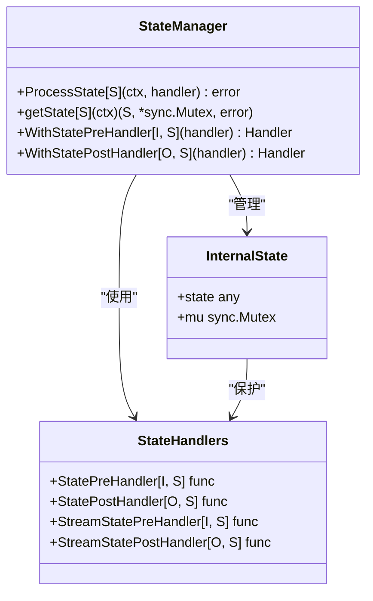
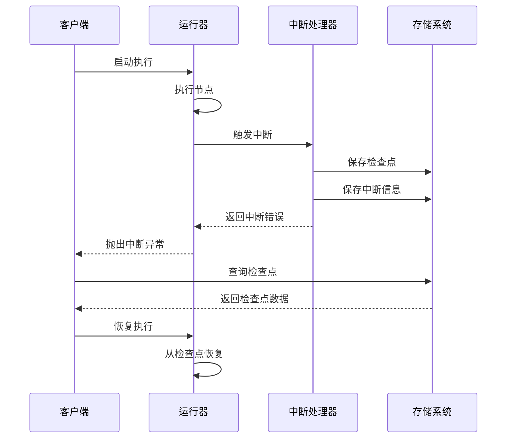
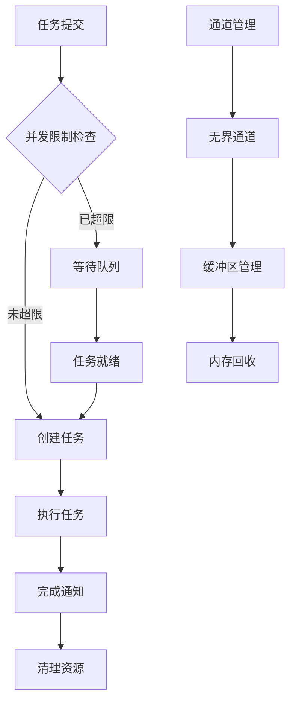
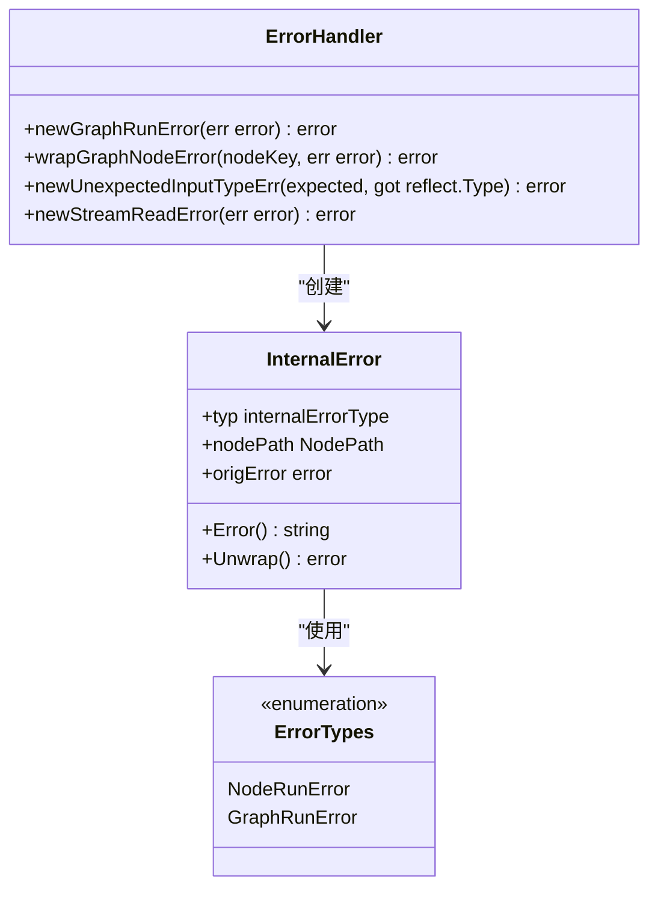

# 高级主题

<cite>
**本文档引用的文件**
- [internal/generic/generic.go](file://internal/generic/generic.go)
- [compose/state.go](file://compose/state.go)
- [adk/interrupt.go](file://adk/interrupt.go)
- [compose/interrupt.go](file://compose/interrupt.go)
- [compose/graph.go](file://compose/graph.go)
- [compose/generic_helper.go](file://compose/generic_helper.go)
- [compose/checkpoint.go](file://compose/checkpoint.go)
- [compose/error.go](file://compose/error.go)
- [internal/safe/panic.go](file://internal/safe/panic.go)
- [internal/channel.go](file://internal/channel.go)
- [components/tool/utils/streamable_func.go](file://components/tool/utils/streamable_func.go)
- [components/tool/utils/invokable_func.go](file://components/tool/utils/invokable_func.go)
</cite>

## 目录
1. [简介](#简介)
2. [泛型辅助系统的类型安全扩展](#泛型辅助系统的类型安全扩展)
3. [复杂状态管理与数据共享](#复杂状态管理与数据共享)
4. [执行中断与错误恢复机制](#执行中断与错误恢复机制)
5. [性能优化策略](#性能优化策略)
6. [错误处理策略与最佳实践](#错误处理策略与最佳实践)
7. [资源管理与清理](#资源管理与清理)
8. [总结](#总结)

## 简介

Eino框架为有经验的开发者提供了强大的高级功能，包括类型安全的泛型扩展、复杂的状态管理系统、灵活的中断机制、性能优化策略以及完善的错误处理体系。本指南将深入探讨这些核心特性，帮助开发者构建高性能、可维护的企业级应用。

## 泛型辅助系统的类型安全扩展

### 内置泛型支持

Eino的`internal/generic/generic.go`提供了强大的泛型辅助功能，支持类型安全的实例化和操作。

```mermaid
classDiagram
class GenericHelper {
+NewInstance[T]() T
+TypeOf[T]() reflect.Type
+PtrOf[T](v T) *T
+Reverse[S, E](s S) S
+CopyMap[K, V](src map[K]V) map[K]V
}
class Pair[F, S] {
+First F
+Second S
}
class TypeOperations {
+TypeOf[T]() reflect.Type
+NewInstance[T]() T
+PtrOf[T](v T) *T
}
GenericHelper --> Pair : "创建"
GenericHelper --> TypeOperations : "提供"
```

**图表来源**
- [internal/generic/generic.go](file://internal/generic/generic.go#L23-L91)

### 类型安全的自定义扩展实现

开发者可以利用泛型辅助系统实现类型安全的自定义扩展：

#### 实例化机制
- 支持基础类型、指针类型、切片和映射的自动实例化
- 智能处理嵌套指针类型的初始化
- 提供类型安全的零值生成

#### 泛型工具函数
- 反转切片元素顺序的安全实现
- 深拷贝映射的类型安全方法
- 类型信息查询和验证

**章节来源**
- [internal/generic/generic.go](file://internal/generic/generic.go#L23-L91)

## 复杂状态管理与数据共享

### 状态管理系统架构

Eino的`compose/state.go`提供了线程安全的状态管理机制，支持复杂的业务逻辑状态维护。



**图表来源**
- [compose/state.go](file://compose/state.go#L34-L162)

### 状态处理模式

#### 并发安全的状态访问
- 使用互斥锁确保状态修改的原子性
- 提供类型安全的状态访问接口
- 支持预处理器和后处理器模式

#### 状态生命周期管理
- 自动状态初始化和清理
- 上下文传播的状态管理
- 异常情况下的状态恢复

### 复杂场景的状态共享

#### 分层状态管理
- 支持多层级状态结构
- 状态继承和覆盖机制
- 条件状态隔离

#### 状态持久化
- 与检查点系统的集成
- 状态序列化和反序列化
- 状态版本控制

**章节来源**
- [compose/state.go](file://compose/state.go#L113-L162)

## 执行中断与错误恢复机制

### 中断系统设计

Eino提供了多层次的中断和恢复机制，支持复杂的执行流程控制。



**图表来源**
- [adk/interrupt.go](file://adk/interrupt.go#L55-L98)
- [compose/interrupt.go](file://compose/interrupt.go#L63-L132)

### ADK中断机制

ADK模块提供了高级的中断和恢复功能：

#### 检查点管理
- 自动序列化执行状态
- 支持流式和非流式数据
- 智能的存储和检索机制

#### 中断信息结构
- 包含完整的执行上下文
- 支持多种中断类型
- 可扩展的中断数据格式

### Compose中断机制

Compose模块提供了细粒度的中断控制：

#### 中断类型
- 节点前中断（BeforeNodes）
- 节点后中断（AfterNodes）
- 重新运行中断（RerunNodes）

#### 错误恢复策略
- 基于错误类型的智能恢复
- 可配置的重试机制
- 状态回滚和清理

**章节来源**
- [adk/interrupt.go](file://adk/interrupt.go#L29-L130)
- [compose/interrupt.go](file://compose/interrupt.go#L26-L132)

## 性能优化策略

### 并发控制机制

Eino实现了多层次的并发控制策略，确保高性能和资源效率。



**图表来源**
- [internal/channel.go](file://internal/channel.go#L1-L78)

### 资源管理策略

#### 无界通道设计
- 动态内存分配和回收
- 条件变量优化等待性能
- 原子操作保证线程安全

#### 流式处理优化
- 零拷贝数据传输
- 智能缓冲区大小调整
- 并发读写分离

### 性能监控和调优

#### 关键指标监控
- 任务队列长度
- 并发度统计
- 内存使用情况

#### 自适应优化
- 动态调整工作线程数
- 智能任务调度算法
- 资源使用预测模型

**章节来源**
- [internal/channel.go](file://internal/channel.go#L1-L78)

## 错误处理策略与最佳实践

### 分层错误处理架构

Eino采用了分层的错误处理策略，确保错误的正确传播和处理。



**图表来源**
- [compose/error.go](file://compose/error.go#L54-L112)

### 错误分类和处理

#### 内部错误类型
- 节点运行错误：包含完整的节点路径信息
- 图运行错误：全局性的执行错误
- 输入类型错误：参数验证失败

#### 错误包装和传播
- 保持原始错误的完整性
- 添加上下文信息
- 支持错误链追踪

### Panic恢复机制

#### 安全的panic处理
- 自动捕获和转换panic
- 保留原始堆栈信息
- 提供详细的错误报告

#### 资源清理保证
- defer语句的正确使用
- 临界区的异常退出处理
- 资源泄漏防护

**章节来源**
- [compose/error.go](file://compose/error.go#L54-L112)
- [internal/safe/panic.go](file://internal/safe/panic.go#L23-L41)

## 资源管理与清理

### 自动资源管理

Eino实现了智能的资源管理机制，确保及时的资源释放和内存回收。

#### 流式资源管理
- 自动关闭不再使用的流
- 垃圾回收友好的资源设计
- 条件自动关闭机制

#### 清理策略
- 延迟清理和立即清理的选择
- 资源池化的生命周期管理
- 异常情况下的强制清理

### 最佳实践建议

#### 资源使用原则
- 尽早释放不再需要的资源
- 使用defer确保资源清理
- 避免资源泄漏的常见陷阱

#### 性能考虑
- 合理设置缓冲区大小
- 避免频繁的资源分配和释放
- 利用对象池减少GC压力

**章节来源**
- [schema/stream.go](file://schema/stream.go#L244-L298)

## 总结

Eino框架为高级开发者提供了完整的解决方案，涵盖了从类型安全的泛型扩展到复杂的错误处理机制。通过合理运用这些高级特性，开发者可以构建：

- **类型安全**的应用程序，避免运行时类型错误
- **高性能**的并发系统，充分利用现代硬件能力
- **可靠**的容错系统，确保服务的稳定性
- **可维护**的代码结构，降低长期开发成本

掌握这些高级主题将使开发者能够充分发挥Eino框架的潜力，构建企业级的AI应用系统。